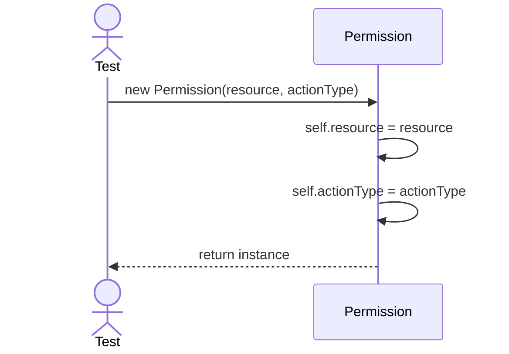
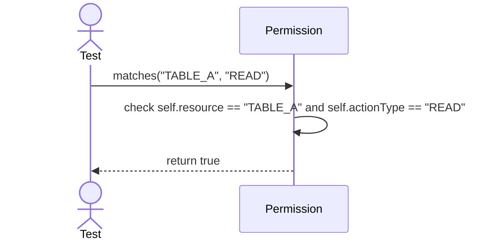

# Sequence Diagrams: Permission

## 🆕 Added Properties & Methods for `Permission`
To support the detailed sequence logic for unit testing, the following missing properties/methods have been introduced. **Please update the `Permission` class in your Class Diagram with these:**

- **Property** added to `Permission`: `resource`, `actionType` (e.g. 'TABLE_A', 'SELECT')

---

This file contains the detailed sequence diagrams for all unit tests of the **Permission** class in the Security & Access Control subsystem.

## 1. Init_SetsResourceAndActionType

## 2. Matches_WhenActionAndResourceAlign_ReturnsTrue

