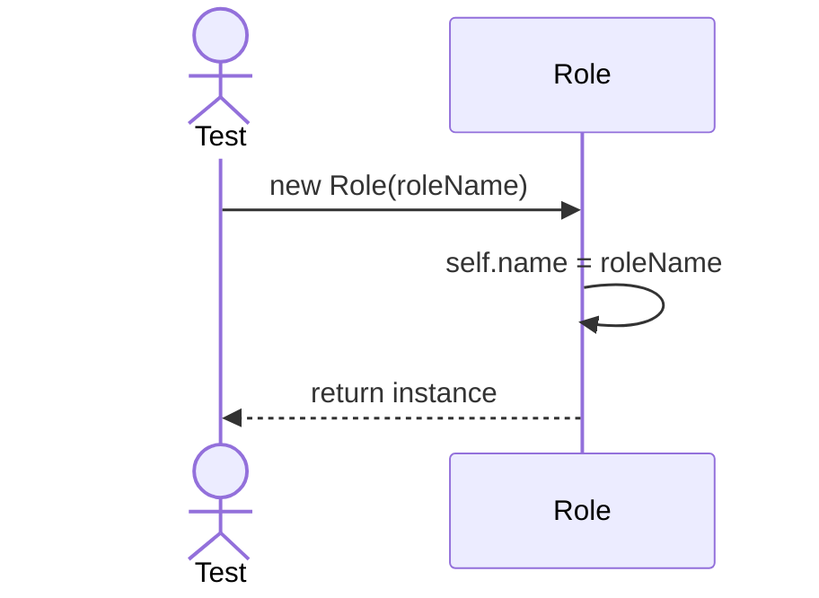
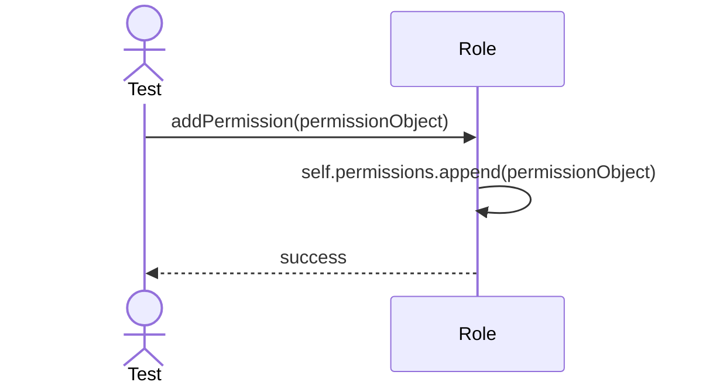

# Sequence Diagrams: Role

## 🆕 Added Properties & Methods for `Role`
To support the detailed sequence logic for unit testing, the following missing properties/methods have been introduced. **Please update the `Role` class in your Class Diagram with these:**

- **Property** added to `Role`: `permissions` (List of Permission objects)

---

This file contains the detailed sequence diagrams for all unit tests of the **Role** class in the Security & Access Control subsystem.

## 1. Init_SetsRoleName

## 2. AddPermission_GrantsPermissionToRole

