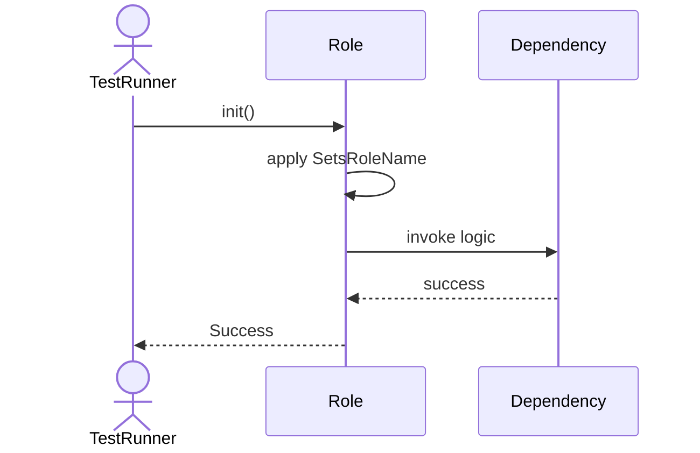
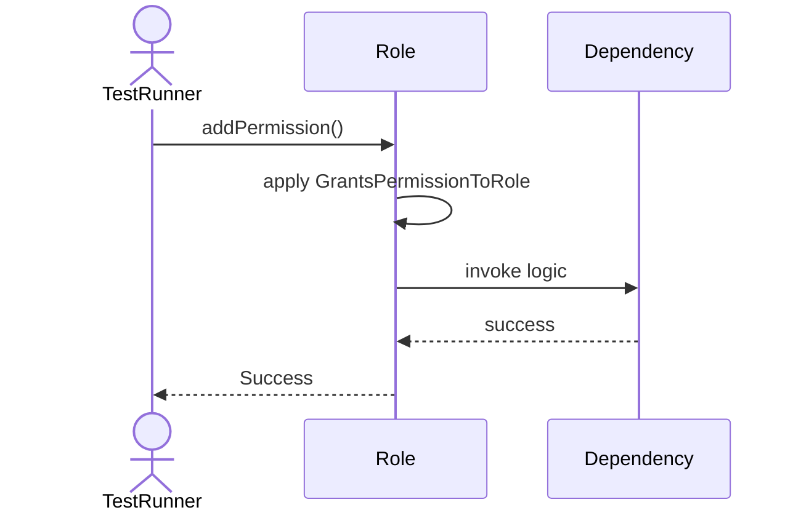
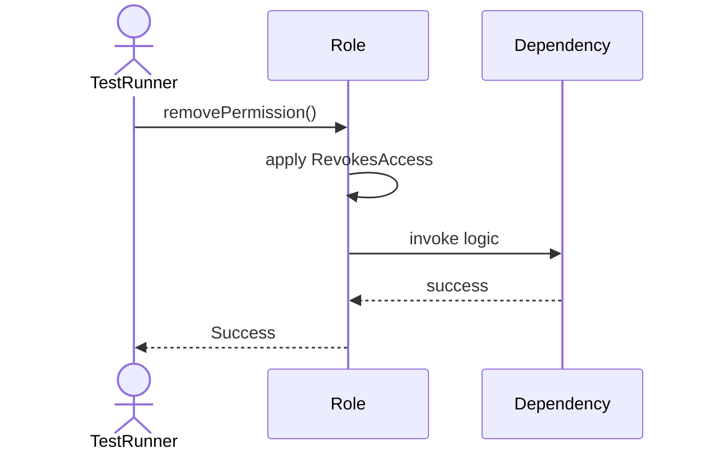
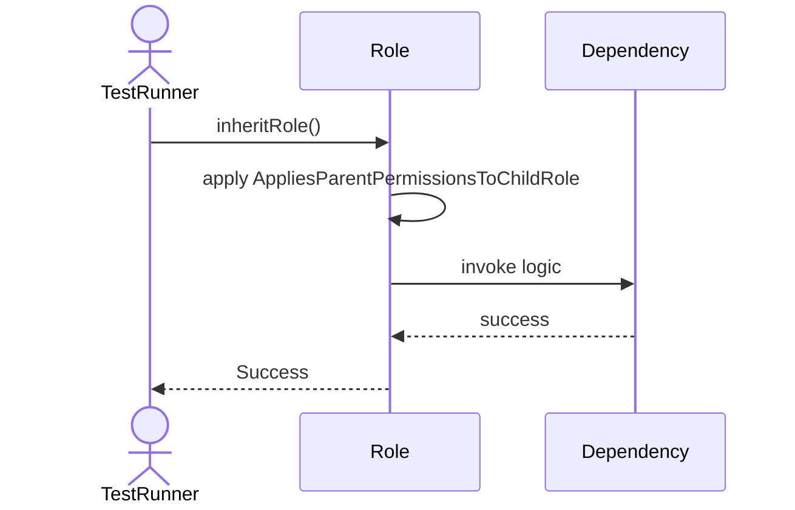

# Sequence Diagrams: Role

## 🆕 Added Properties & Methods for `Role`
To support the detailed sequence logic for unit testing, please update the `Role` class in your Class Diagram with the following properties and methods:

- **Property** added to `Role`: `permissions (List)`
- **Method** added to `Role`: `addPermission()`
- **Method** added to `Role`: `getAllPermissions()`
- **Method** added to `Role`: `hasPermission()`
- **Method** added to `Role`: `inheritRole()`
- **Method** added to `Role`: `removePermission()`

---

This file contains the detailed sequence diagrams for all 6 unit tests of the **Role** class.

## 1. Init_SetsRoleName

## 2. AddPermission_GrantsPermissionToRole

## 3. RemovePermission_RevokesAccess

## 4. HasPermission_ReturnsTrueIfMatchFound

## 5. GetAllPermissions_ReturnsCombinedList

## 6. InheritRole_AppliesParentPermissionsToChildRole

