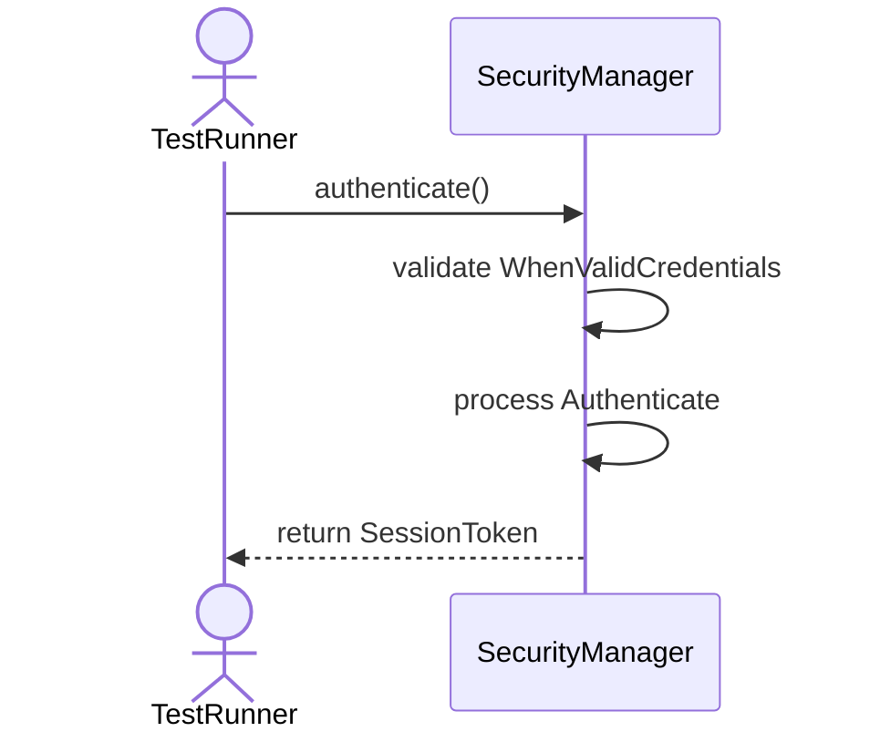
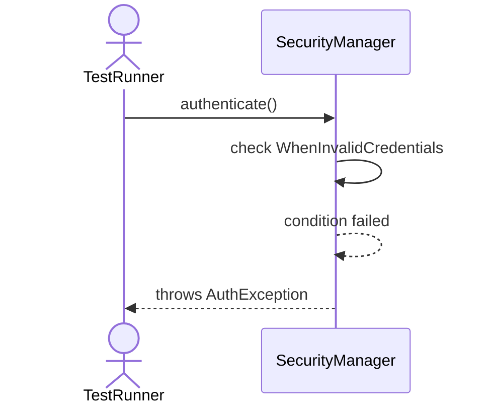
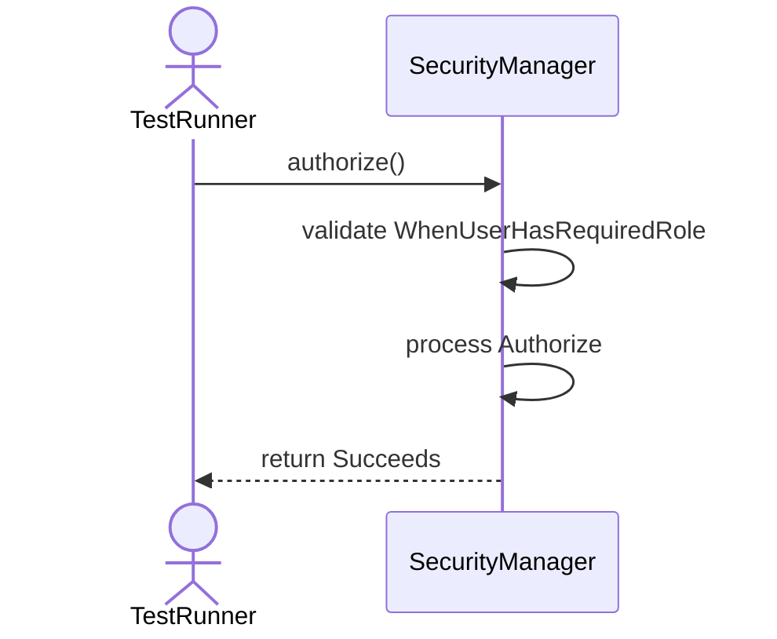
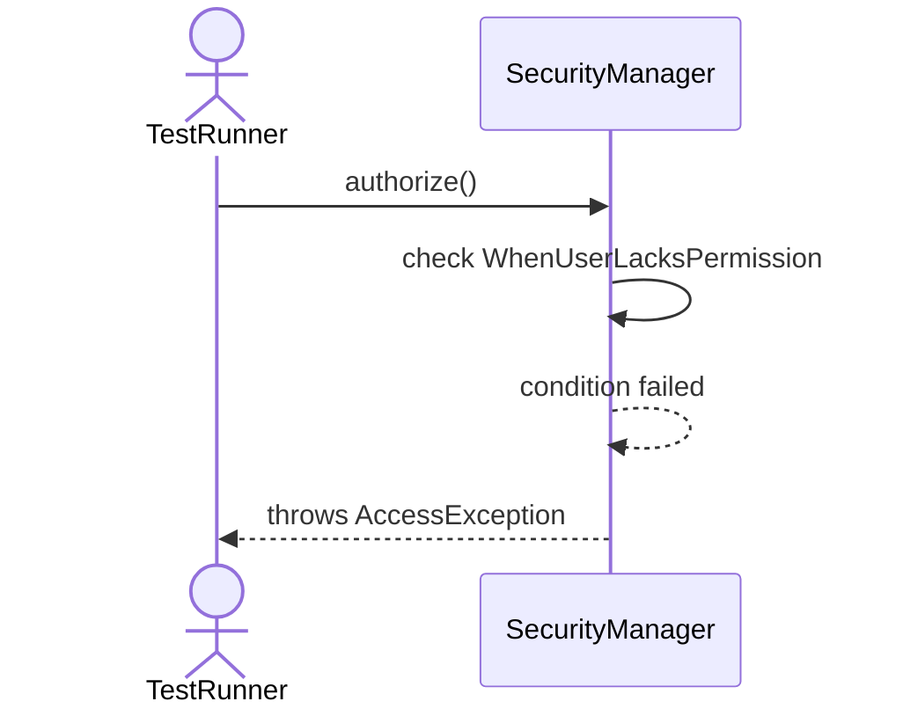
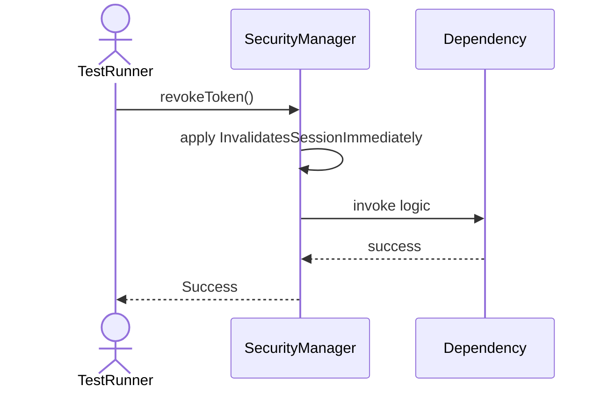
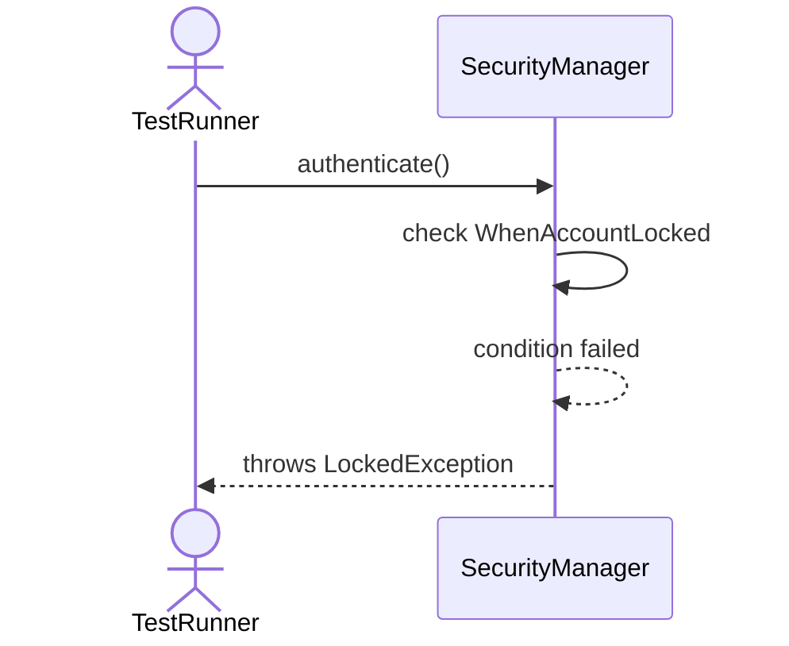
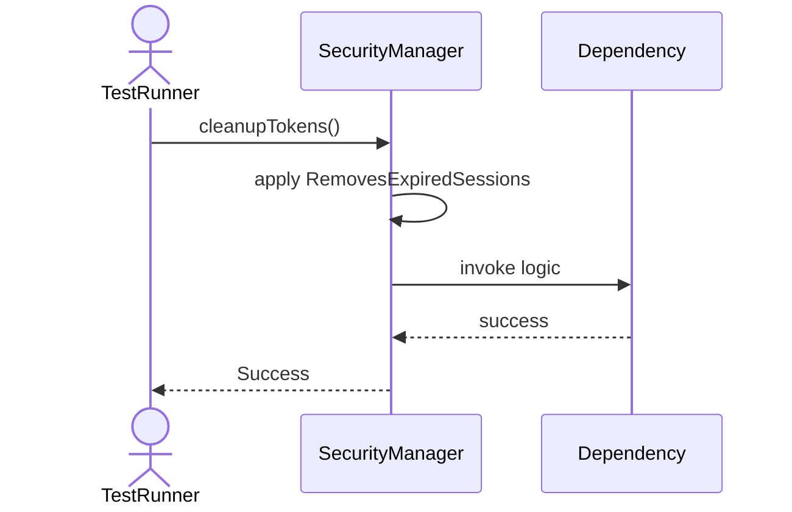

# Sequence Diagrams: SecurityManager

## 🆕 Added Properties & Methods for `SecurityManager`
To support the detailed sequence logic for unit testing, please update the `SecurityManager` class in your Class Diagram with the following properties and methods:

- **Property** added to `SecurityManager`: `usersDict (Dict)`
- **Property** added to `SecurityManager`: `activeTokens (Set)`
- **Method** added to `SecurityManager`: `authenticate()`
- **Method** added to `SecurityManager`: `authorize()`
- **Method** added to `SecurityManager`: `cleanupTokens()`
- **Method** added to `SecurityManager`: `hashPassword()`
- **Method** added to `SecurityManager`: `revokeToken()`

---

This file contains the detailed sequence diagrams for all 8 unit tests of the **SecurityManager** class.

## 1. Authenticate_WhenValidCredentials_ReturnsSessionToken

## 2. Authenticate_WhenInvalidCredentials_ThrowsAuthException

## 3. Authorize_WhenUserHasRequiredRole_Succeeds

## 4. Authorize_WhenUserLacksPermission_ThrowsAccessException

## 5. RevokeToken_InvalidatesSessionImmediately

## 6. HashPassword_UsesStrongCryptography

## 7. Authenticate_WhenAccountLocked_ThrowsLockedException

## 8. CleanupTokens_RemovesExpiredSessions

