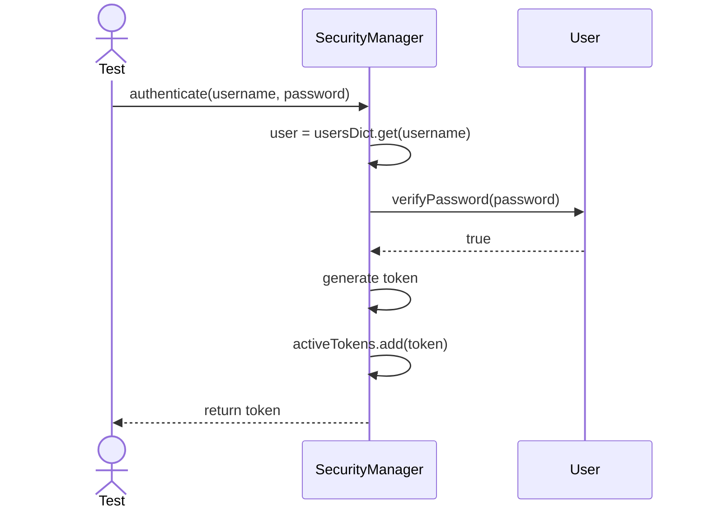
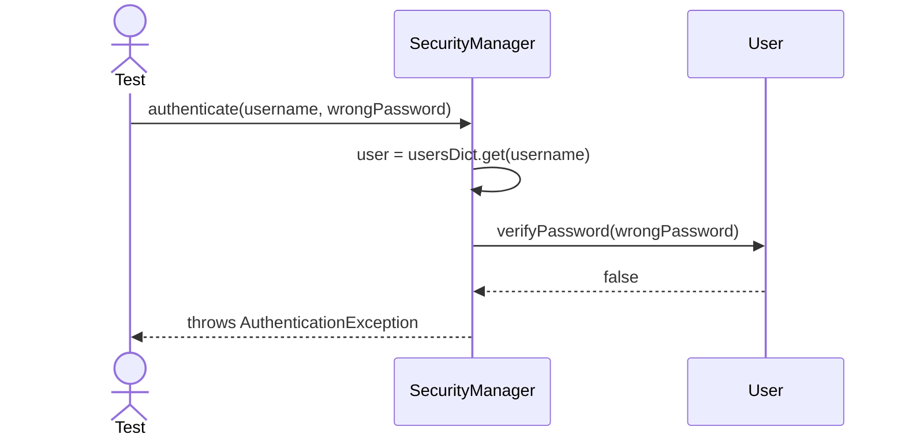
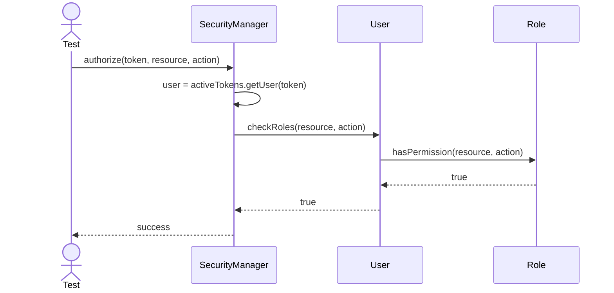
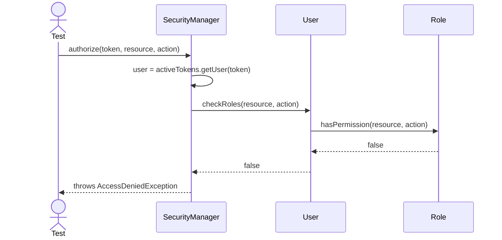

# Sequence Diagrams: SecurityManager

## 🆕 Added Properties & Methods for `SecurityManager`
To support the detailed sequence logic for unit testing, the following missing properties/methods have been introduced. **Please update the `SecurityManager` class in your Class Diagram with these:**

- **Property** added to `SecurityManager`: `usersDict` (Maps username to User object)
- **Property** added to `SecurityManager`: `activeTokens` (Tracks authenticated sessions)

---

This file contains the detailed sequence diagrams for all unit tests of the **SecurityManager** class in the Security & Access Control subsystem.

## 1. Authenticate_WhenValidCredentials_ReturnsSessionToken

## 2. Authenticate_WhenInvalidCredentials_ThrowsAuthException

## 3. Authorize_WhenUserHasRequiredRole_Succeeds

## 4. Authorize_WhenUserLacksPermission_ThrowsAccessException

