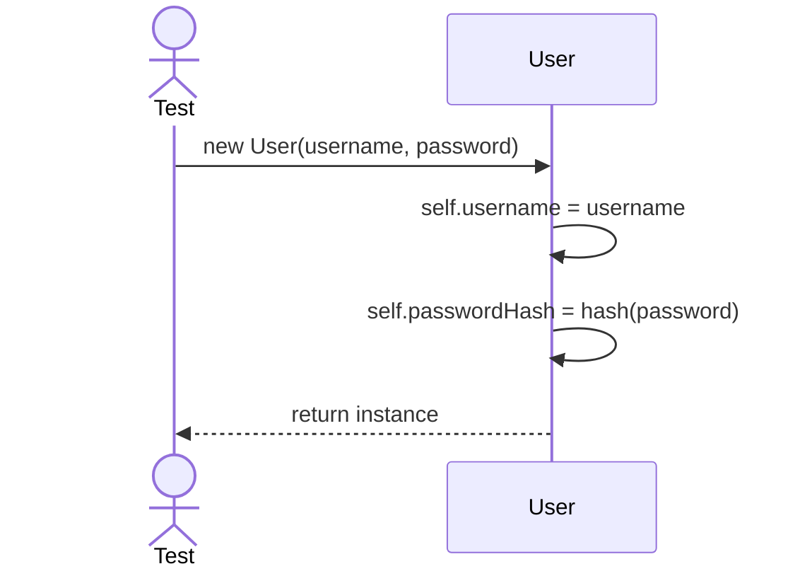
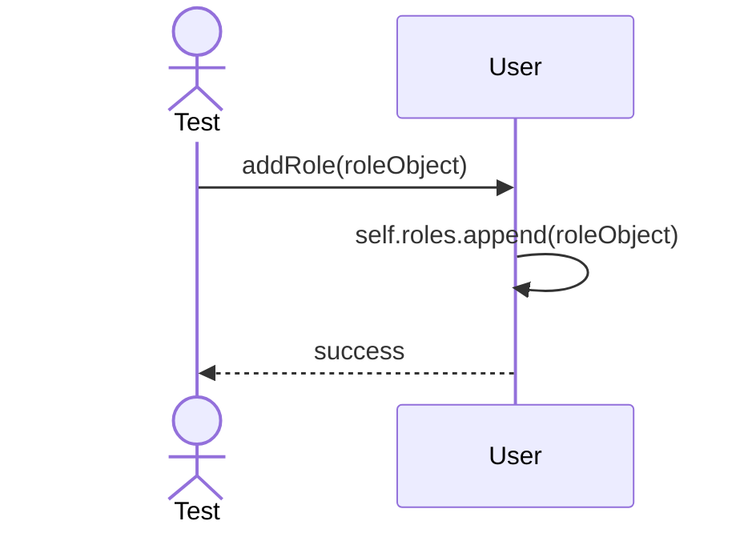

# Sequence Diagrams: User

## 🆕 Added Properties & Methods for `User`
To support the detailed sequence logic for unit testing, the following missing properties/methods have been introduced. **Please update the `User` class in your Class Diagram with these:**

- **Property** added to `User`: `roles` (List of Role objects assigned to user)

---

This file contains the detailed sequence diagrams for all unit tests of the **User** class in the Security & Access Control subsystem.

## 1. Init_SetsUsernameAndHashedPassword

## 2. AddRole_AssignsNewRoleToUser

