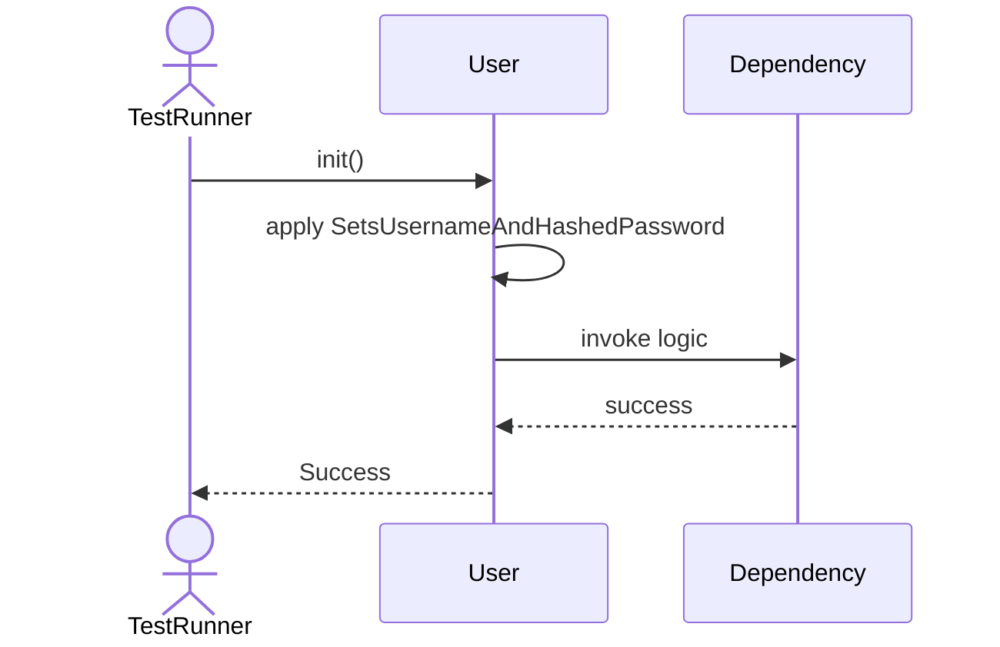
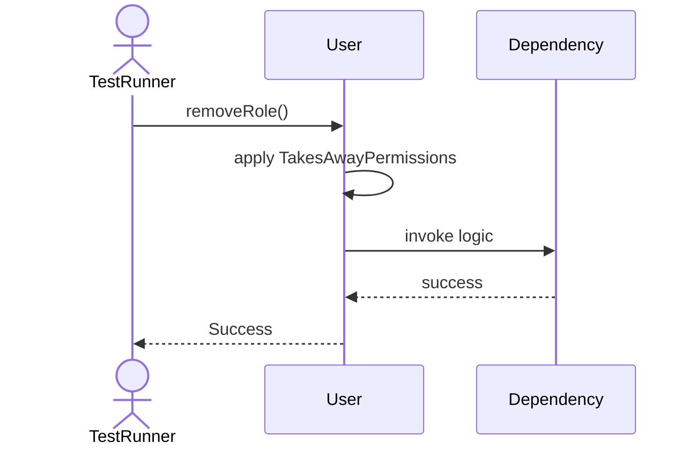
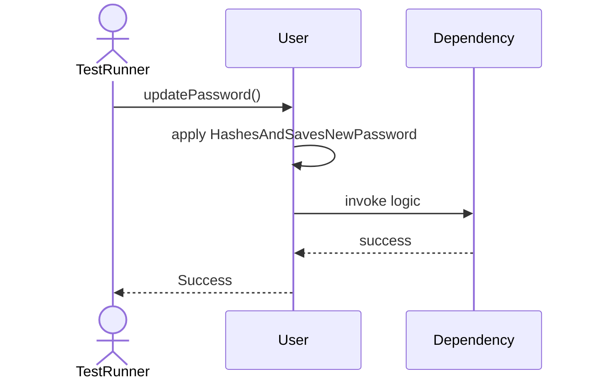
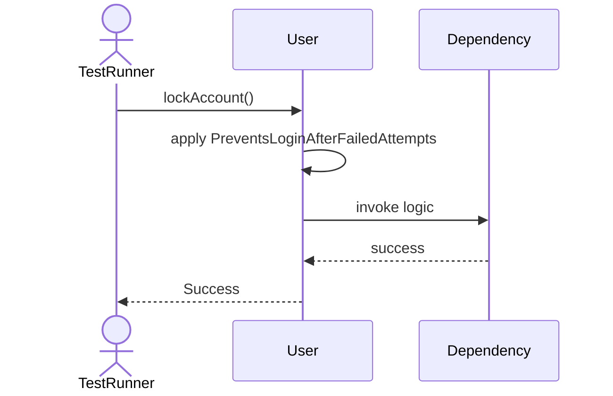
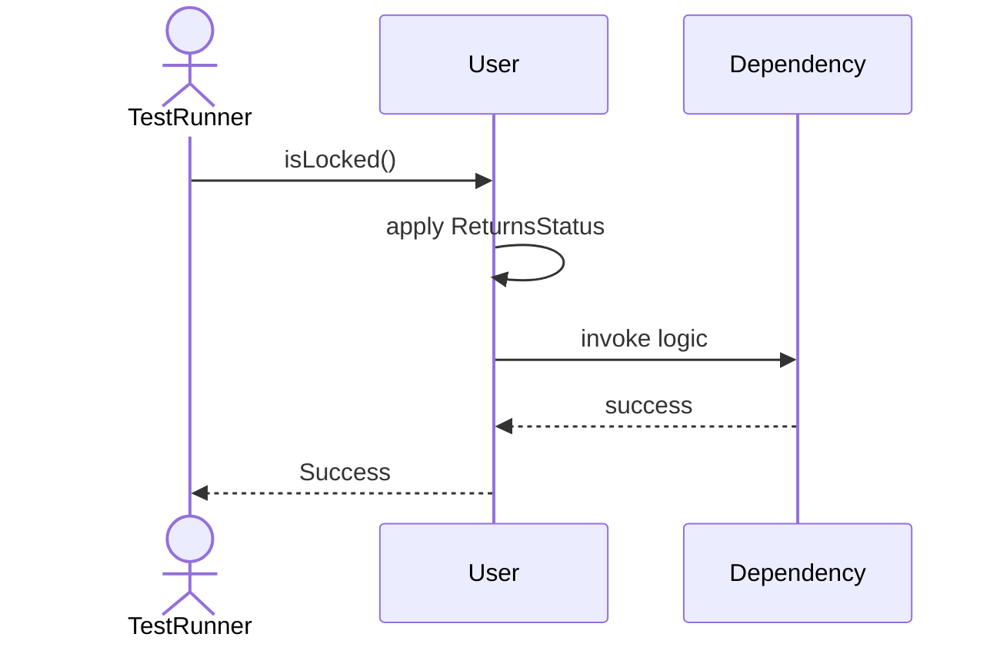

# Sequence Diagrams: User

## 🆕 Added Properties & Methods for `User`
To support the detailed sequence logic for unit testing, please update the `User` class in your Class Diagram with the following properties and methods:

- **Property** added to `User`: `roles (List)`
- **Property** added to `User`: `isLocked (Bool)`
- **Method** added to `User`: `addRole()`
- **Method** added to `User`: `hasRole()`
- **Method** added to `User`: `isLocked()`
- **Method** added to `User`: `lockAccount()`
- **Method** added to `User`: `removeRole()`
- **Method** added to `User`: `updatePassword()`

---

This file contains the detailed sequence diagrams for all 7 unit tests of the **User** class.

## 1. Init_SetsUsernameAndHashedPassword

## 2. AddRole_AssignsNewRoleToUser

## 3. RemoveRole_TakesAwayPermissions

## 4. UpdatePassword_HashesAndSavesNewPassword

## 5. LockAccount_PreventsLoginAfterFailedAttempts

## 6. IsLocked_ReturnsStatus

## 7. HasRole_ReturnsTrueIfAssigned

