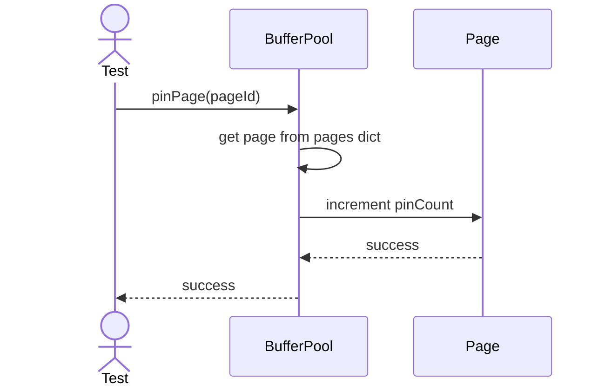
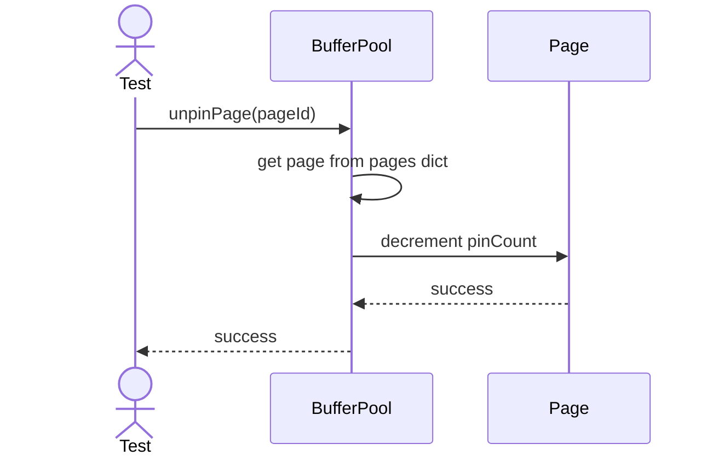
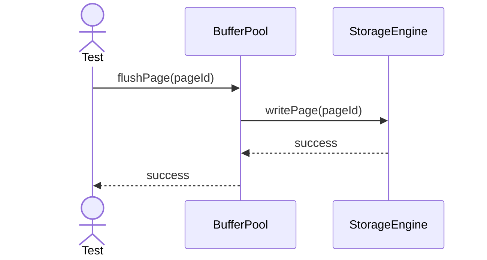
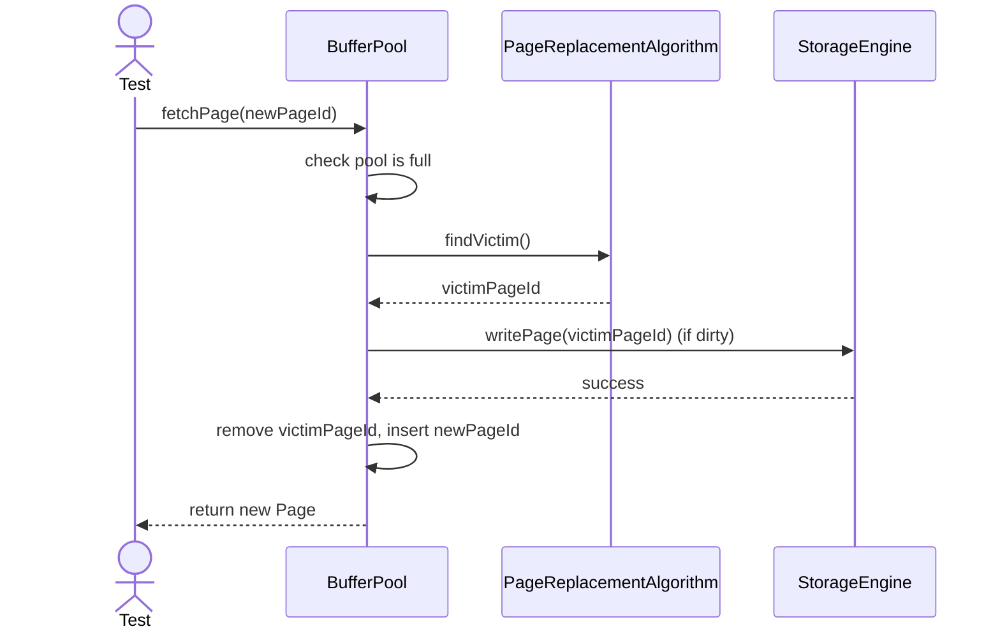

# Sequence Diagrams: BufferPool

## 🆕 Added Properties & Methods for `BufferPool`
To support the detailed sequence logic for unit testing, the following missing properties/methods have been introduced. **Please update the `BufferPool` class in your Class Diagram with these:**

- **Property** added to `BufferPool`: `pages` (Dictionary of cached pages)
- **Property** added to `BufferPool`: `replacementAlgorithm` (Reference to PageReplacementAlgorithm)
- **Method** added to `BufferPool`: `evictPage()` (Finds a victim page and removes it)

---

This file contains the detailed sequence diagrams for all unit tests of the **BufferPool** class in the Storage Engine subsystem.

## 1. PinPage_IncrementsPinCountAndPreventsEviction

## 2. UnpinPage_DecrementsPinCount

## 3. FlushPage_ForcesDirtyPageToDisk

## 4. FetchPage_WhenPoolFull_EvictsUnpinnedPage

