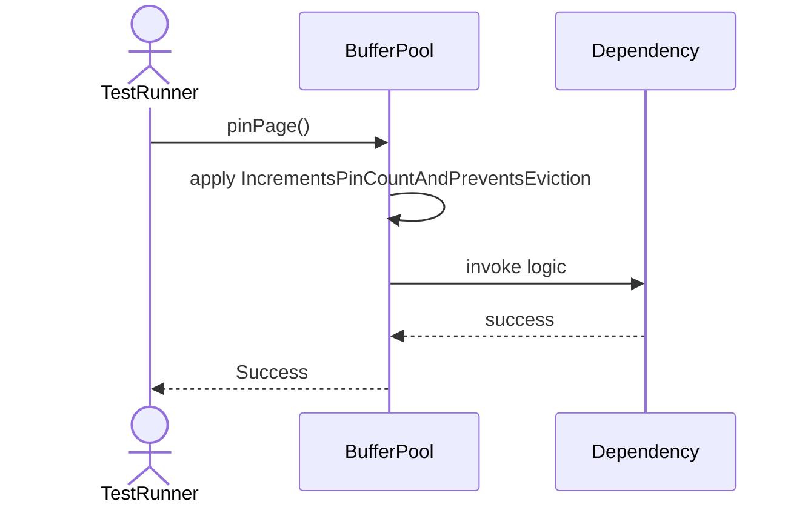
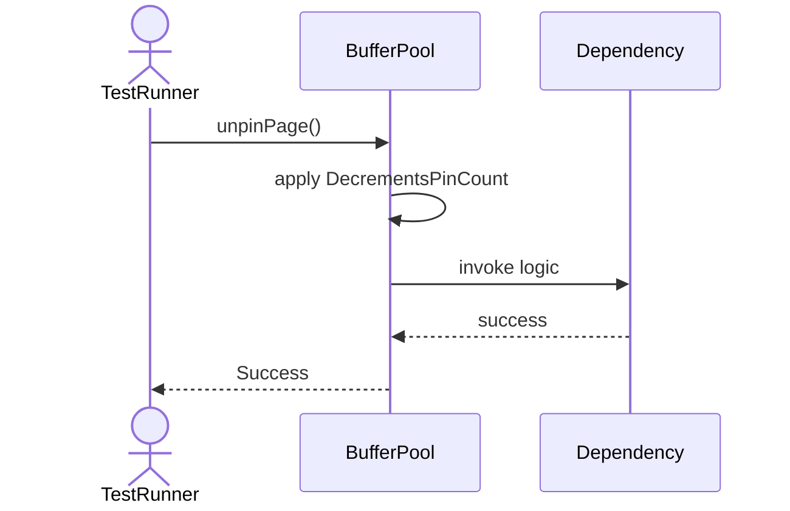
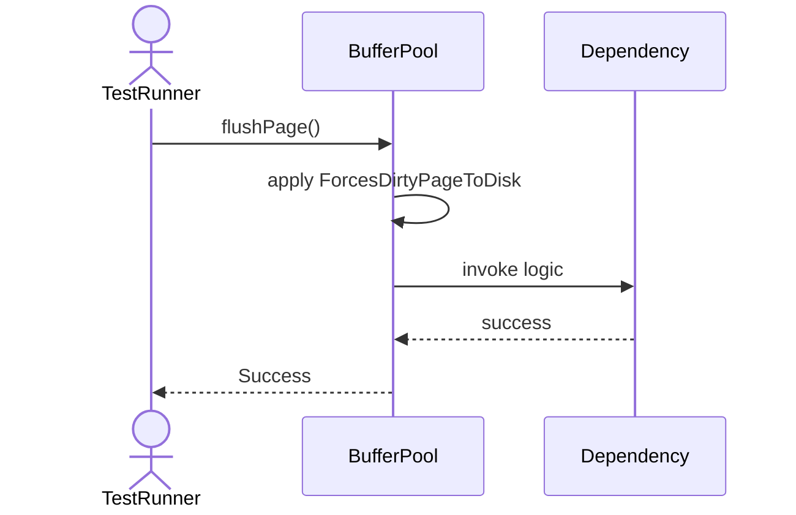
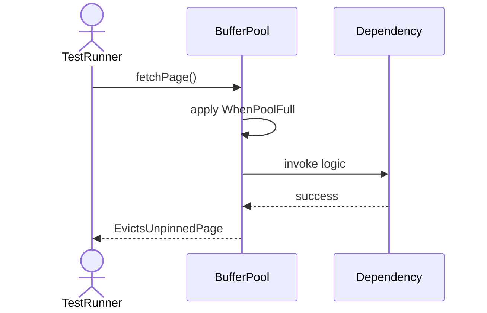
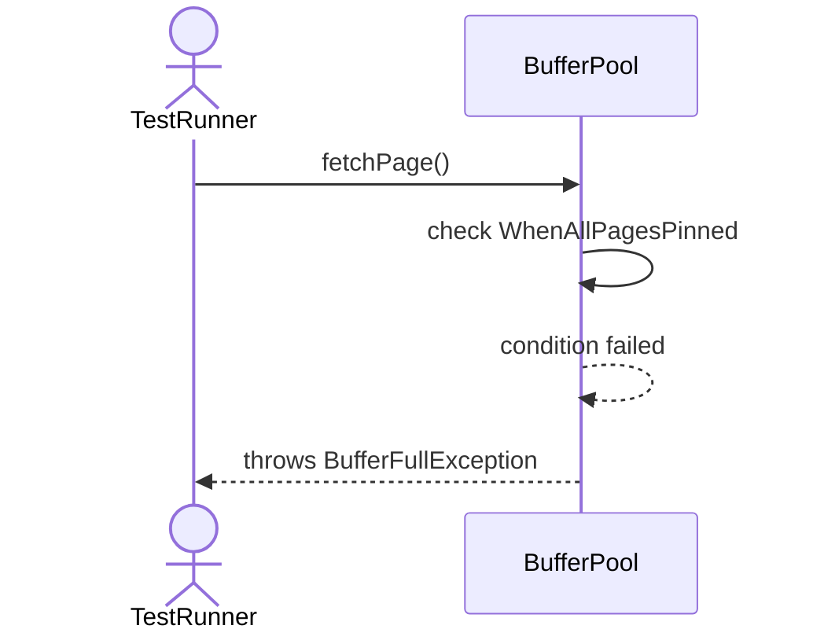
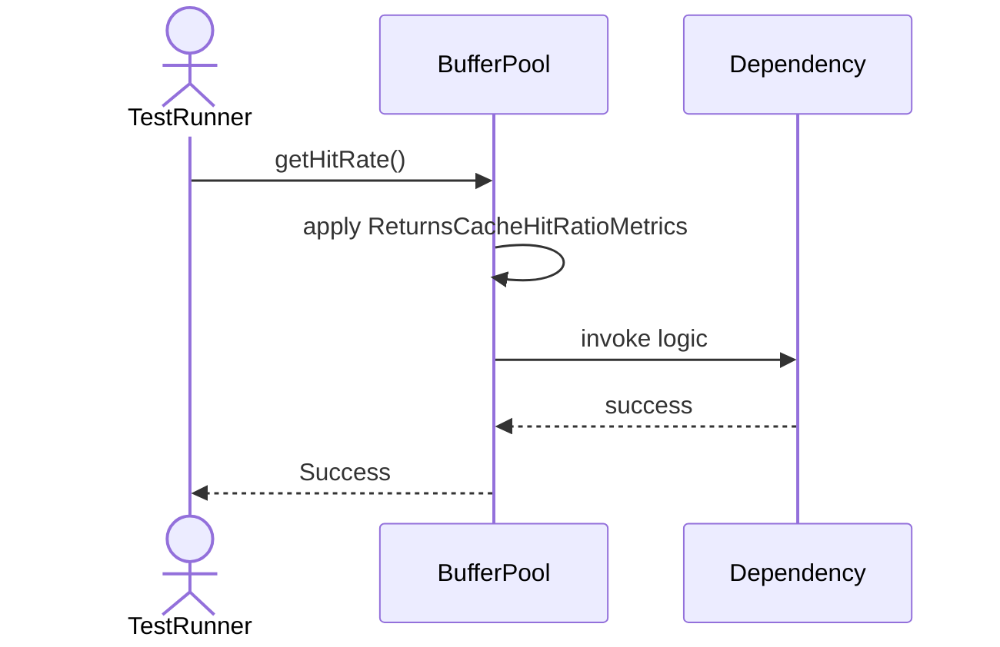
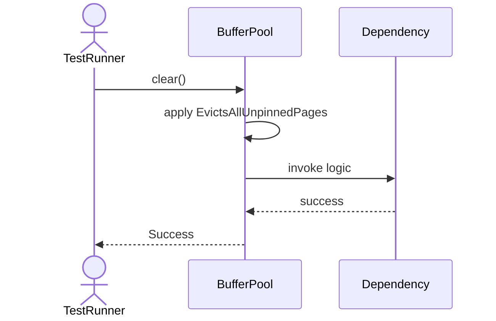
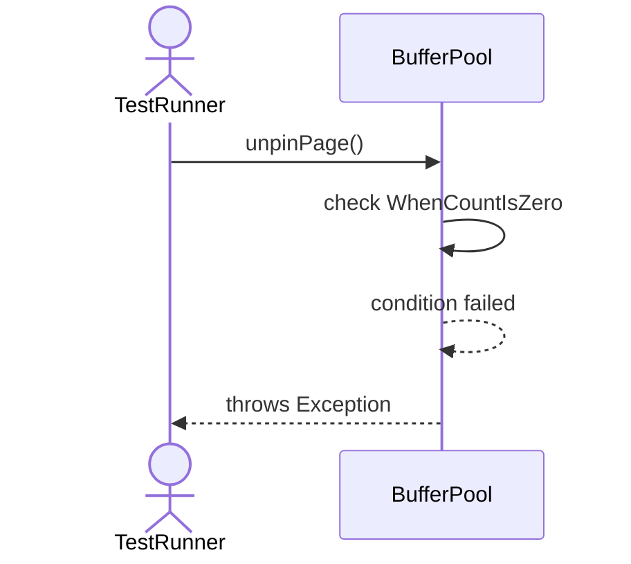

# Sequence Diagrams: BufferPool

## 🆕 Added Properties & Methods for `BufferPool`
To support the detailed sequence logic for unit testing, please update the `BufferPool` class in your Class Diagram with the following properties and methods:

- **Property** added to `BufferPool`: `pages (Dict)`
- **Property** added to `BufferPool`: `replacementAlgorithm`
- **Property** added to `BufferPool`: `maxSize (Int)`
- **Method** added to `BufferPool`: `clear()`
- **Method** added to `BufferPool`: `fetchPage()`
- **Method** added to `BufferPool`: `flushPage()`
- **Method** added to `BufferPool`: `getHitRate()`
- **Method** added to `BufferPool`: `pinPage()`
- **Method** added to `BufferPool`: `unpinPage()`

---

This file contains the detailed sequence diagrams for all 8 unit tests of the **BufferPool** class.

## 1. PinPage_IncrementsPinCountAndPreventsEviction

## 2. UnpinPage_DecrementsPinCount

## 3. FlushPage_ForcesDirtyPageToDisk

## 4. FetchPage_WhenPoolFull_EvictsUnpinnedPage

## 5. FetchPage_WhenAllPagesPinned_ThrowsBufferFullException

## 6. GetHitRate_ReturnsCacheHitRatioMetrics

## 7. Clear_EvictsAllUnpinnedPages

## 8. UnpinPage_WhenCountIsZero_ThrowsException

