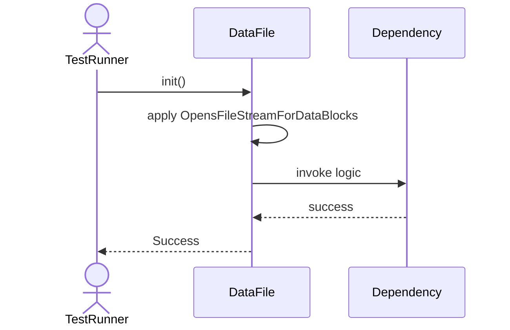
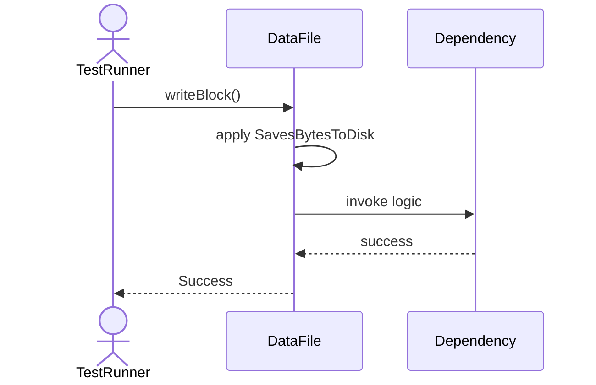
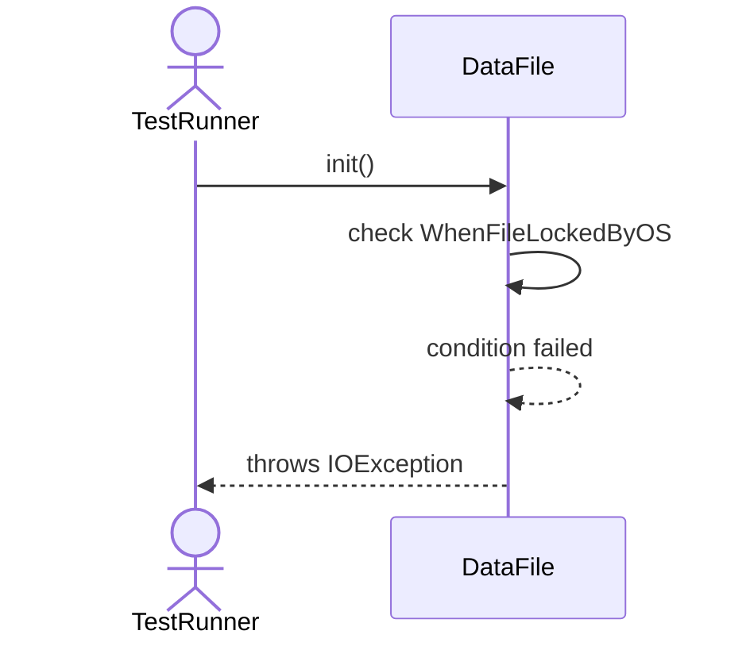

# Sequence Diagrams: DataFile

## 🆕 Added Properties & Methods for `DataFile`
To support the detailed sequence logic for unit testing, please update the `DataFile` class in your Class Diagram with the following properties and methods:

- **Property** added to `DataFile`: `fileStream`
- **Method** added to `DataFile`: `deleteFile()`
- **Method** added to `DataFile`: `readBlock()`
- **Method** added to `DataFile`: `writeBlock()`

---

This file contains the detailed sequence diagrams for all 5 unit tests of the **DataFile** class.

## 1. Init_OpensFileStreamForDataBlocks

## 2. ReadBlock_LoadsBytesFromDisk

## 3. WriteBlock_SavesBytesToDisk

## 4. DeleteFile_RemovesFromOS

## 5. Init_WhenFileLockedByOS_ThrowsIOException

