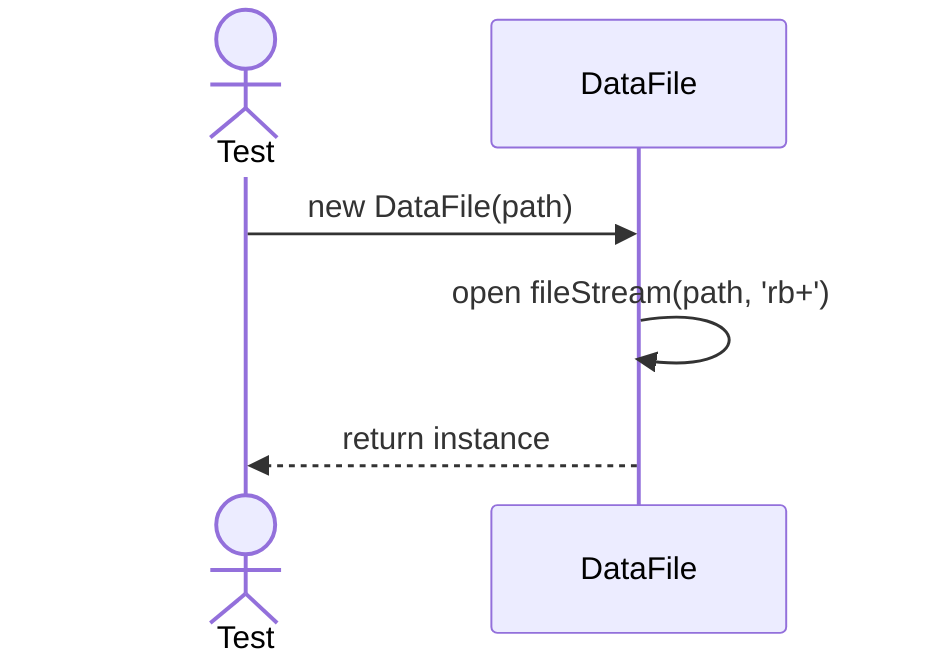
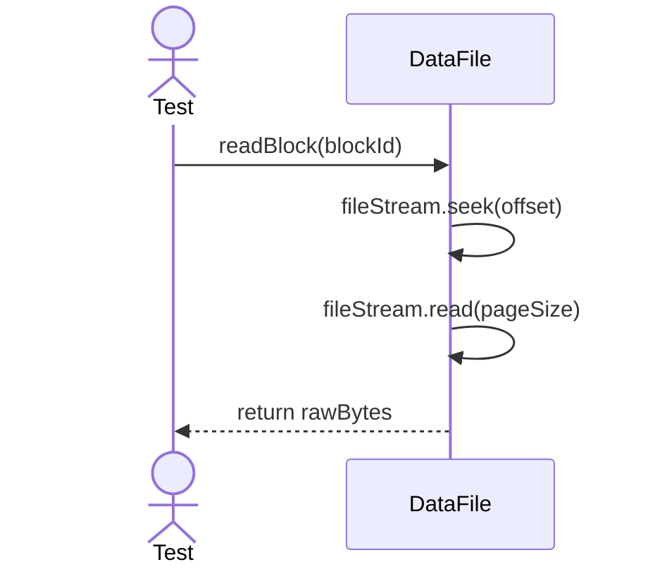

# Sequence Diagrams: DataFile

## 🆕 Added Properties & Methods for `DataFile`
To support the detailed sequence logic for unit testing, the following missing properties/methods have been introduced. **Please update the `DataFile` class in your Class Diagram with these:**

- **Property** added to `DataFile`: `fileStream` (IO stream handle)

---

This file contains the detailed sequence diagrams for all unit tests of the **DataFile** class in the Storage Engine subsystem.

## 1. Init_OpensFileStreamForDataBlocks

## 2. ReadBlock_LoadsBytesFromDisk

