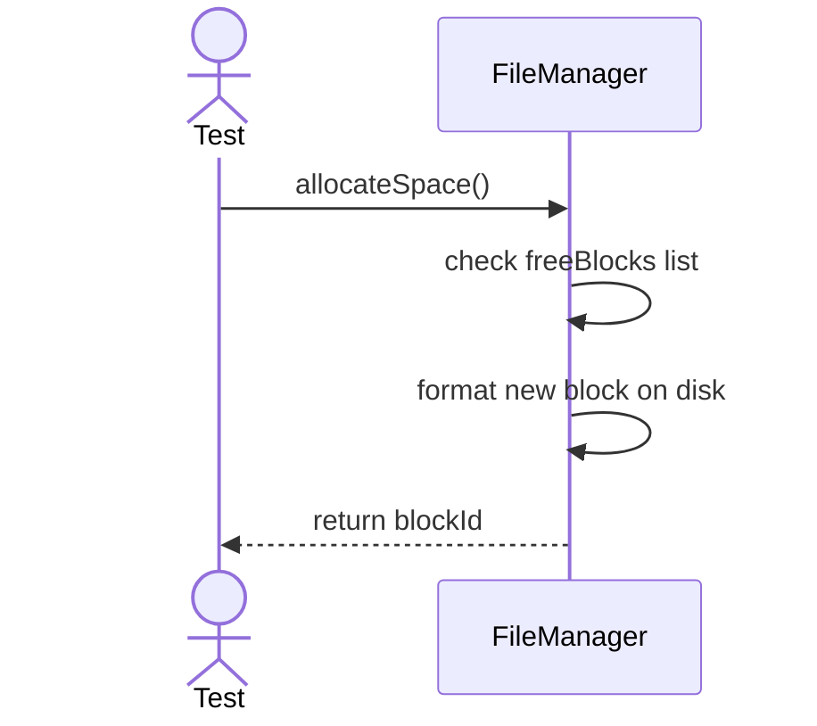
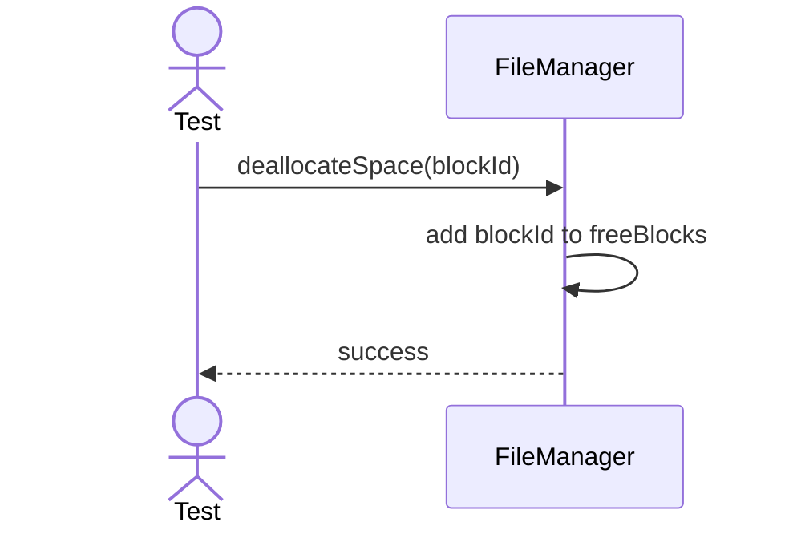

# Sequence Diagrams: FileManager

## 🆕 Added Properties & Methods for `FileManager`
To support the detailed sequence logic for unit testing, the following missing properties/methods have been introduced. **Please update the `FileManager` class in your Class Diagram with these:**

- **Property** added to `FileManager`: `freeBlocks` (List of deallocated block IDs)

---

This file contains the detailed sequence diagrams for all unit tests of the **FileManager** class in the Storage Engine subsystem.

## 1. AllocateSpace_CreatesNewBlockAndReturnsId

## 2. DeallocateSpace_MarksBlockAsFree

