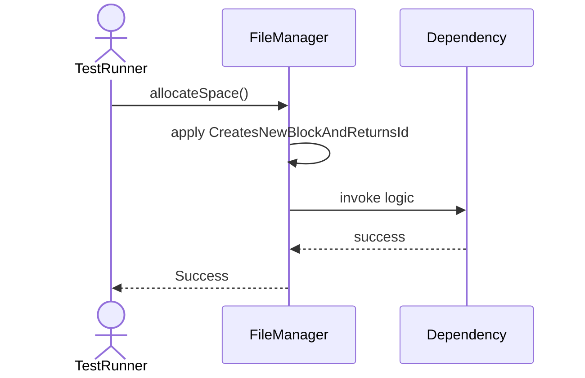
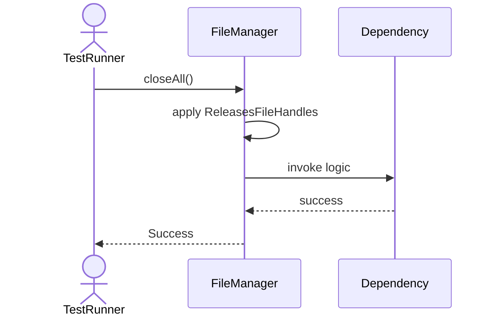
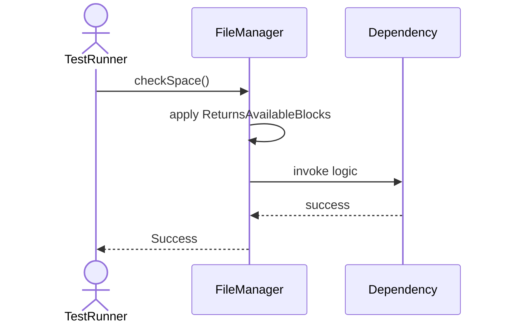

# Sequence Diagrams: FileManager

## 🆕 Added Properties & Methods for `FileManager`
To support the detailed sequence logic for unit testing, please update the `FileManager` class in your Class Diagram with the following properties and methods:

- **Property** added to `FileManager`: `freeBlocks (List)`
- **Method** added to `FileManager`: `allocateSpace()`
- **Method** added to `FileManager`: `checkSpace()`
- **Method** added to `FileManager`: `closeAll()`
- **Method** added to `FileManager`: `deallocateSpace()`
- **Method** added to `FileManager`: `extendFile()`
- **Method** added to `FileManager`: `getFileSize()`

---

This file contains the detailed sequence diagrams for all 6 unit tests of the **FileManager** class.

## 1. AllocateSpace_CreatesNewBlockAndReturnsId

## 2. DeallocateSpace_MarksBlockAsFree

## 3. ExtendFile_IncreasesFileSizeWhenFull

## 4. CloseAll_ReleasesFileHandles

## 5. GetFileSize_ReturnsSizeInBytes

## 6. CheckSpace_ReturnsAvailableBlocks

