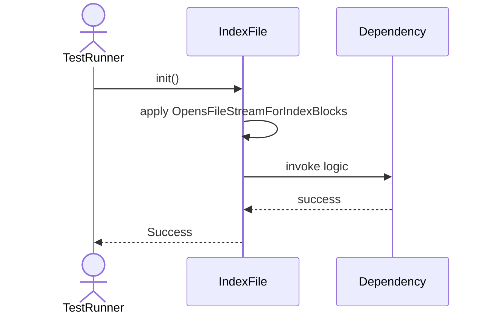
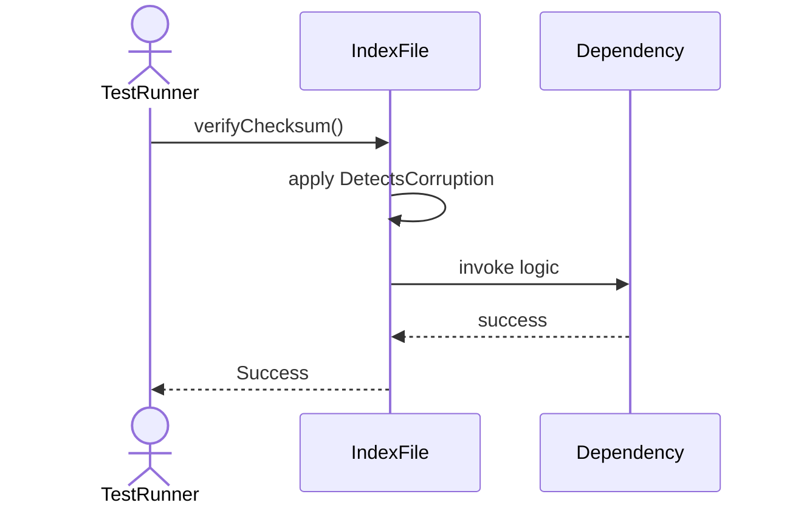

# Sequence Diagrams: IndexFile

## 🆕 Added Properties & Methods for `IndexFile`
To support the detailed sequence logic for unit testing, please update the `IndexFile` class in your Class Diagram with the following properties and methods:

- **Property** added to `IndexFile`: `fileStream`
- **Method** added to `IndexFile`: `readBlock()`
- **Method** added to `IndexFile`: `rebuild()`
- **Method** added to `IndexFile`: `verifyChecksum()`
- **Method** added to `IndexFile`: `writeBlock()`

---

This file contains the detailed sequence diagrams for all 5 unit tests of the **IndexFile** class.

## 1. Init_OpensFileStreamForIndexBlocks

## 2. WriteBlock_SavesBytesToDisk

## 3. ReadBlock_LoadsBytesFromDisk

## 4. Rebuild_CompactsIndexData

## 5. VerifyChecksum_DetectsCorruption

