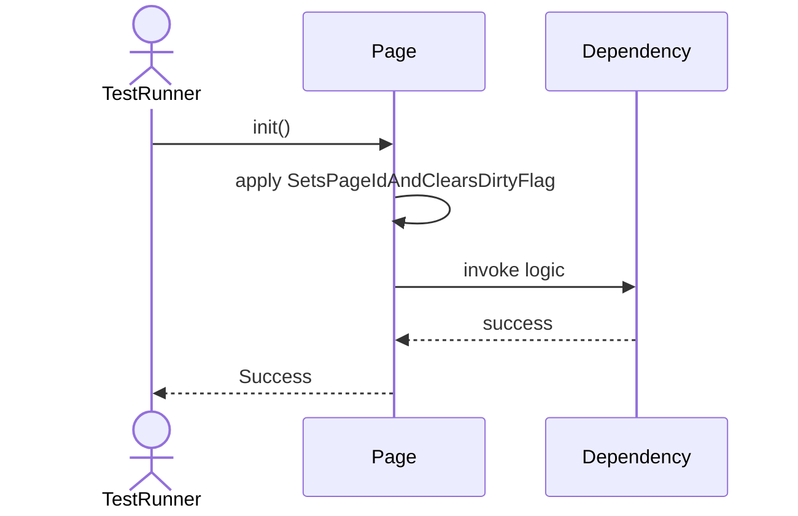
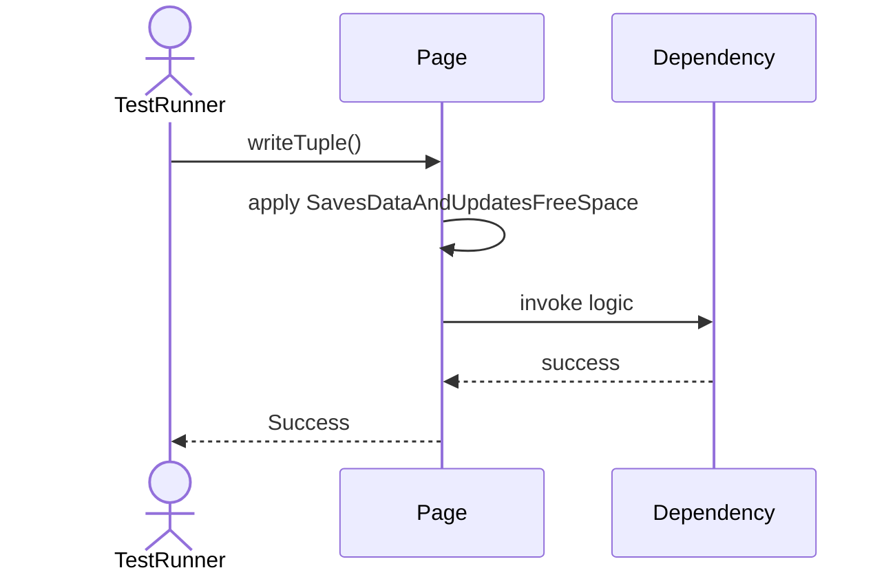
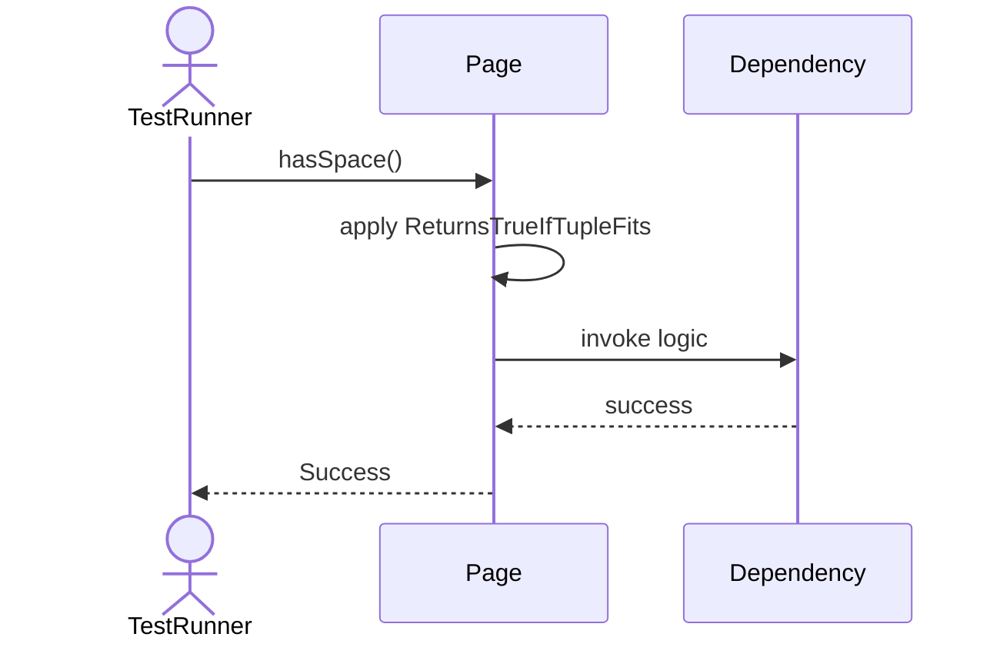
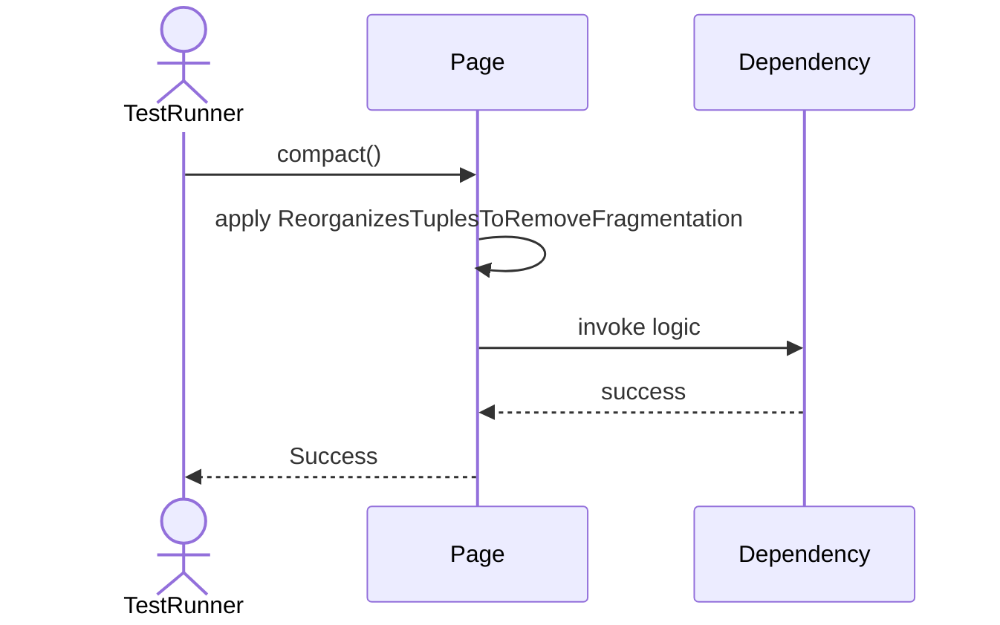
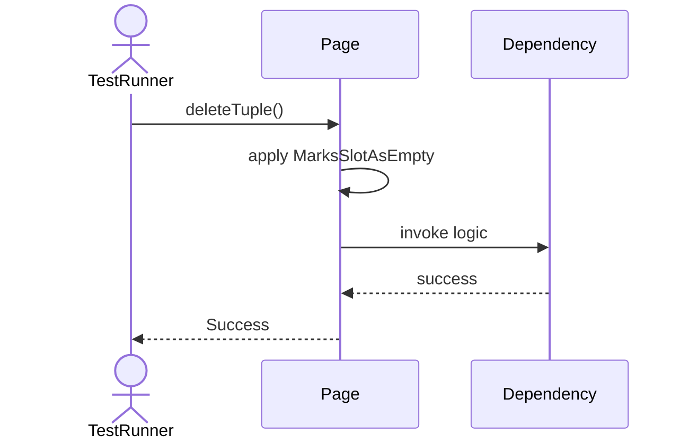

# Sequence Diagrams: Page

## 🆕 Added Properties & Methods for `Page`
To support the detailed sequence logic for unit testing, please update the `Page` class in your Class Diagram with the following properties and methods:

- **Property** added to `Page`: `pageId`
- **Property** added to `Page`: `isDirty (Bool)`
- **Property** added to `Page`: `pinCount (Int)`
- **Method** added to `Page`: `compact()`
- **Method** added to `Page`: `deleteTuple()`
- **Method** added to `Page`: `hasSpace()`
- **Method** added to `Page`: `markDirty()`
- **Method** added to `Page`: `readTuple()`
- **Method** added to `Page`: `writeTuple()`

---

This file contains the detailed sequence diagrams for all 7 unit tests of the **Page** class.

## 1. Init_SetsPageIdAndClearsDirtyFlag

## 2. MarkDirty_SetsDirtyFlagToTrue

## 3. ReadTuple_ReturnsDataAtOffset

## 4. WriteTuple_SavesDataAndUpdatesFreeSpace

## 5. HasSpace_ReturnsTrueIfTupleFits

## 6. Compact_ReorganizesTuplesToRemoveFragmentation

## 7. DeleteTuple_MarksSlotAsEmpty

