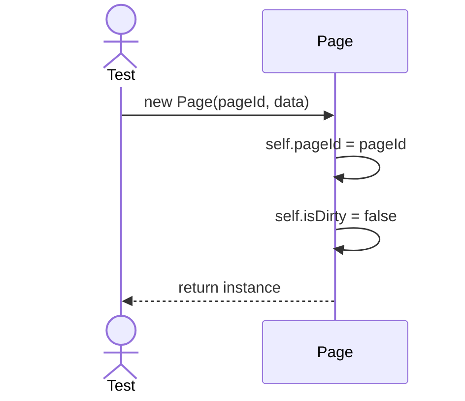
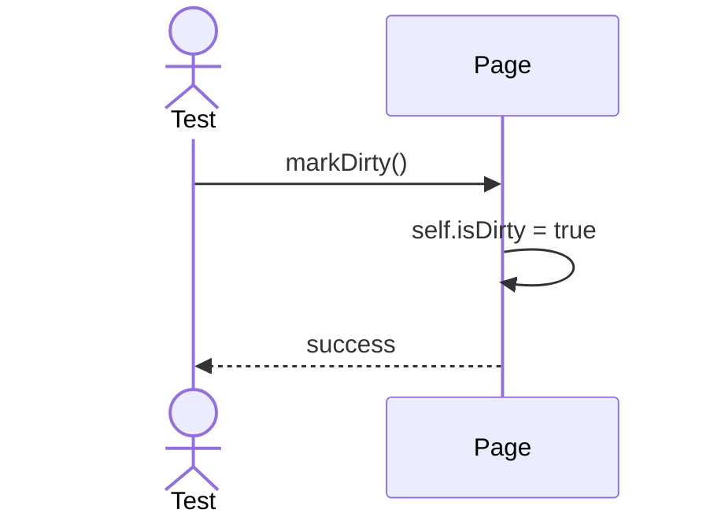

# Sequence Diagrams: Page

## 🆕 Added Properties & Methods for `Page`
To support the detailed sequence logic for unit testing, the following missing properties/methods have been introduced. **Please update the `Page` class in your Class Diagram with these:**

- **Property** added to `Page`: `pageId`, `isDirty`, `pinCount`

---

This file contains the detailed sequence diagrams for all unit tests of the **Page** class in the Storage Engine subsystem.

## 1. Init_SetsPageIdAndClearsDirtyFlag

## 2. MarkDirty_SetsDirtyFlagToTrue

