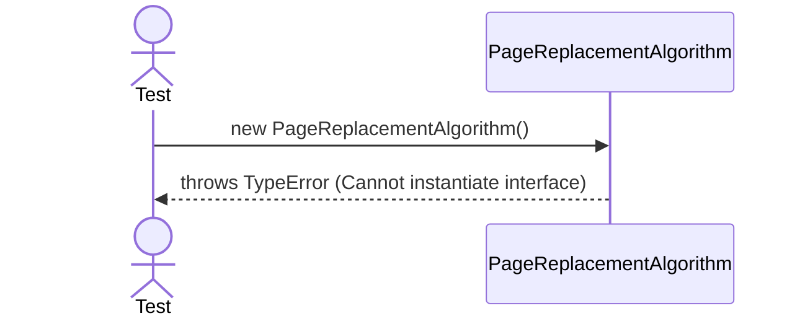
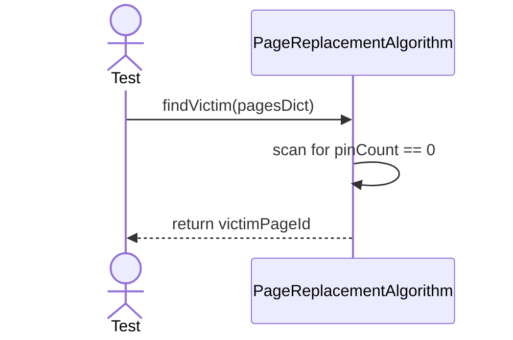

# Sequence Diagrams: PageReplacementAlgorithm

## 🆕 Added Properties & Methods for `PageReplacementAlgorithm`
To support the detailed sequence logic for unit testing, the following missing properties/methods have been introduced. **Please update the `PageReplacementAlgorithm` class in your Class Diagram with these:**

- **Method** added to `PageReplacementAlgorithm`: `findVictim()` (Identifies least recently used/unpinned page)

---

This file contains the detailed sequence diagrams for all unit tests of the **PageReplacementAlgorithm** class in the Storage Engine subsystem.

## 1. Instantiation_OfInterface_FailsWithTypeError

## 2. FindVictim_Implementation_ReturnsUnpinnedPageId

