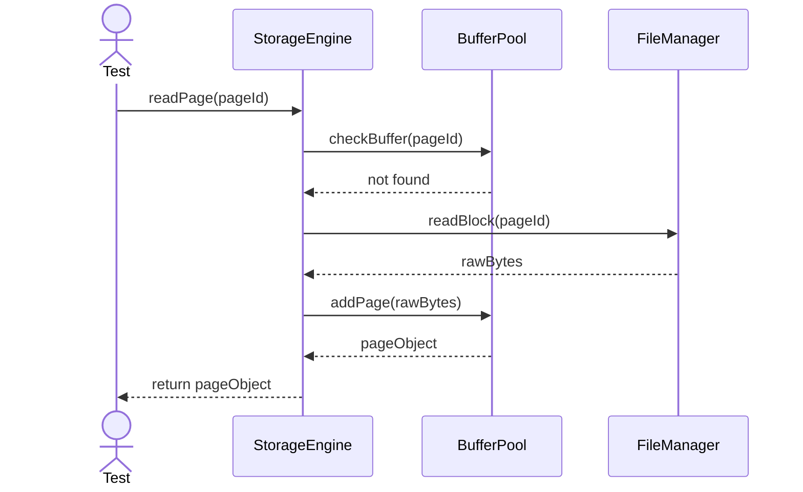
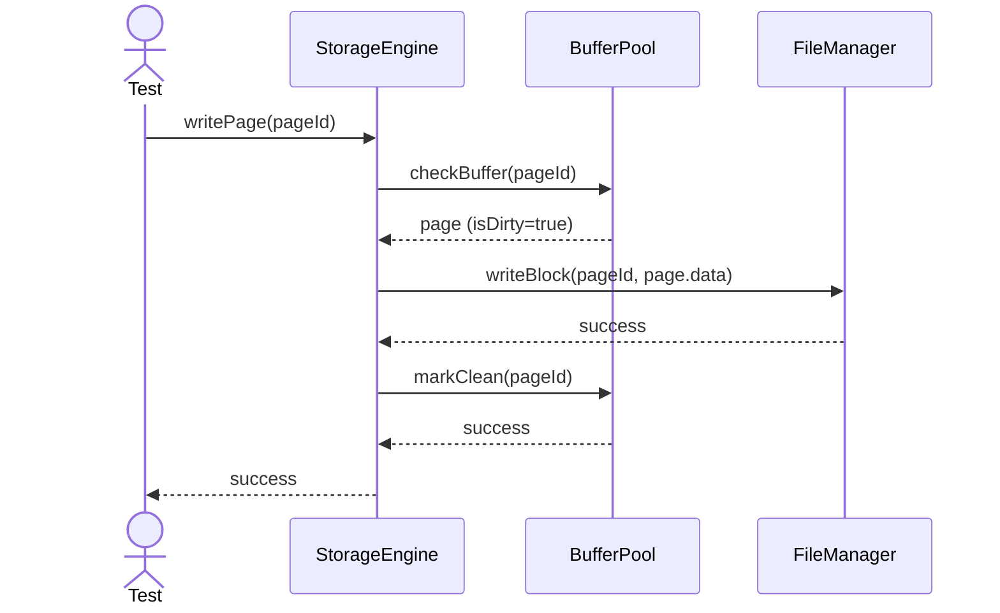

# Sequence Diagrams: StorageEngine

## 🆕 Added Properties & Methods for `StorageEngine`
To support the detailed sequence logic for unit testing, the following missing properties/methods have been introduced. **Please update the `StorageEngine` class in your Class Diagram with these:**

- **Method** added to `StorageEngine`: `checkBuffer(pageId)` (Checks BufferPool before disk access)

---

This file contains the detailed sequence diagrams for all unit tests of the **StorageEngine** class in the Storage Engine subsystem.

## 1. ReadPage_WhenPageNotInBuffer_LoadsFromDisk

## 2. WritePage_WhenPageIsDirty_FlushesToDisk

