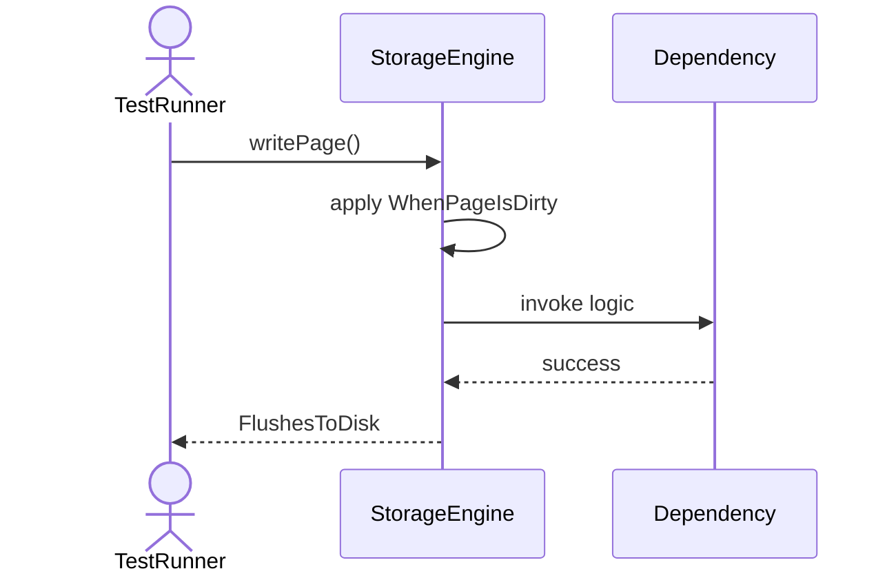
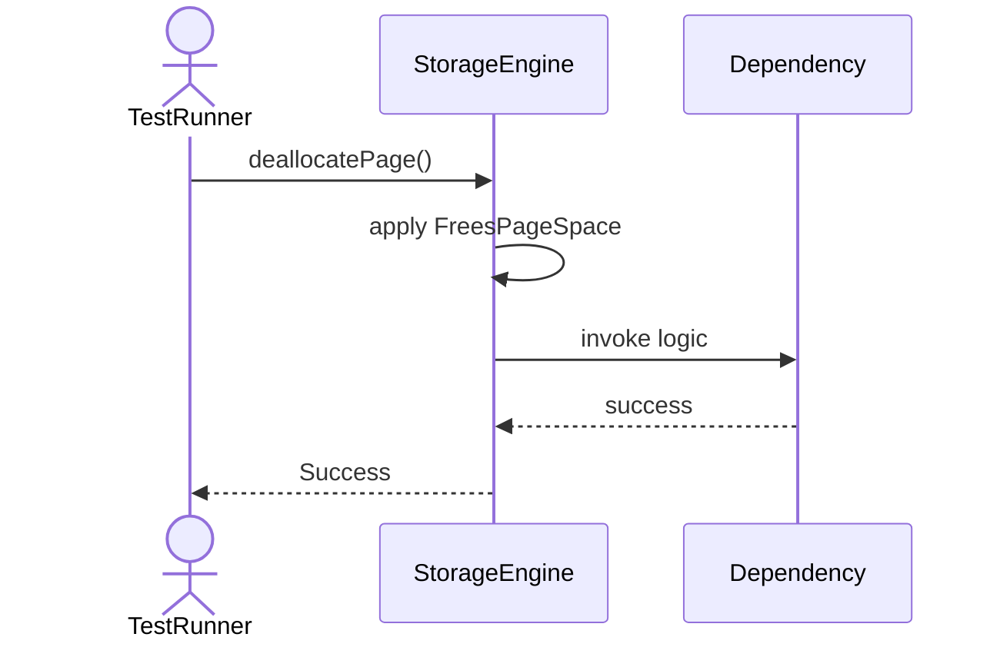
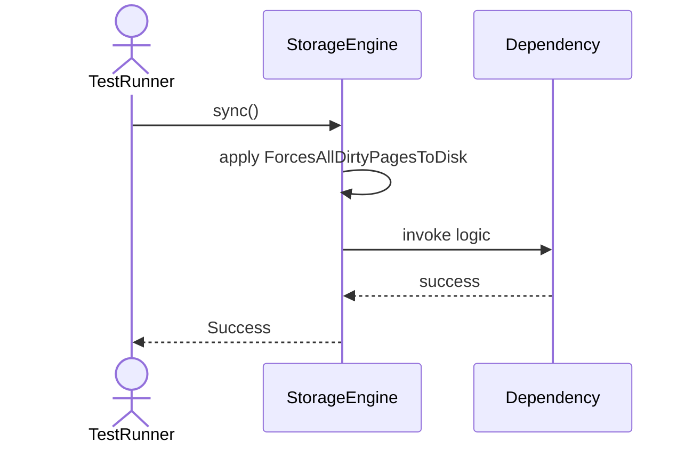
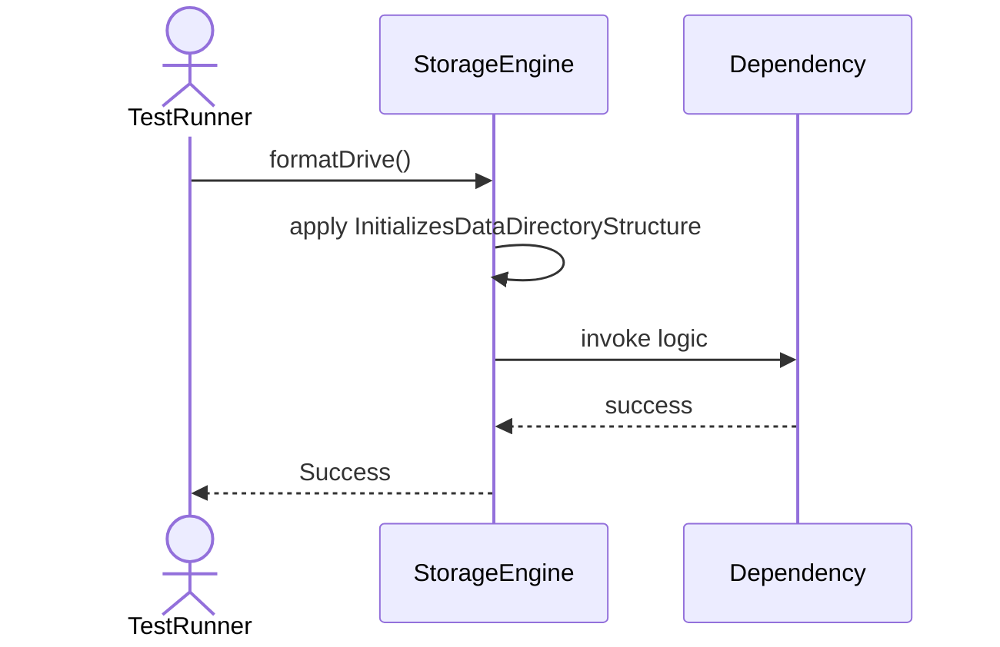

# Sequence Diagrams: StorageEngine

## 🆕 Added Properties & Methods for `StorageEngine`
To support the detailed sequence logic for unit testing, please update the `StorageEngine` class in your Class Diagram with the following properties and methods:

- **Method** added to `StorageEngine`: `allocatePage()`
- **Method** added to `StorageEngine`: `deallocatePage()`
- **Method** added to `StorageEngine`: `formatDrive()`
- **Method** added to `StorageEngine`: `readPage()`
- **Method** added to `StorageEngine`: `sync()`
- **Method** added to `StorageEngine`: `writePage()`

---

This file contains the detailed sequence diagrams for all 6 unit tests of the **StorageEngine** class.

## 1. ReadPage_WhenPageNotInBuffer_LoadsFromDisk

## 2. WritePage_WhenPageIsDirty_FlushesToDisk

## 3. AllocatePage_CreatesNewPageAndReturnsId

## 4. DeallocatePage_FreesPageSpace

## 5. Sync_ForcesAllDirtyPagesToDisk

## 6. FormatDrive_InitializesDataDirectoryStructure

