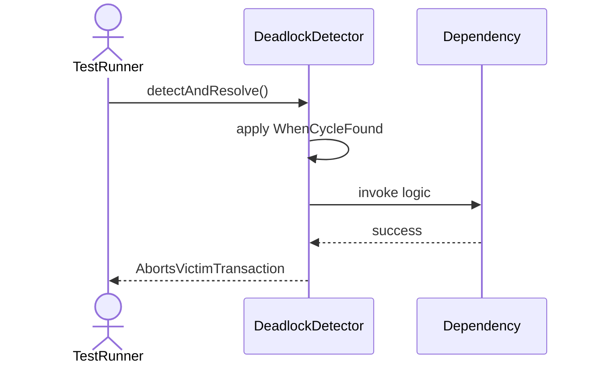
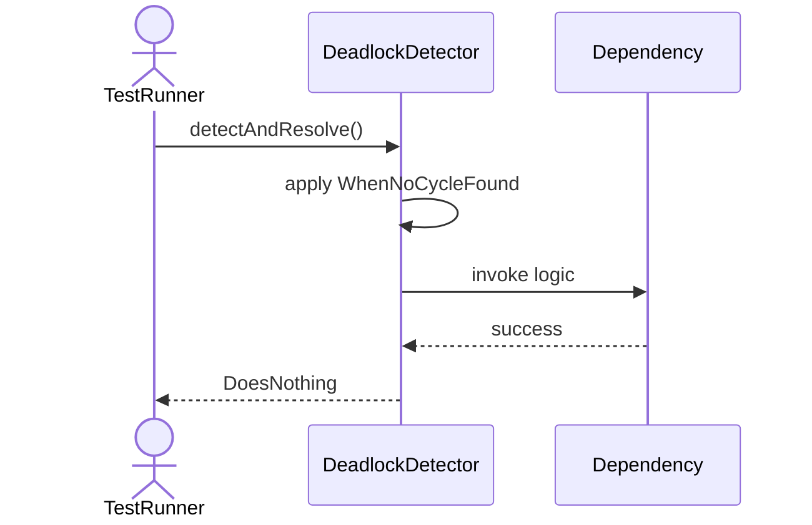
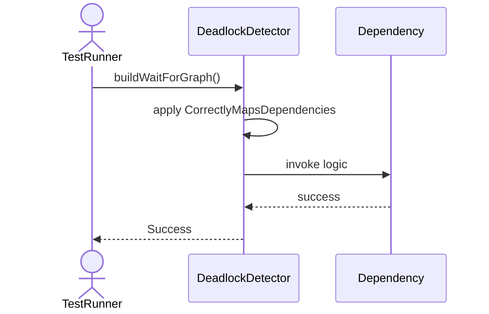
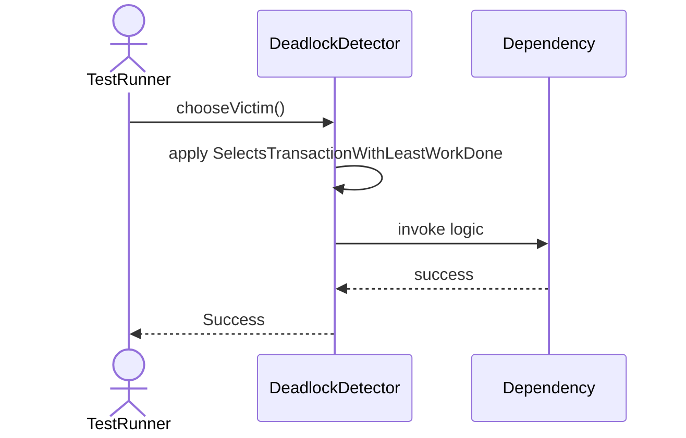
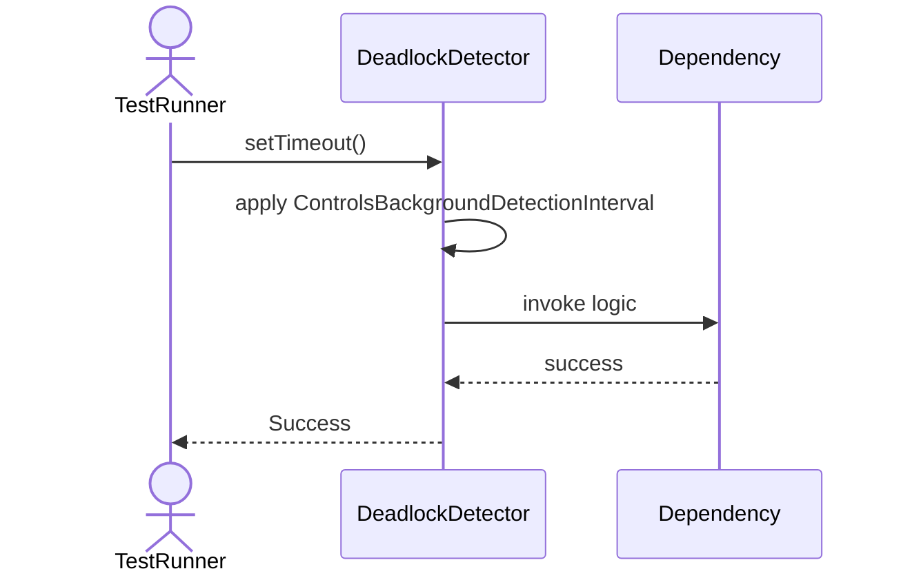

# Sequence Diagrams: DeadlockDetector

## 🆕 Added Properties & Methods for `DeadlockDetector`
To support the detailed sequence logic for unit testing, please update the `DeadlockDetector` class in your Class Diagram with the following properties and methods:

- **Property** added to `DeadlockDetector`: `waitForGraph`
- **Property** added to `DeadlockDetector`: `timeout (Int)`
- **Method** added to `DeadlockDetector`: `buildWaitForGraph()`
- **Method** added to `DeadlockDetector`: `chooseVictim()`
- **Method** added to `DeadlockDetector`: `detectAndResolve()`
- **Method** added to `DeadlockDetector`: `setTimeout()`

---

This file contains the detailed sequence diagrams for all 5 unit tests of the **DeadlockDetector** class.

## 1. DetectAndResolve_WhenCycleFound_AbortsVictimTransaction

## 2. DetectAndResolve_WhenNoCycleFound_DoesNothing

## 3. BuildWaitForGraph_CorrectlyMapsDependencies

## 4. ChooseVictim_SelectsTransactionWithLeastWorkDone

## 5. SetTimeout_ControlsBackgroundDetectionInterval

