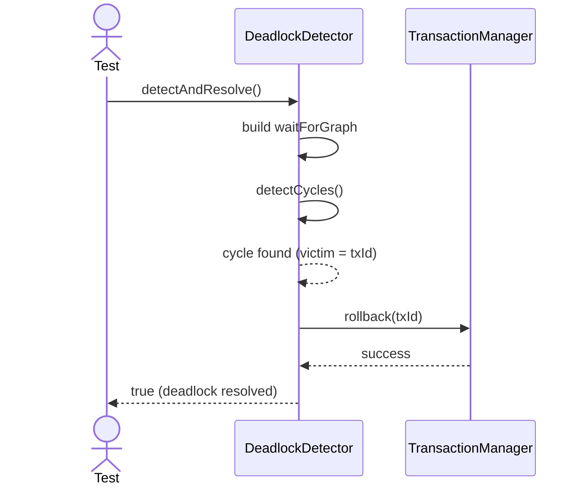
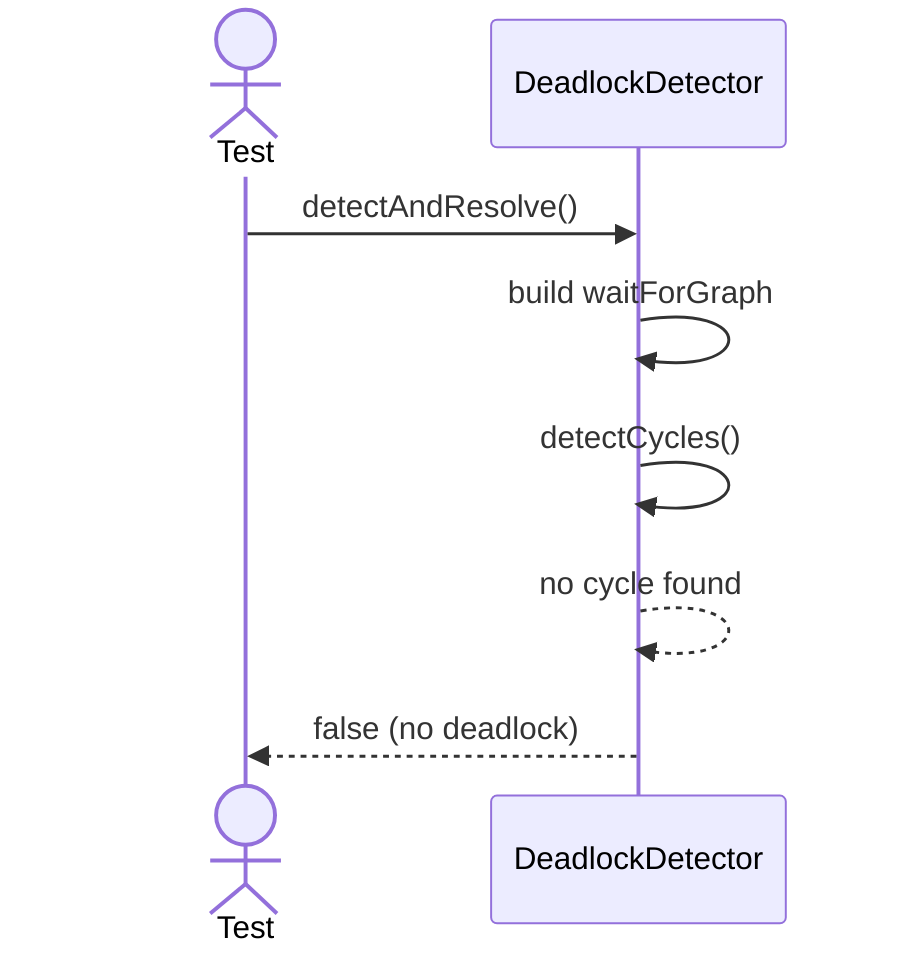

# Sequence Diagrams: DeadlockDetector

## 🆕 Added Properties & Methods for `DeadlockDetector`
To support the detailed sequence logic for unit testing, the following missing properties/methods have been introduced. **Please update the `DeadlockDetector` class in your Class Diagram with these:**

- **Property** added to `DeadlockDetector`: `waitForGraph` (Internal graph of waiting transactions)
- **Method** added to `DeadlockDetector`: `detectCycles()` (Runs cycle detection algorithm)

---

This file contains the detailed sequence diagrams for all unit tests of the **DeadlockDetector** class in the Transaction Management subsystem.

## 1. DetectAndResolve_WhenCycleFound_AbortsVictimTransaction

## 2. DetectAndResolve_WhenNoCycleFound_DoesNothing

