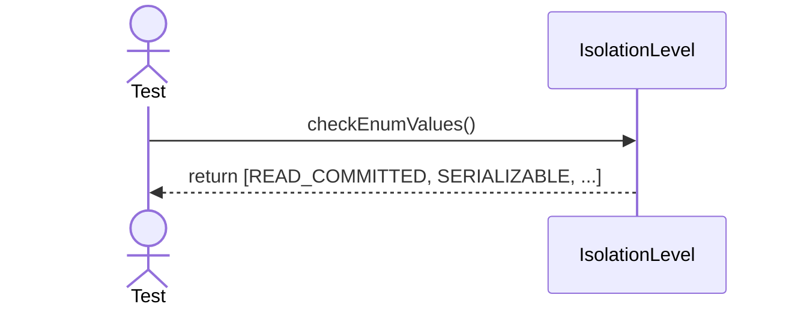

# Sequence Diagrams: IsolationLevel

This file contains the detailed sequence diagrams for all unit tests of the **IsolationLevel** class in the Transaction Management subsystem.

## 1. EnumValues_IncludeReadCommittedAndSerializable

