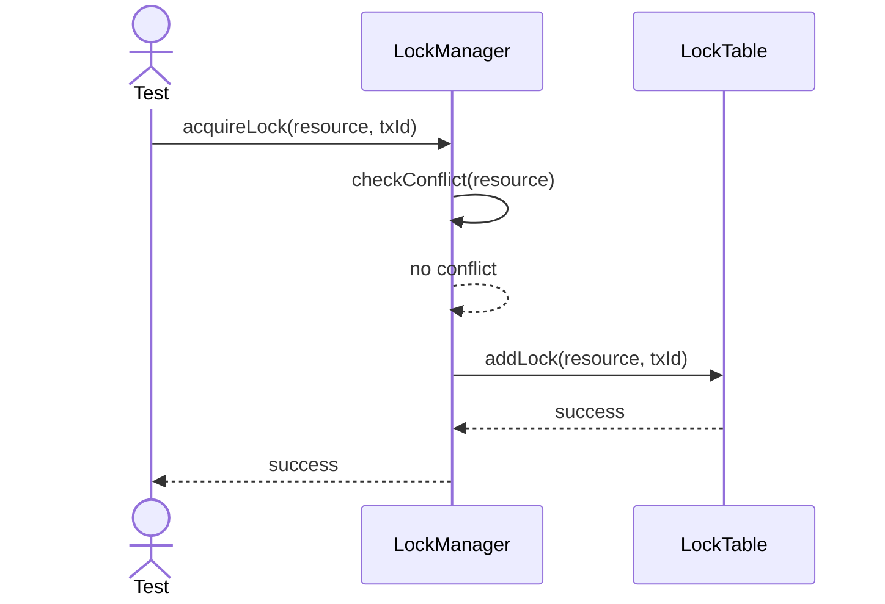
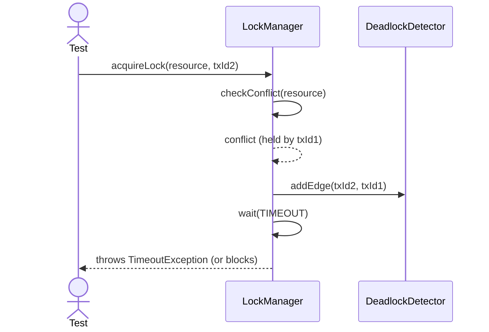
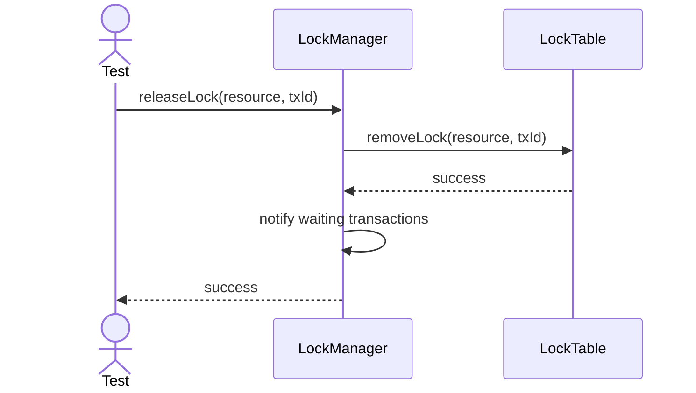

# Sequence Diagrams: LockManager

## 🆕 Added Properties & Methods for `LockManager`
To support the detailed sequence logic for unit testing, the following missing properties/methods have been introduced. **Please update the `LockManager` class in your Class Diagram with these:**

- **Property** added to `LockManager`: `lockTable` (Reference to the LockTable object)
- **Property** added to `LockManager`: `deadlockDetector` (Reference to the DeadlockDetector)
- **Method** added to `LockManager`: `checkConflict(resource)` (Checks if lock can be granted immediately)

---

This file contains the detailed sequence diagrams for all unit tests of the **LockManager** class in the Transaction Management subsystem.

## 1. AcquireLock_WhenResourceFree_GrantsLockInstantly

## 2. AcquireLock_WhenResourceLocked_BlocksOrThrowsTimeout

## 3. ReleaseLock_WhenHoldingLock_FreesResourceAndWakesWaiters

