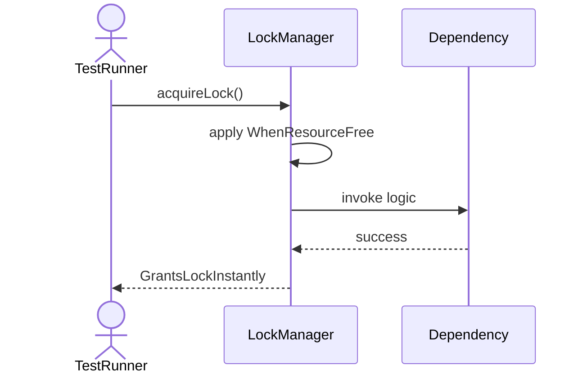
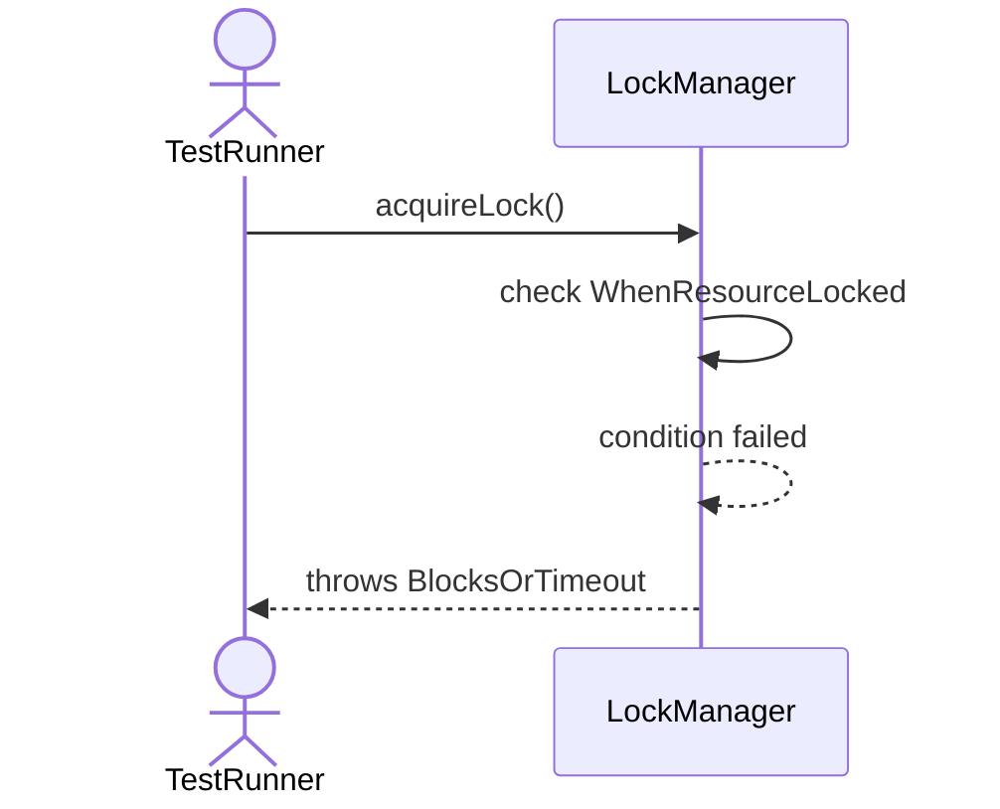
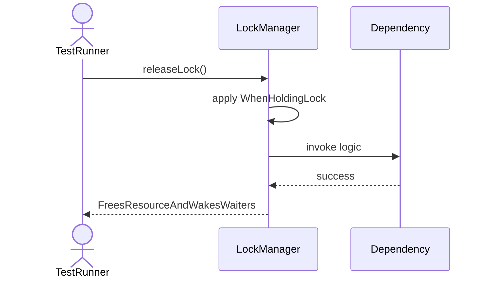
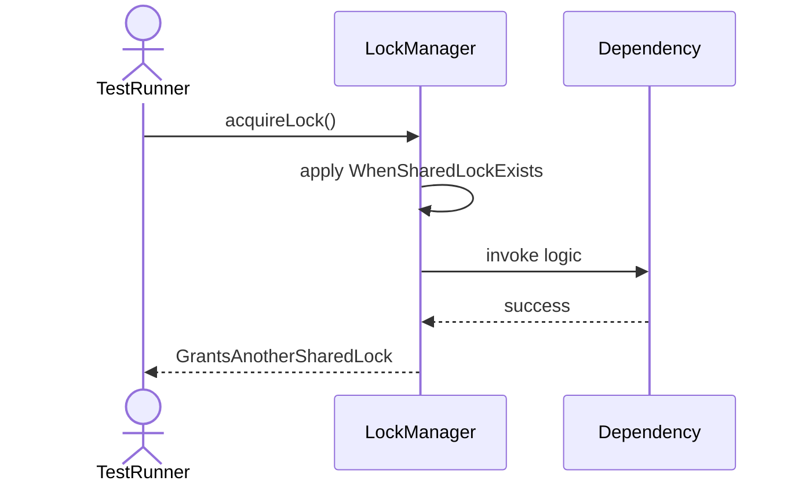
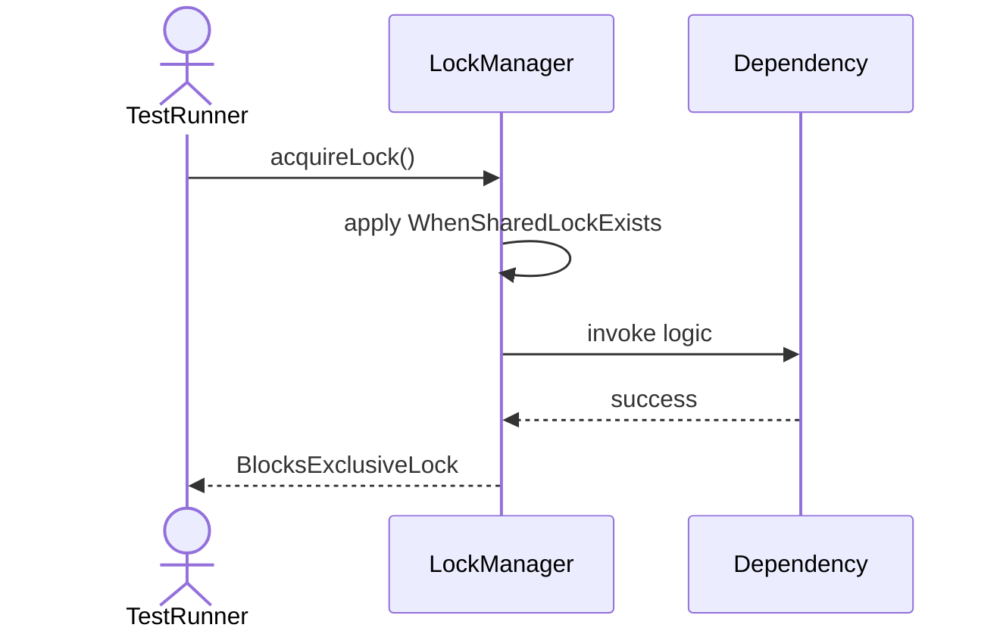
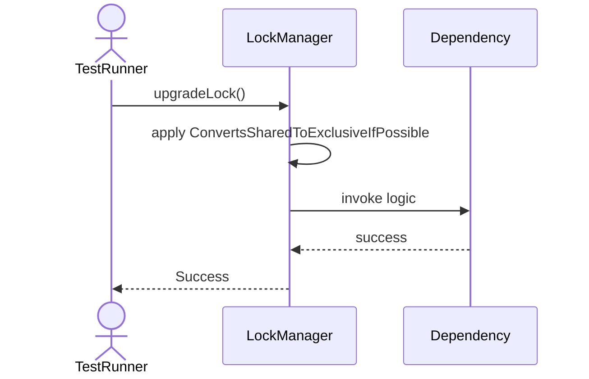
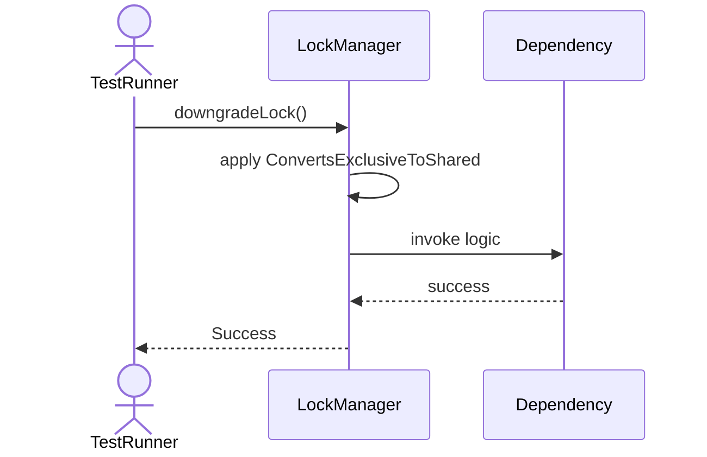
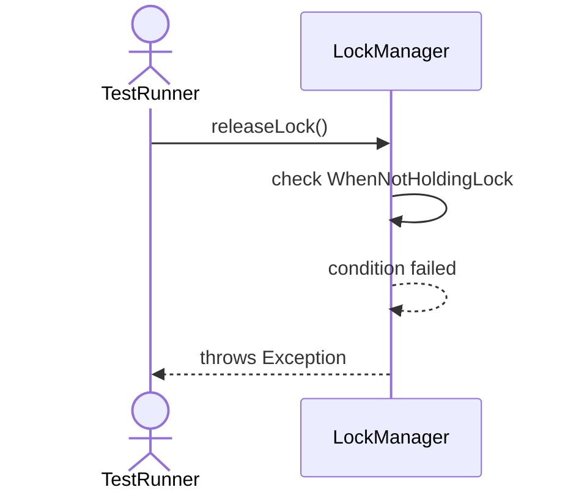

# Sequence Diagrams: LockManager

## 🆕 Added Properties & Methods for `LockManager`
To support the detailed sequence logic for unit testing, please update the `LockManager` class in your Class Diagram with the following properties and methods:

- **Property** added to `LockManager`: `lockTable`
- **Property** added to `LockManager`: `deadlockDetector`
- **Method** added to `LockManager`: `acquireLock()`
- **Method** added to `LockManager`: `downgradeLock()`
- **Method** added to `LockManager`: `releaseLock()`
- **Method** added to `LockManager`: `upgradeLock()`

---

This file contains the detailed sequence diagrams for all 8 unit tests of the **LockManager** class.

## 1. AcquireLock_WhenResourceFree_GrantsLockInstantly

## 2. AcquireLock_WhenResourceLocked_BlocksOrThrowsTimeout

## 3. ReleaseLock_WhenHoldingLock_FreesResourceAndWakesWaiters

## 4. AcquireLock_WhenSharedLockExists_GrantsAnotherSharedLock

## 5. AcquireLock_WhenSharedLockExists_BlocksExclusiveLock

## 6. UpgradeLock_ConvertsSharedToExclusiveIfPossible

## 7. DowngradeLock_ConvertsExclusiveToShared

## 8. ReleaseLock_WhenNotHoldingLock_ThrowsException

