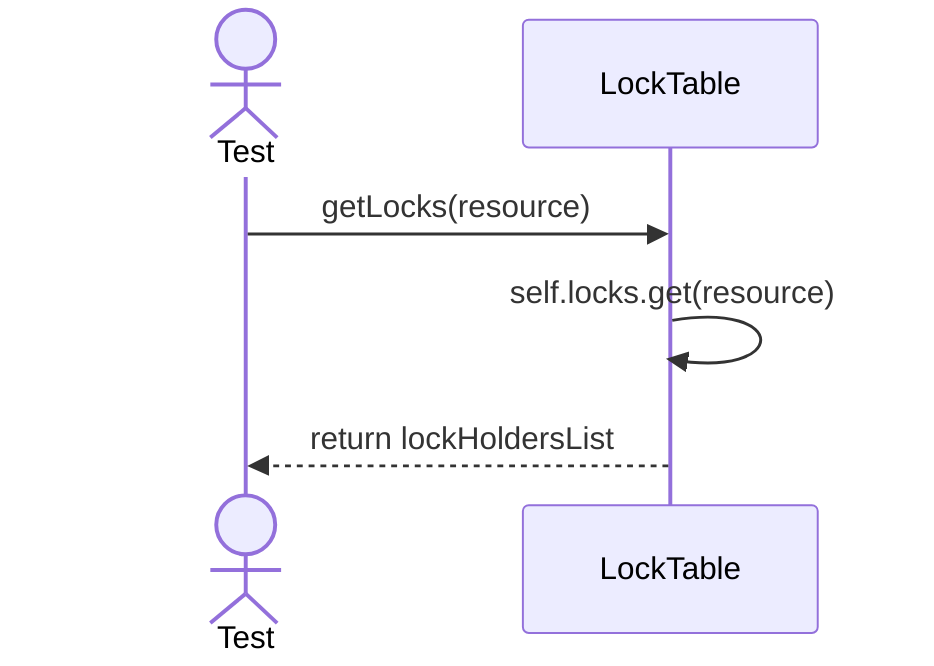
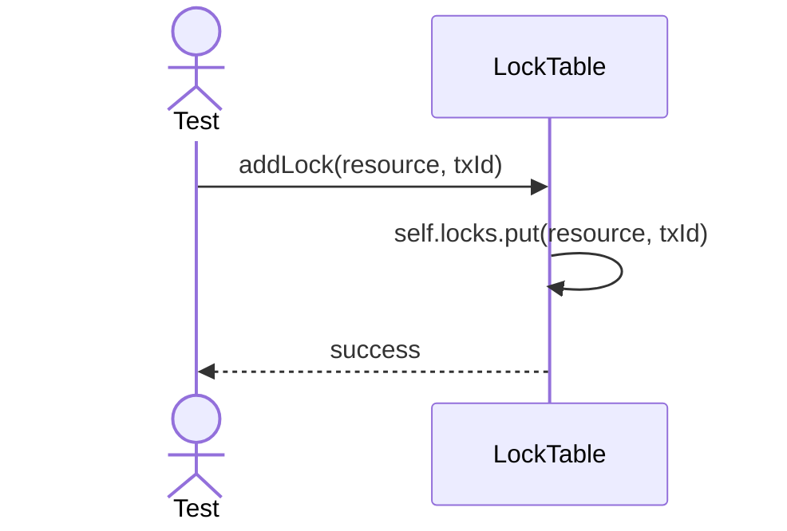

# Sequence Diagrams: LockTable

## 🆕 Added Properties & Methods for `LockTable`
To support the detailed sequence logic for unit testing, the following missing properties/methods have been introduced. **Please update the `LockTable` class in your Class Diagram with these:**

- **Property** added to `LockTable`: `locks` (Dictionary mapping resources to current lock holders)
- **Method** added to `LockTable`: `addLock(resource, txId)` (Registers the lock)

---

This file contains the detailed sequence diagrams for all unit tests of the **LockTable** class in the Transaction Management subsystem.

## 1. GetLocks_ReturnsCurrentLockInformation

## 2. AddLock_RegistersNewLockForResource

