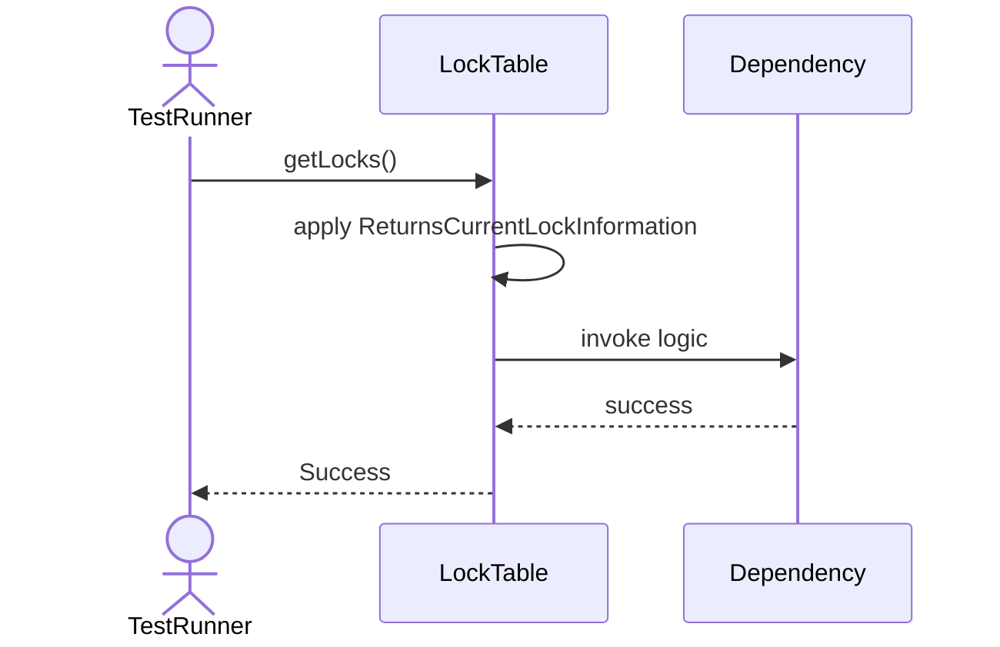
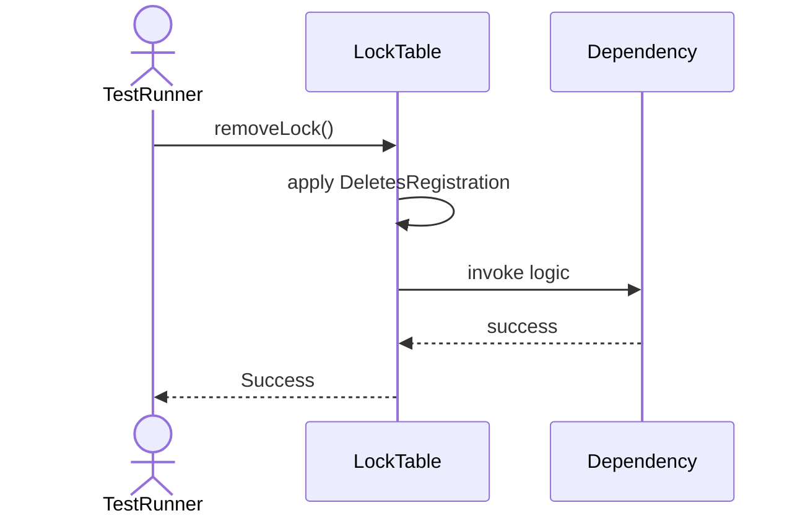
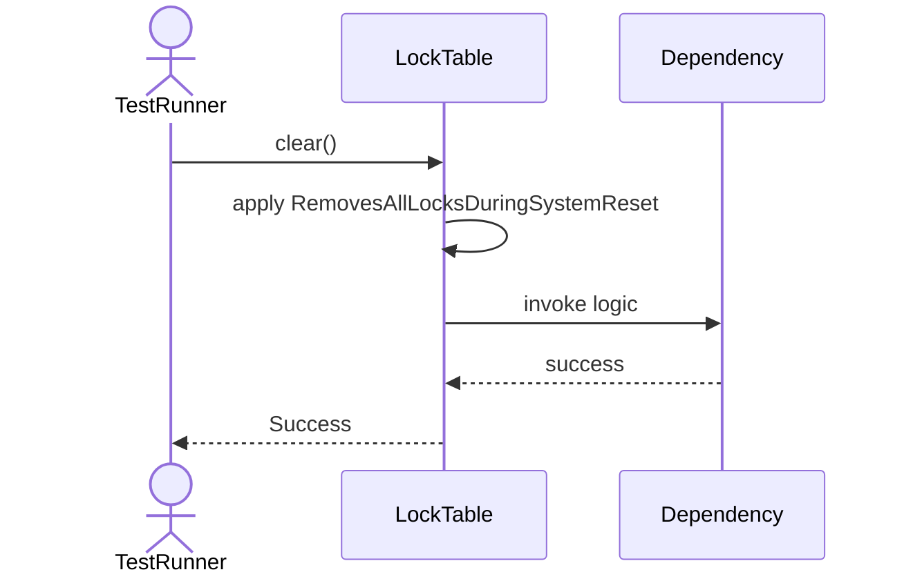

# Sequence Diagrams: LockTable

## 🆕 Added Properties & Methods for `LockTable`
To support the detailed sequence logic for unit testing, please update the `LockTable` class in your Class Diagram with the following properties and methods:

- **Property** added to `LockTable`: `locks (Dict)`
- **Method** added to `LockTable`: `addLock()`
- **Method** added to `LockTable`: `clear()`
- **Method** added to `LockTable`: `countLocks()`
- **Method** added to `LockTable`: `getLocks()`
- **Method** added to `LockTable`: `removeLock()`

---

This file contains the detailed sequence diagrams for all 5 unit tests of the **LockTable** class.

## 1. GetLocks_ReturnsCurrentLockInformation

## 2. AddLock_RegistersNewLockForResource

## 3. RemoveLock_DeletesRegistration

## 4. Clear_RemovesAllLocksDuringSystemReset

## 5. CountLocks_ForSpecificTransactionId

