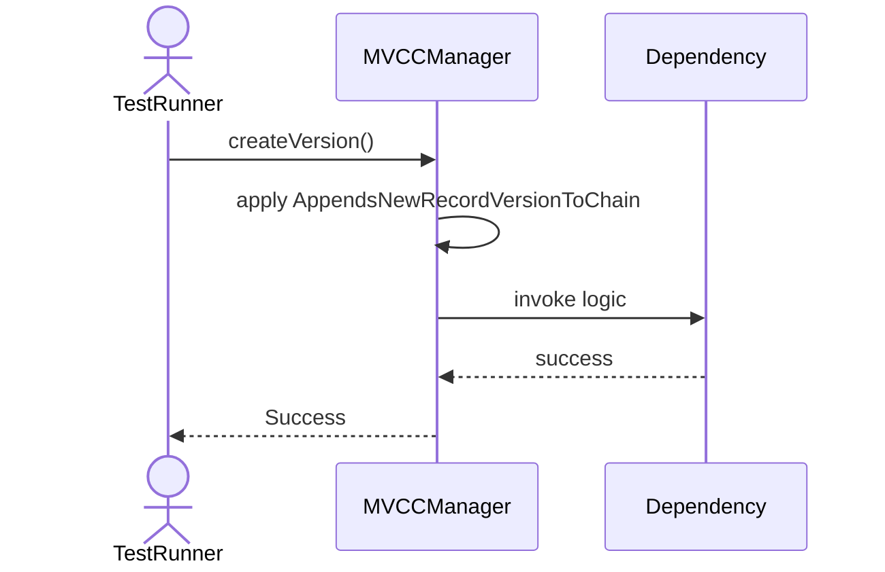
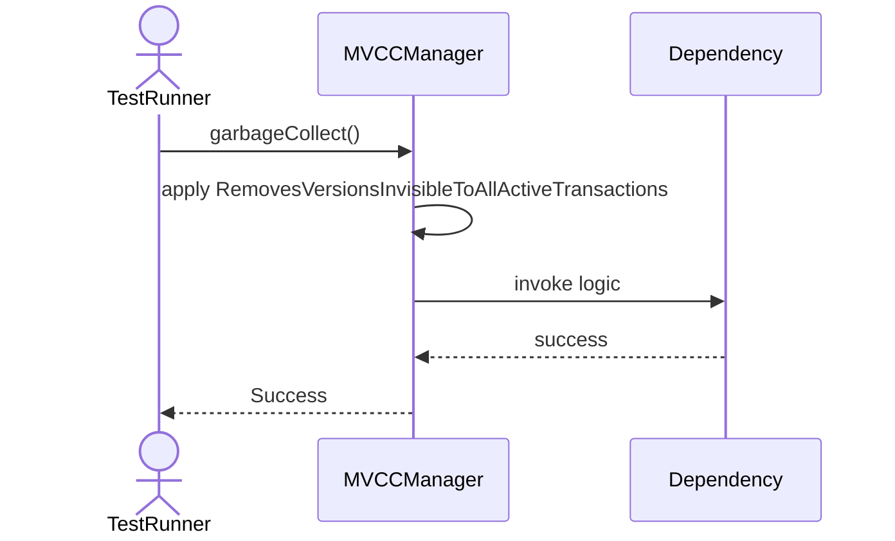
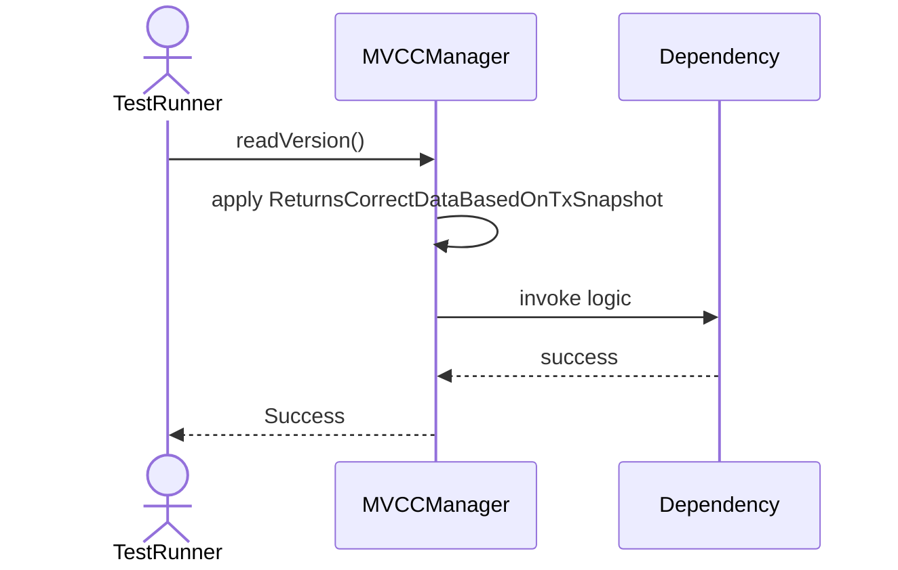
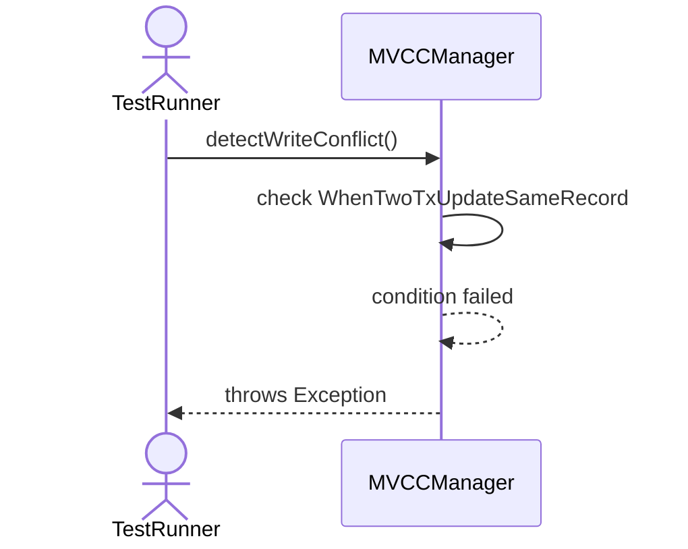
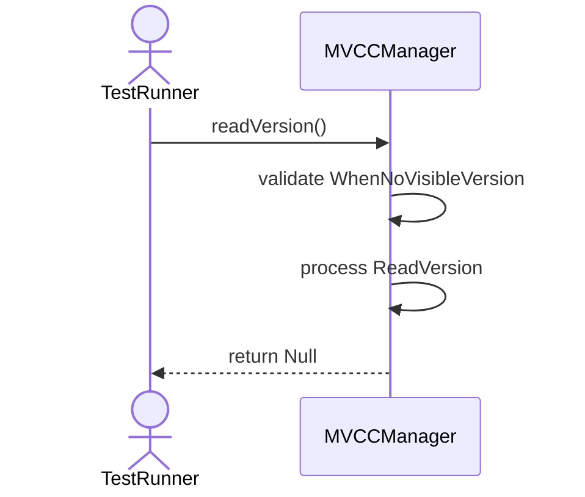

# Sequence Diagrams: MVCCManager

## 🆕 Added Properties & Methods for `MVCCManager`
To support the detailed sequence logic for unit testing, please update the `MVCCManager` class in your Class Diagram with the following properties and methods:

- **Property** added to `MVCCManager`: `versionChain (List)`
- **Method** added to `MVCCManager`: `createVersion()`
- **Method** added to `MVCCManager`: `detectWriteConflict()`
- **Method** added to `MVCCManager`: `garbageCollect()`
- **Method** added to `MVCCManager`: `readVersion()`

---

This file contains the detailed sequence diagrams for all 5 unit tests of the **MVCCManager** class.

## 1. CreateVersion_AppendsNewRecordVersionToChain

## 2. GarbageCollect_RemovesVersionsInvisibleToAllActiveTransactions

## 3. ReadVersion_ReturnsCorrectDataBasedOnTxSnapshot

## 4. DetectWriteConflict_WhenTwoTxUpdateSameRecord_ThrowsException

## 5. ReadVersion_WhenNoVisibleVersion_ReturnsNull

