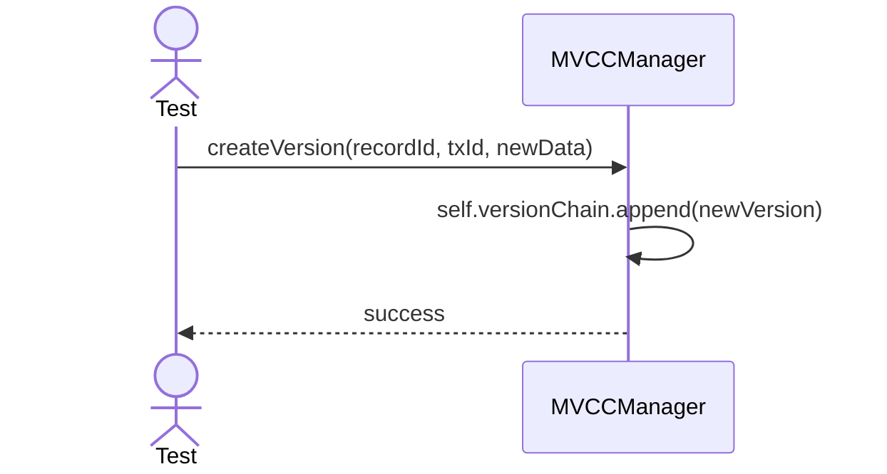
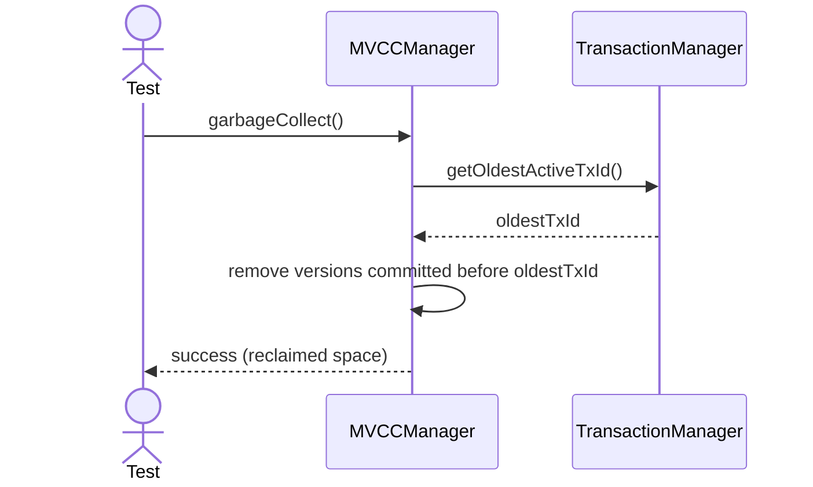

# Sequence Diagrams: MVCCManager

## 🆕 Added Properties & Methods for `MVCCManager`
To support the detailed sequence logic for unit testing, the following missing properties/methods have been introduced. **Please update the `MVCCManager` class in your Class Diagram with these:**

- **Property** added to `MVCCManager`: `versionChain` (Stores multiversion records)
- **Method** added to `MVCCManager`: `findVisibleVersion(txId)` (Resolves the correct version based on IsolationLevel)

---

This file contains the detailed sequence diagrams for all unit tests of the **MVCCManager** class in the Transaction Management subsystem.

## 1. CreateVersion_AppendsNewRecordVersionToChain

## 2. GarbageCollect_RemovesVersionsInvisibleToAllActiveTransactions

