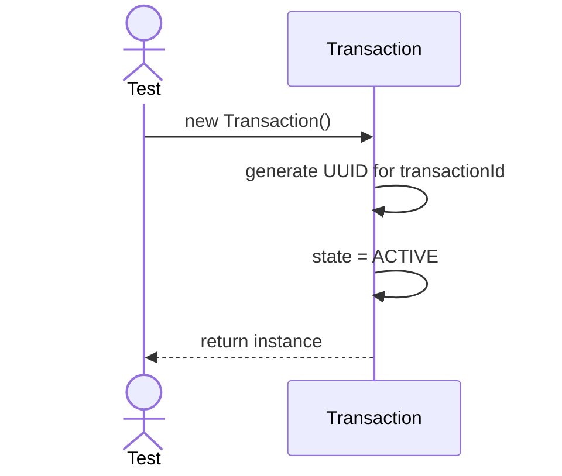
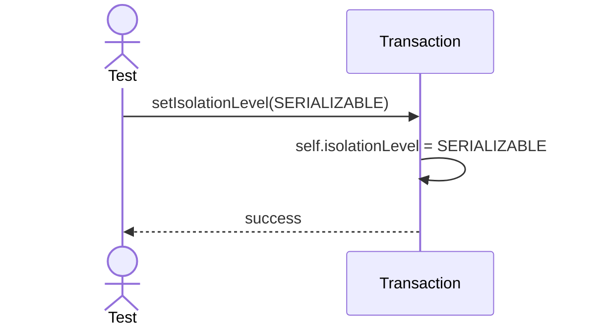

# Sequence Diagrams: Transaction

## 🆕 Added Properties & Methods for `Transaction`
To support the detailed sequence logic for unit testing, the following missing properties/methods have been introduced. **Please update the `Transaction` class in your Class Diagram with these:**

- **Property** added to `Transaction`: `transactionId`, `isolationLevel`, `state`

---

This file contains the detailed sequence diagrams for all unit tests of the **Transaction** class in the Transaction Management subsystem.

## 1. Init_GeneratesUniqueTransactionId

## 2. SetIsolationLevel_UpdatesTransactionProperties

