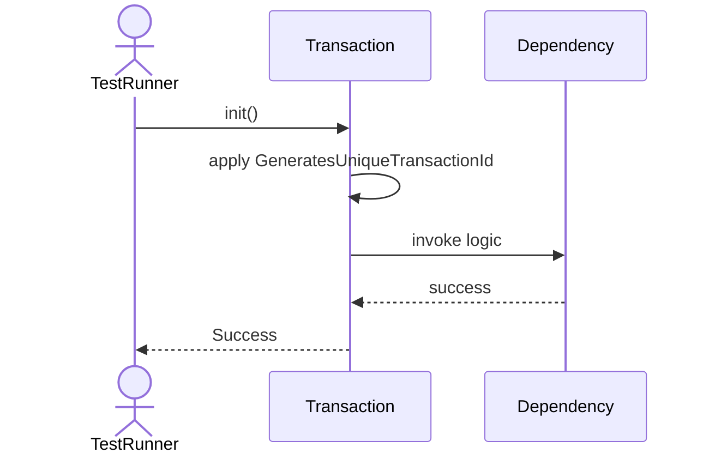
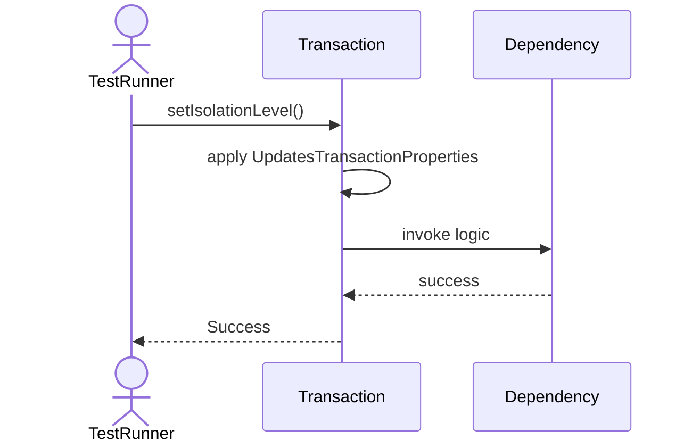
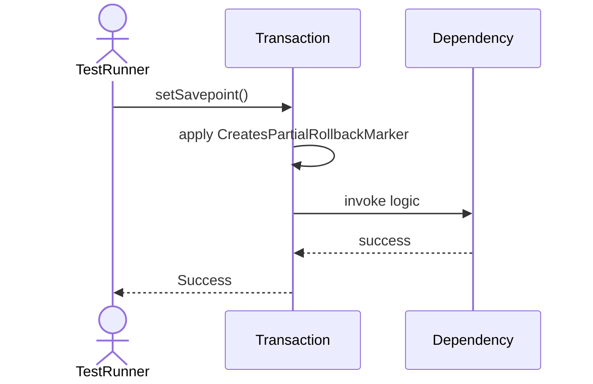
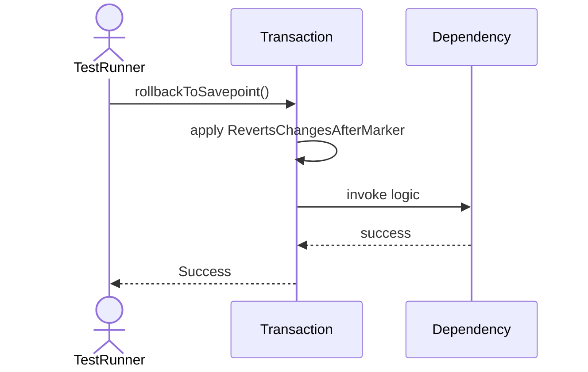

# Sequence Diagrams: Transaction

## 🆕 Added Properties & Methods for `Transaction`
To support the detailed sequence logic for unit testing, please update the `Transaction` class in your Class Diagram with the following properties and methods:

- **Property** added to `Transaction`: `transactionId`
- **Property** added to `Transaction`: `isolationLevel`
- **Property** added to `Transaction`: `state`
- **Property** added to `Transaction`: `savepoints (List)`
- **Property** added to `Transaction`: `heldLocks (List)`
- **Method** added to `Transaction`: `addLock()`
- **Method** added to `Transaction`: `releaseAllLocks()`
- **Method** added to `Transaction`: `rollbackToSavepoint()`
- **Method** added to `Transaction`: `setIsolationLevel()`
- **Method** added to `Transaction`: `setSavepoint()`

---

This file contains the detailed sequence diagrams for all 6 unit tests of the **Transaction** class.

## 1. Init_GeneratesUniqueTransactionId

## 2. SetIsolationLevel_UpdatesTransactionProperties

## 3. AddLock_TracksLocksHeldByThisTransaction

## 4. ReleaseAllLocks_CalledDuringCommitOrRollback

## 5. SetSavepoint_CreatesPartialRollbackMarker

## 6. RollbackToSavepoint_RevertsChangesAfterMarker

