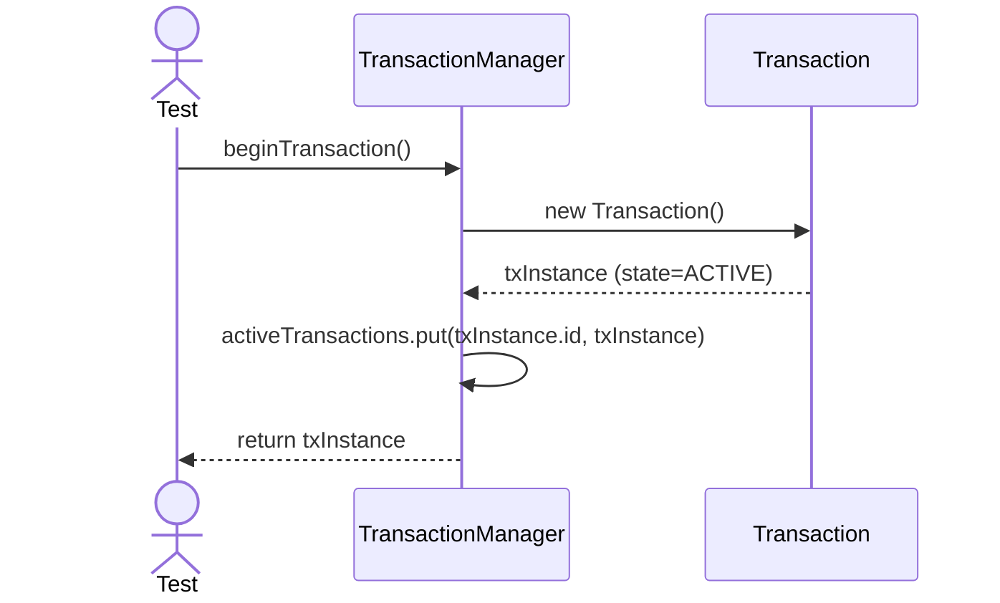
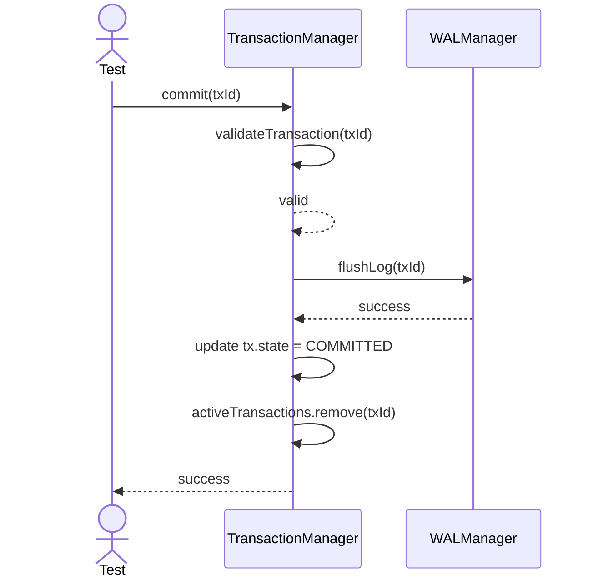
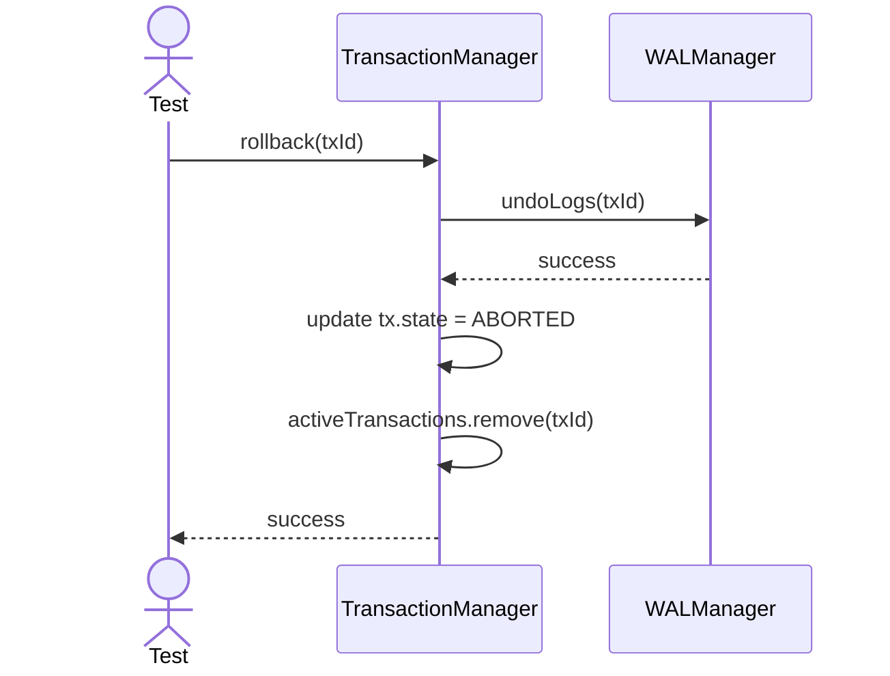
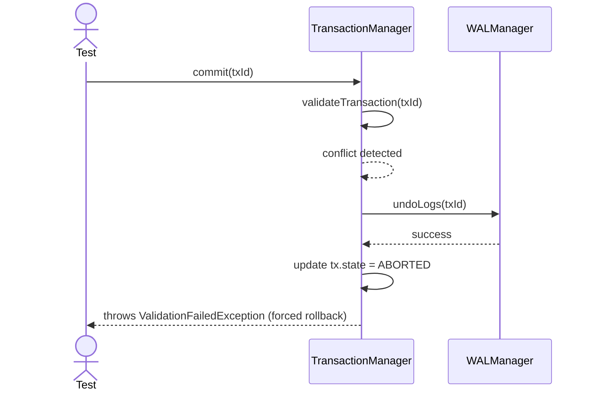

# Sequence Diagrams: TransactionManager

## 🆕 Added Properties & Methods for `TransactionManager`
To support the detailed sequence logic for unit testing, the following missing properties/methods have been introduced. **Please update the `TransactionManager` class in your Class Diagram with these:**

- **Property** added to `TransactionManager`: `activeTransactions` (Dictionary mapping TxId to Transaction)
- **Property** added to `TransactionManager`: `walManager` (Reference to Write-Ahead Log manager)
- **Method** added to `TransactionManager`: `validateTransaction(txId)` (Checks constraints before commit)

---

This file contains the detailed sequence diagrams for all unit tests of the **TransactionManager** class in the Transaction Management subsystem.

## 1. BeginTransaction_CreatesAndRegistersNewActiveTransaction

## 2. Commit_WhenSuccessful_WritesToLogAndChangesState

## 3. Rollback_WhenCalled_RevertsAllModifications

## 4. Commit_WhenValidationFails_ForcesRollback

