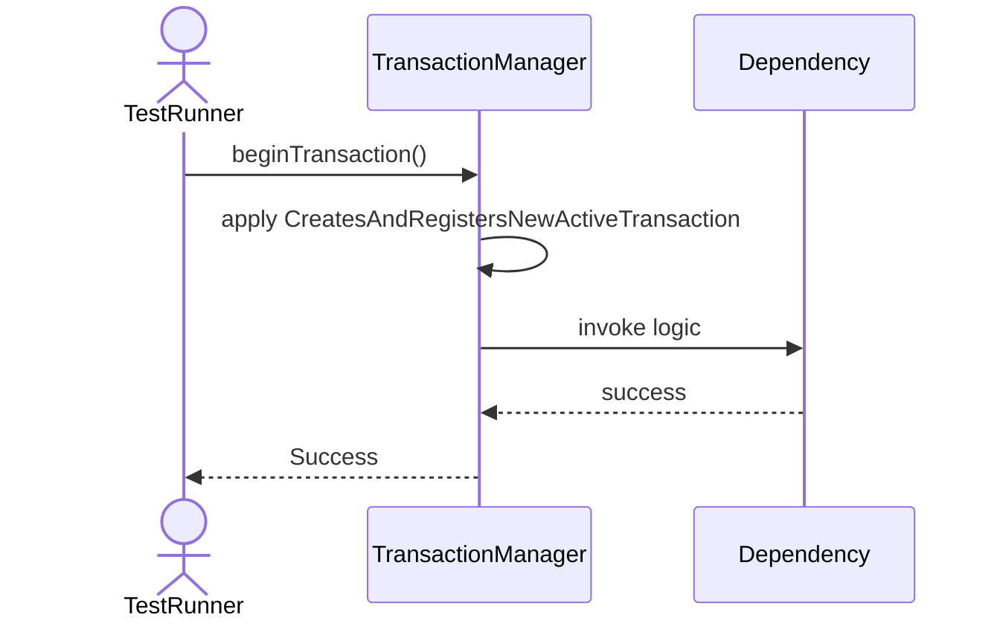
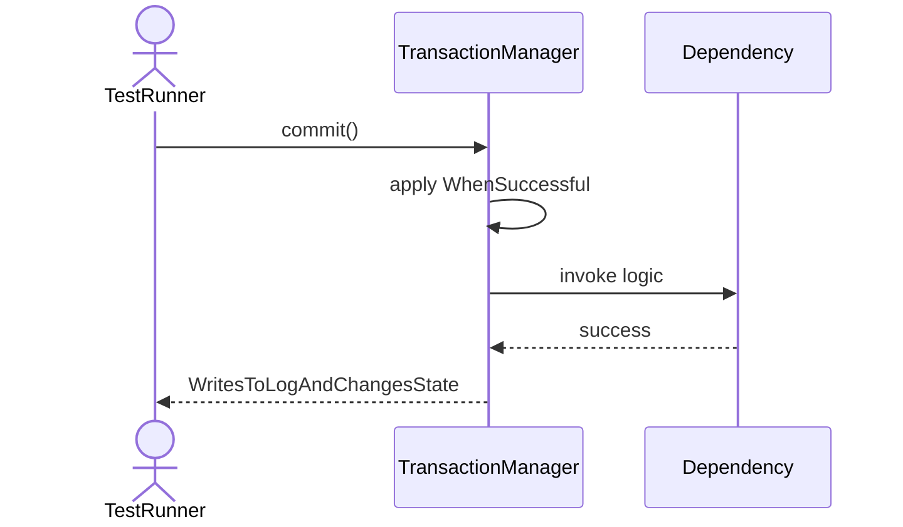
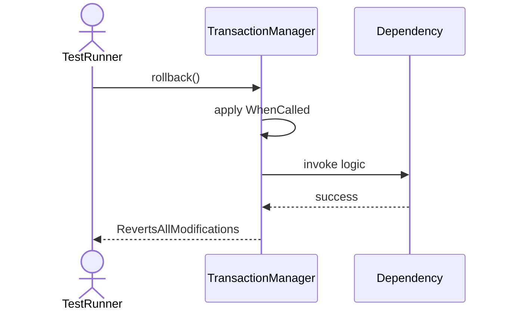
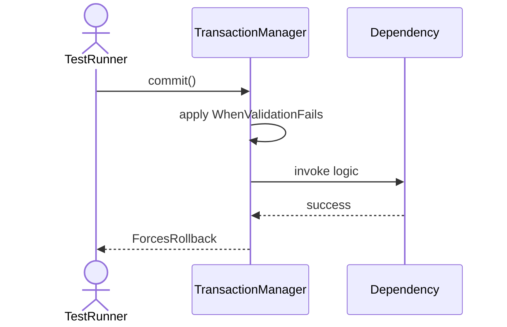
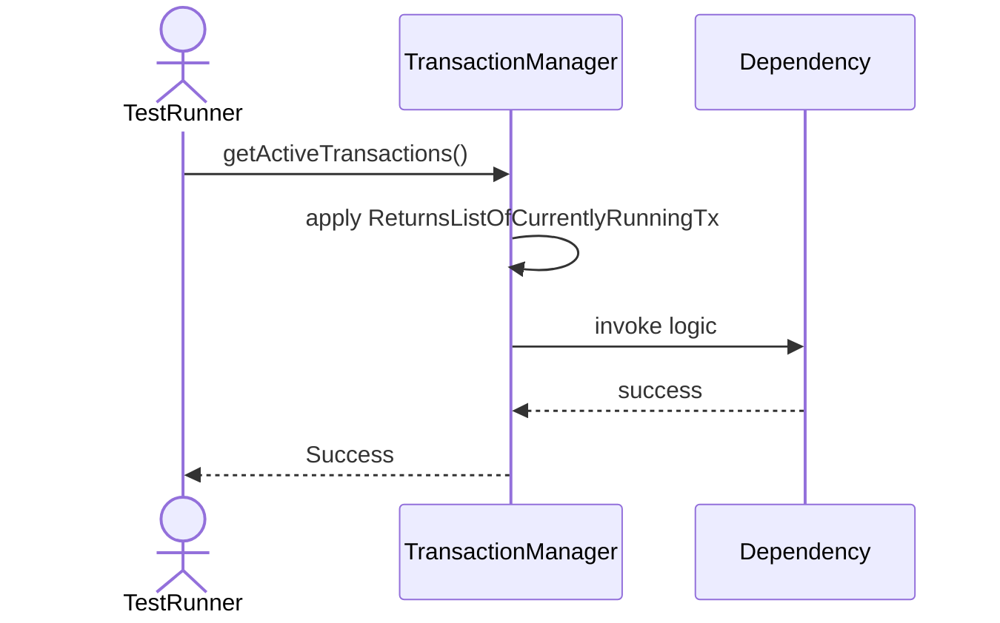
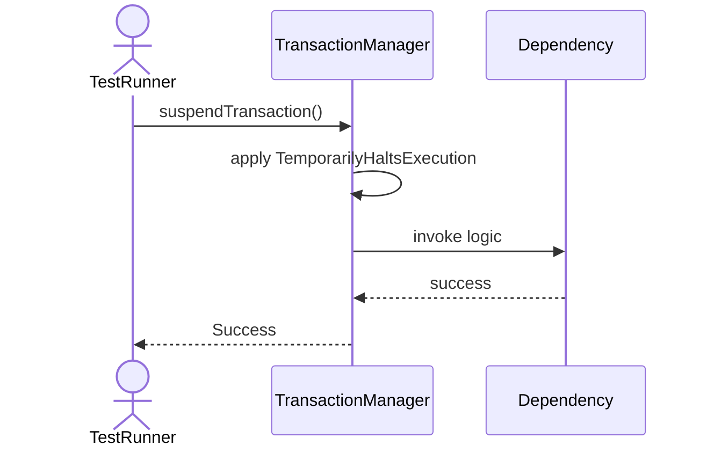
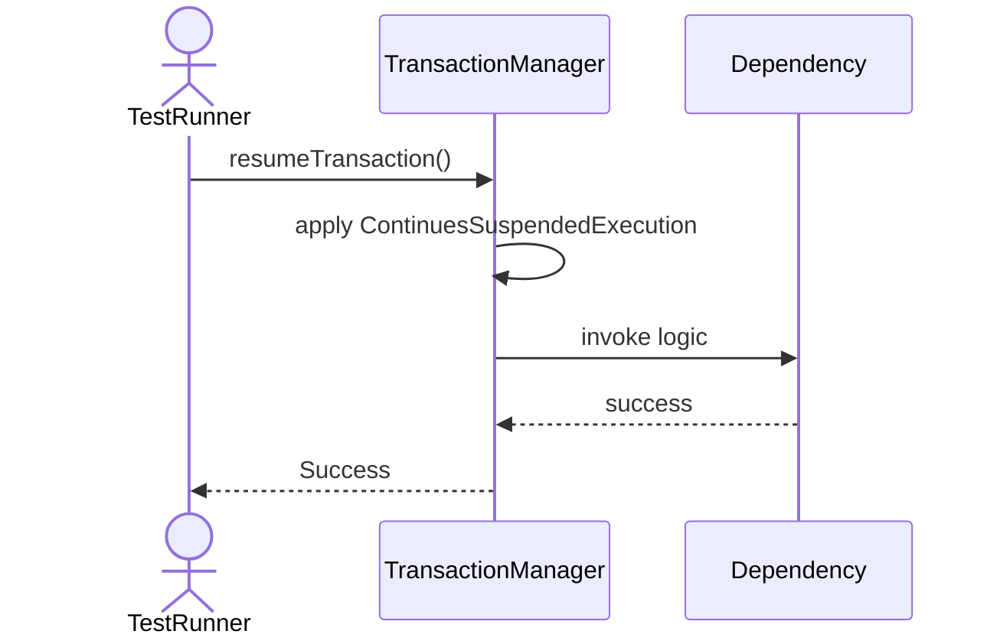
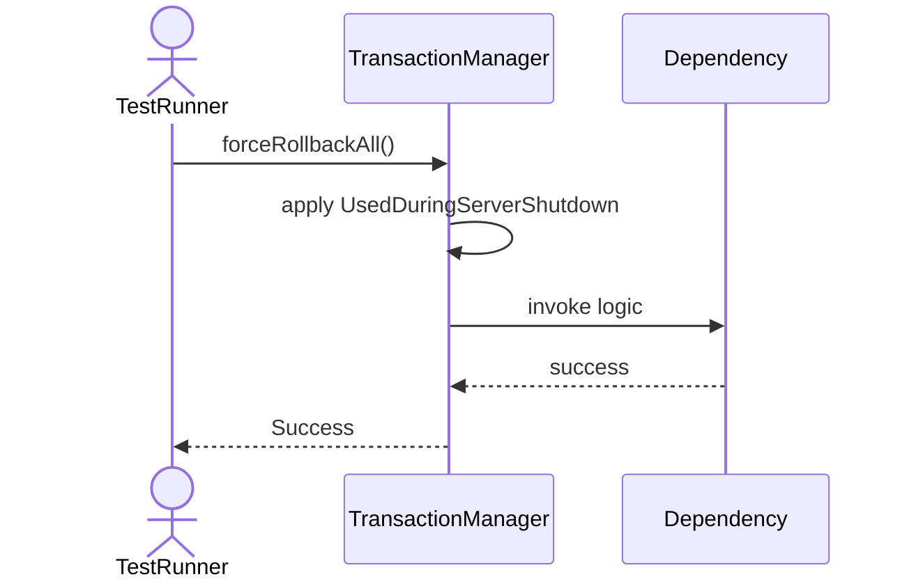

# Sequence Diagrams: TransactionManager

## 🆕 Added Properties & Methods for `TransactionManager`
To support the detailed sequence logic for unit testing, please update the `TransactionManager` class in your Class Diagram with the following properties and methods:

- **Property** added to `TransactionManager`: `activeTransactions (Dict)`
- **Property** added to `TransactionManager`: `walManager`
- **Method** added to `TransactionManager`: `beginTransaction()`
- **Method** added to `TransactionManager`: `commit()`
- **Method** added to `TransactionManager`: `forceRollbackAll()`
- **Method** added to `TransactionManager`: `getActiveTransactions()`
- **Method** added to `TransactionManager`: `resumeTransaction()`
- **Method** added to `TransactionManager`: `rollback()`
- **Method** added to `TransactionManager`: `suspendTransaction()`

---

This file contains the detailed sequence diagrams for all 8 unit tests of the **TransactionManager** class.

## 1. BeginTransaction_CreatesAndRegistersNewActiveTransaction

## 2. Commit_WhenSuccessful_WritesToLogAndChangesState

## 3. Rollback_WhenCalled_RevertsAllModifications

## 4. Commit_WhenValidationFails_ForcesRollback

## 5. GetActiveTransactions_ReturnsListOfCurrentlyRunningTx

## 6. SuspendTransaction_TemporarilyHaltsExecution

## 7. ResumeTransaction_ContinuesSuspendedExecution

## 8. ForceRollbackAll_UsedDuringServerShutdown

