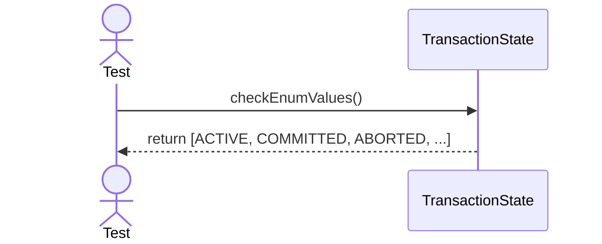

# Sequence Diagrams: TransactionState

This file contains the detailed sequence diagrams for all unit tests of the **TransactionState** class in the Transaction Management subsystem.

## 1. EnumValues_IncludeActiveCommittedAborted

