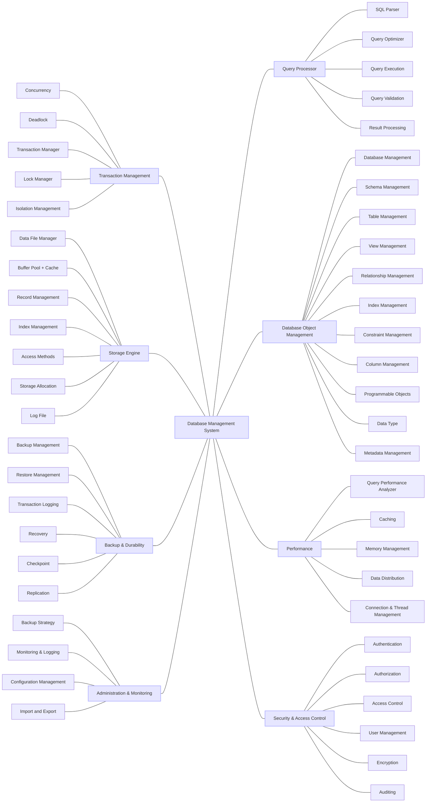
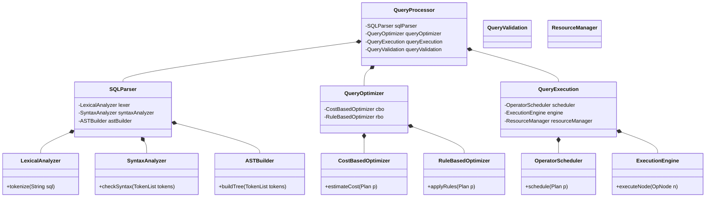
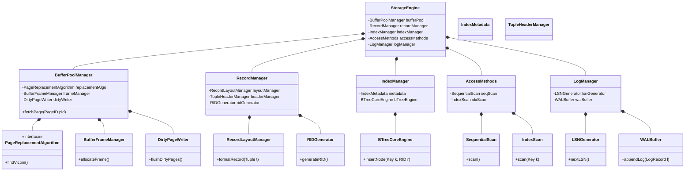
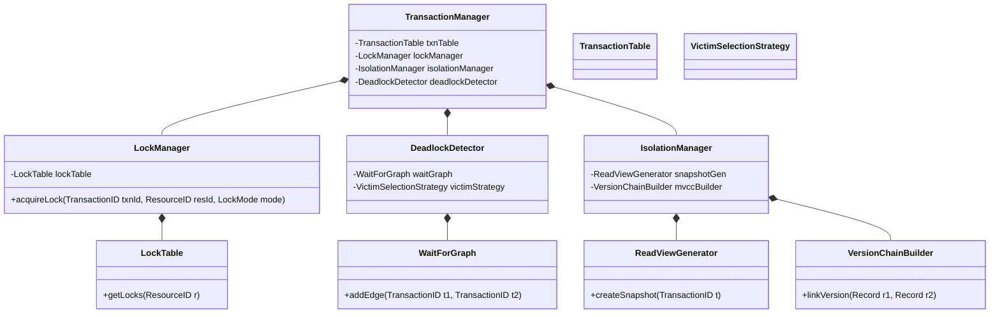
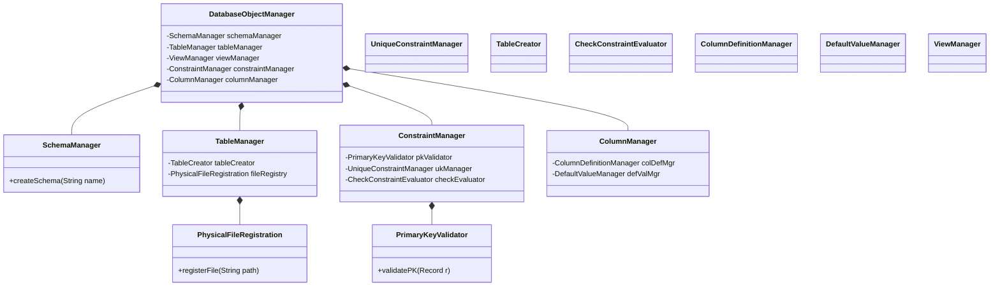
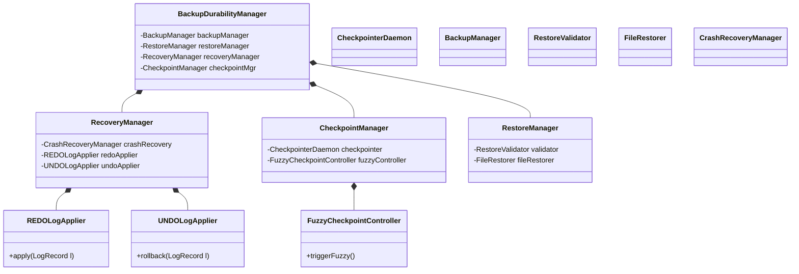
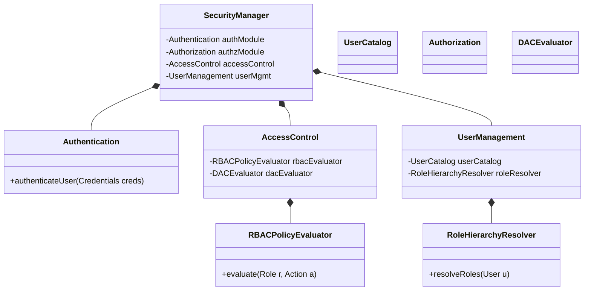
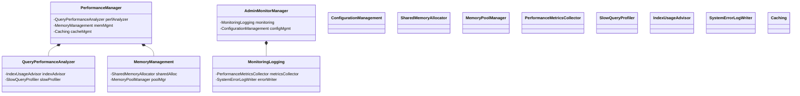

# DBMS Architecture Design

This project is a comprehensive, high-level object-oriented design and implementation plan for a modern Database Management System (DBMS).

## 🏗️ System Architecture

## 🧠 Mind Map

Below is the mind map illustrating the layered architecture of the DBMS.

### Mindmap (Text Representation)

## 📐 Class Diagrams

The detailed UML Class Diagrams defining the entities, properties, and relationships within each subsystem:

```mermaid
classDiagram
    class DBMS {
        -QueryProcessor queryProcessor
        -StorageEngine storageEngine
        -TransactionManager transactionManager
        -DatabaseObjectManager objectManager
        -SecurityManager securityManager
        -BackupDurabilityManager backupManager
        -PerformanceManager performanceManager
        -AdminMonitorManager adminManager
        +startSystem()
        +stopSystem()
    }

    class QueryProcessor {
        -SQLParser sqlParser
        -QueryOptimizer queryOptimizer
        -QueryExecution queryExecution
        -QueryValidation queryValidation
    }
    class SQLParser {
        -LexicalAnalyzer lexer
        -SyntaxAnalyzer syntaxAnalyzer
        -ASTBuilder astBuilder
    }
    class LexicalAnalyzer {
        +tokenize(String sql)
    }
    class SyntaxAnalyzer {
        +checkSyntax(TokenList tokens)
    }
    class ASTBuilder {
        +buildTree(TokenList tokens)
    }
    class QueryOptimizer {
        -CostBasedOptimizer cbo
        -RuleBasedOptimizer rbo
    }
    class CostBasedOptimizer {
        +estimateCost(Plan p)
    }
    class RuleBasedOptimizer {
        +applyRules(Plan p)
    }
    class QueryExecution {
        -OperatorScheduler scheduler
        -ExecutionEngine engine
        -ResourceManager resourceManager
    }
    class OperatorScheduler {
        +schedule(Plan p)
    }
    class ExecutionEngine {
        +executeNode(OpNode n)
    }

    QueryProcessor *-- SQLParser
    QueryProcessor *-- QueryOptimizer
    QueryProcessor *-- QueryExecution
    SQLParser *-- LexicalAnalyzer
    SQLParser *-- SyntaxAnalyzer
    SQLParser *-- ASTBuilder
    QueryOptimizer *-- CostBasedOptimizer
    QueryOptimizer *-- RuleBasedOptimizer
    QueryExecution *-- OperatorScheduler
    QueryExecution *-- ExecutionEngine

    class StorageEngine {
        -BufferPoolManager bufferPool
        -RecordManager recordManager
        -IndexManager indexManager
        -AccessMethods accessMethods
        -LogManager logManager
    }
    class BufferPoolManager {
        -PageReplacementAlgorithm replacementAlgo
        -BufferFrameManager frameManager
        -DirtyPageWriter dirtyWriter
        +fetchPage(PageID pid)
    }
    class PageReplacementAlgorithm {
        <<interface>>
        +findVictim()
    }
    class BufferFrameManager {
        +allocateFrame()
    }
    class DirtyPageWriter {
        +flushDirtyPages()
    }
    class RecordManager {
        -RecordLayoutManager layoutManager
        -TupleHeaderManager headerManager
        -RIDGenerator ridGenerator
    }
    class RecordLayoutManager {
        +formatRecord(Tuple t)
    }
    class RIDGenerator {
        +generateRID()
    }
    class IndexManager {
        -IndexMetadata metadata
        -BTreeCoreEngine bTreeEngine
    }
    class BTreeCoreEngine {
        +insertNode(Key k, RID r)
    }
    class AccessMethods {
        -SequentialScan seqScan
        -IndexScan idxScan
    }
    class SequentialScan {
        +scan()
    }
    class IndexScan {
        +scan(Key k)
    }
    class LogManager {
        -LSNGenerator lsnGenerator
        -WALBuffer walBuffer
    }
    class LSNGenerator {
        +nextLSN()
    }
    class WALBuffer {
        +appendLog(LogRecord l)
    }

    StorageEngine *-- BufferPoolManager
    StorageEngine *-- RecordManager
    StorageEngine *-- IndexManager
    StorageEngine *-- AccessMethods
    StorageEngine *-- LogManager
    BufferPoolManager *-- PageReplacementAlgorithm
    BufferPoolManager *-- BufferFrameManager
    BufferPoolManager *-- DirtyPageWriter
    RecordManager *-- RecordLayoutManager
    RecordManager *-- RIDGenerator
    IndexManager *-- BTreeCoreEngine
    AccessMethods *-- SequentialScan
    AccessMethods *-- IndexScan
    LogManager *-- LSNGenerator
    LogManager *-- WALBuffer

    class TransactionManager {
        -TransactionTable txnTable
        -LockManager lockManager
        -IsolationManager isolationManager
        -DeadlockDetector deadlockDetector
    }
    class LockManager {
        -LockTable lockTable
        +acquireLock(TransactionID txnId, ResourceID resId, LockMode mode)
    }
    class LockTable {
        +getLocks(ResourceID r)
    }
    class DeadlockDetector {
        -WaitForGraph waitGraph
        -VictimSelectionStrategy victimStrategy
    }
    class WaitForGraph {
        +addEdge(TransactionID t1, TransactionID t2)
    }
    class IsolationManager {
        -ReadViewGenerator snapshotGen
        -VersionChainBuilder mvccBuilder
    }
    class ReadViewGenerator {
        +createSnapshot(TransactionID t)
    }
    class VersionChainBuilder {
        +linkVersion(Record r1, Record r2)
    }

    TransactionManager *-- LockManager
    TransactionManager *-- DeadlockDetector
    TransactionManager *-- IsolationManager
    LockManager *-- LockTable
    DeadlockDetector *-- WaitForGraph
    IsolationManager *-- ReadViewGenerator
    IsolationManager *-- VersionChainBuilder

    class DatabaseObjectManager {
        -SchemaManager schemaManager
        -TableManager tableManager
        -ViewManager viewManager
        -ConstraintManager constraintManager
        -ColumnManager columnManager
    }
    class SchemaManager {
        +createSchema(String name)
    }
    class TableManager {
        -TableCreator tableCreator
        -PhysicalFileRegistration fileRegistry
    }
    class PhysicalFileRegistration {
        +registerFile(String path)
    }
    class ConstraintManager {
        -PrimaryKeyValidator pkValidator
        -UniqueConstraintManager ukManager
        -CheckConstraintEvaluator checkEvaluator
    }
    class PrimaryKeyValidator {
        +validatePK(Record r)
    }
    class ColumnManager {
        -ColumnDefinitionManager colDefMgr
        -DefaultValueManager defValMgr
    }

    DatabaseObjectManager *-- SchemaManager
    DatabaseObjectManager *-- TableManager
    DatabaseObjectManager *-- ConstraintManager
    DatabaseObjectManager *-- ColumnManager
    ConstraintManager *-- PrimaryKeyValidator
    TableManager *-- PhysicalFileRegistration

    class BackupDurabilityManager {
        -BackupManager backupManager
        -RestoreManager restoreManager
        -RecoveryManager recoveryManager
        -CheckpointManager checkpointMgr
    }
    class RecoveryManager {
        -CrashRecoveryManager crashRecovery
        -REDOLogApplier redoApplier
        -UNDOLogApplier undoApplier
    }
    class REDOLogApplier {
        +apply(LogRecord l)
    }
    class UNDOLogApplier {
        +rollback(LogRecord l)
    }
    class CheckpointManager {
        -CheckpointerDaemon checkpointer
        -FuzzyCheckpointController fuzzyController
    }
    class FuzzyCheckpointController {
        +triggerFuzzy()
    }
    class RestoreManager {
        -RestoreValidator validator
        -FileRestorer fileRestorer
    }
    BackupDurabilityManager *-- RecoveryManager
    BackupDurabilityManager *-- CheckpointManager
    BackupDurabilityManager *-- RestoreManager
    RecoveryManager *-- REDOLogApplier
    RecoveryManager *-- UNDOLogApplier
    CheckpointManager *-- FuzzyCheckpointController

    class SecurityManager {
        -Authentication authModule
        -Authorization authzModule
        -AccessControl accessControl
        -UserManagement userMgmt
    }
    class Authentication {
        +authenticateUser(Credentials creds)
    }
    class AccessControl {
        -RBACPolicyEvaluator rbacEvaluator
        -DACEvaluator dacEvaluator
    }
    class RBACPolicyEvaluator {
        +evaluate(Role r, Action a)
    }
    class UserManagement {
        -UserCatalog userCatalog
        -RoleHierarchyResolver roleResolver
    }
    class RoleHierarchyResolver {
        +resolveRoles(User u)
    }
    SecurityManager *-- Authentication
    SecurityManager *-- AccessControl
    SecurityManager *-- UserManagement
    AccessControl *-- RBACPolicyEvaluator
    UserManagement *-- RoleHierarchyResolver

    class PerformanceManager {
        -QueryPerformanceAnalyzer perfAnalyzer
        -MemoryManagement memMgmt
        -Caching cacheMgmt
    }
    class QueryPerformanceAnalyzer {
        -IndexUsageAdvisor indexAdvisor
        -SlowQueryProfiler slowProfiler
    }
    class MemoryManagement {
        -SharedMemoryAllocator sharedAlloc
        -MemoryPoolManager poolMgr
    }
    class AdminMonitorManager {
        -MonitoringLogging monitoring
        -ConfigurationManagement configMgmt
    }
    class MonitoringLogging {
        -PerformanceMetricsCollector metricsCollector
        -SystemErrorLogWriter errorWriter
    }

    PerformanceManager *-- QueryPerformanceAnalyzer
    PerformanceManager *-- MemoryManagement
    AdminMonitorManager *-- MonitoringLogging

    DBMS *-- QueryProcessor
    DBMS *-- StorageEngine
    DBMS *-- TransactionManager
    DBMS *-- DatabaseObjectManager
    DBMS *-- SecurityManager
    DBMS *-- BackupDurabilityManager
    DBMS *-- PerformanceManager
    DBMS *-- AdminMonitorManager

    QueryExecution ..> StorageEngine
    QueryExecution ..> TransactionManager
    StorageEngine ..> LogManager
    RecoveryManager ..> LogManager
    AccessMethods ..> BufferPoolManager
    TransactionManager ..> LogManager
    %% Missing classes defined for strict parsers
    class TupleHeaderManager
    class ResourceManager
    class SlowQueryProfiler
    class PerformanceMetricsCollector
    class ViewManager
    class ConfigurationManagement
    class SharedMemoryAllocator
    class ColumnDefinitionManager
    class DACEvaluator
    class TransactionTable
    class Authorization
    class CheckpointerDaemon
    class UserCatalog
    class TableCreator
    class SystemErrorLogWriter
    class IndexUsageAdvisor
    class BackupManager
    class FileRestorer
    class QueryValidation
    class Caching
    class MemoryPoolManager
    class UniqueConstraintManager
    class DefaultValueManager
    class IndexMetadata
    class CrashRecoveryManager
    class CheckConstraintEvaluator
    class VictimSelectionStrategy
    class RestoreValidator
```

## 🔍 Subsystem Class Diagrams

### 1. Query Processor Subsystem

### 2. Storage Engine Subsystem

### 3. Transaction Subsystem

### 4. Database Object Management

### 5. Backup & Durability

### 6. Security & Access Control

### 7. Performance and Admin Subsystems

