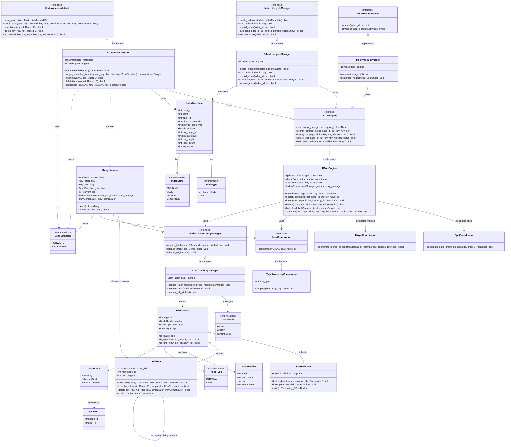

# DBMS Index Management Class Diagram

This document provides the object-oriented architectural analysis for the **Index Management** subsystem within the DBMS. The class diagram is synchronized 100% with the design from `class_diagrams/0_overall.md`.

As the project is currently in the **TDD Red Phase** (all tests exist but fail), the Python implementation skeletons provided below serve as structural stubs (method declarations with empty or placeholder bodies) to define the interface contracts.

---

## 1. Complete Class Diagram (Mermaid)

Below is the complete class diagram featuring all classes, interfaces, entities, enumerations, and relationships, copied exactly from `class_diagrams/0_overall.md` to ensure absolute correctness.



---

## 2. Python Implementation Skeletons (TDD Red Phase Stubs)

The following python code blocks represent structural declarations matching the diagram above. All methods are stubbed out with `raise NotImplementedError()` or default placeholders to enforce test failure during the Red Phase of TDD.

### 2.1. Enumerations

```python
from enum import Enum, auto

class IndexType(Enum):
    B_PLUS_TREE = auto()
    HASH = auto()

class IndexState(Enum):
    BUILDING = auto()
    VALID = auto()
    INVALID = auto()
    UNUSABLE = auto()

class NodeType(Enum):
    INTERNAL = auto()
    LEAF = auto()

class LatchMode(Enum):
    READ = auto()
    WRITE = auto()
    OPTIMISTIC = auto()

class ScanDirection(Enum):
    FORWARD = auto()
    BACKWARD = auto()
```

### 2.2. Entities (Structural Data Types)

```python
from typing import Any, List, Optional, Tuple, Iterable, Iterator

class RecordID:
    def __init__(self, page_id: int, slot_id: int):
        self.page_id: int = page_id
        self.slot_id: int = slot_id

class IndexEntry:
    def __init__(self, key: Any, rid: RecordID, is_deleted: bool = False):
        self.key: Any = key
        self.rid: RecordID = rid
        self.is_deleted: bool = is_deleted

class NodeHeader:
    def __init__(self, level: int = 0, key_count: int = 0, lsn: int = 0, free_space: int = 4096):
        self.level: int = level
        self.key_count: int = key_count
        self.lsn: int = lsn
        self.free_space: int = free_space

class BTreeNode:
    def __init__(self, page_id: int, node_type: NodeType, header: NodeHeader):
        self.page_id: int = page_id
        self.header: NodeHeader = header
        self.node_type: NodeType = node_type
        self.keys: List[Any] = []

    def is_leaf(self) -> bool:
        raise NotImplementedError("TDD Stub")

    def is_overflow(self, max_capacity: int) -> bool:
        raise NotImplementedError("TDD Stub")

    def is_underflow(self, min_capacity: int) -> bool:
        raise NotImplementedError("TDD Stub")

class InternalNode(BTreeNode):
    def __init__(self, page_id: int, header: NodeHeader):
        super().__init__(page_id, NodeType.INTERNAL, header)
        self.children_page_ids: List[int] = []

    def lookup(self, key: Any, comparator: 'IKeyComparator') -> int:
        raise NotImplementedError("TDD Stub")

    def insert(self, key: Any, child_page_id: int) -> None:
        raise NotImplementedError("TDD Stub")

    def split(self) -> Tuple[Any, BTreeNode]:
        raise NotImplementedError("TDD Stub")

class LeafNode(BTreeNode):
    def __init__(self, page_id: int, header: NodeHeader, next_page_id: int = -1, prev_page_id: int = -1):
        super().__init__(page_id, NodeType.LEAF, header)
        self.record_ids: List[RecordID] = []
        self.next_page_id: int = next_page_id
        self.prev_page_id: int = prev_page_id

    def lookup(self, key: Any, comparator: 'IKeyComparator') -> List[RecordID]:
        raise NotImplementedError("TDD Stub")

    def insert(self, key: Any, rid: RecordID, comparator: 'IKeyComparator') -> bool:
        raise NotImplementedError("TDD Stub")

    def delete(self, key: Any, rid: RecordID, comparator: 'IKeyComparator') -> bool:
        raise NotImplementedError("TDD Stub")

    def split(self) -> Tuple[Any, BTreeNode]:
        raise NotImplementedError("TDD Stub")

class IndexMetadata:
    def __init__(self, index_id: int, name: str, table_id: int, column_ids: List[int], index_type: IndexType):
        self.index_id: int = index_id
        self.name: str = name
        self.table_id: int = table_id
        self.column_ids: List[int] = column_ids
        self.index_type: IndexType = index_type
        self.is_unique: bool = False
        self.root_page_id: int = -1
        self.state: IndexState = IndexState.BUILDING
        self.tree_height: int = 0
        self.node_count: int = 0
        self.key_count: int = 0
```

### 2.3. Interfaces (Abstractions)

```python
from abc import ABC, abstractmethod

class IIndexLifecycleManager(ABC):
    @abstractmethod
    def create_index(self, metadata: IndexMetadata) -> bool:
        pass

    @abstractmethod
    def drop_index(self, index_id: int) -> bool:
        pass

    @abstractmethod
    def rebuild_index(self, index_id: int) -> bool:
        pass

    @abstractmethod
    def bulk_load(self, index_id: int, entries: Iterable[IndexEntry]) -> bool:
        pass

    @abstractmethod
    def validate_index(self, index_id: int) -> bool:
        pass

class IIndexAccessMethod(ABC):
    @abstractmethod
    def point_search(self, key: Any) -> List[RecordID]:
        pass

    @abstractmethod
    def range_scan(self, start_key: Any, end_key: Any, direction: ScanDirection) -> Iterator[IndexEntry]:
        pass

    @abstractmethod
    def insert(self, key: Any, rid: RecordID) -> bool:
        pass

    @abstractmethod
    def delete(self, key: Any, rid: RecordID) -> bool:
        pass

    @abstractmethod
    def update(self, old_key: Any, new_key: Any, rid: RecordID) -> bool:
        pass

class IBTreeEngine(ABC):
    @abstractmethod
    def search(self, root_page_id: int, key: Any) -> LeafNode:
        pass

    @abstractmethod
    def search_optimistic(self, root_page_id: int, key: Any) -> int:
        pass

    @abstractmethod
    def insert(self, root_page_id: int, key: Any, rid: RecordID) -> bool:
        pass

    @abstractmethod
    def delete(self, root_page_id: int, key: Any, rid: RecordID) -> bool:
        pass

    @abstractmethod
    def bulk_load_build(self, entries: Iterable[IndexEntry]) -> int:
        pass

class IKeyComparator(ABC):
    @abstractmethod
    def compare(self, key1: Any, key2: Any) -> int:
        pass

class IIndexConcurrencyManager(ABC):
    @abstractmethod
    def acquire_latch(self, node: BTreeNode, mode: LatchMode) -> None:
        pass

    @abstractmethod
    def release_latch(self, node: BTreeNode) -> None:
        pass

    @abstractmethod
    def release_all_latches(self) -> None:
        pass

class IIndexMaintenance(ABC):
    @abstractmethod
    def vacuum(self, index_id: int) -> int:
        pass

    @abstractmethod
    def compress_nodes(self, node: LeafNode) -> None:
        pass
```

### 2.4. Concrete Class Declarations (TDD Stubs)

```python
class BTreeLifecycleManager(IIndexLifecycleManager):
    def __init__(self, engine: IBTreeEngine):
        self._engine = engine

    def create_index(self, metadata: IndexMetadata) -> bool:
        raise NotImplementedError("TDD Stub")

    def drop_index(self, index_id: int) -> bool:
        raise NotImplementedError("TDD Stub")

    def rebuild_index(self, index_id: int) -> bool:
        raise NotImplementedError("TDD Stub")

    def bulk_load(self, index_id: int, entries: Iterable[IndexEntry]) -> bool:
        raise NotImplementedError("TDD Stub")

    def validate_index(self, index_id: int) -> bool:
        raise NotImplementedError("TDD Stub")

class BTreeAccessMethod(IIndexAccessMethod):
    def __init__(self, metadata: IndexMetadata, engine: IBTreeEngine):
        self._metadata = metadata
        self._engine = engine

    def point_search(self, key: Any) -> List[RecordID]:
        raise NotImplementedError("TDD Stub")

    def range_scan(self, start_key: Any, end_key: Any, direction: ScanDirection) -> Iterator[IndexEntry]:
        raise NotImplementedError("TDD Stub")

    def insert(self, key: Any, rid: RecordID) -> bool:
        raise NotImplementedError("TDD Stub")

    def delete(self, key: Any, rid: RecordID) -> bool:
        raise NotImplementedError("TDD Stub")

    def update(self, old_key: Any, new_key: Any, rid: RecordID) -> bool:
        raise NotImplementedError("TDD Stub")

class BTreeEngine(IBTreeEngine):
    def __init__(self, 
                 split_coordinator: 'SplitCoordinator', 
                 merge_coordinator: 'MergeCoordinator',
                 key_comparator: IKeyComparator,
                 concurrency_manager: IIndexConcurrencyManager):
        self._split_coordinator = split_coordinator
        self._merge_coordinator = merge_coordinator
        self._key_comparator = key_comparator
        self._concurrency_manager = concurrency_manager

    def search(self, root_page_id: int, key: Any) -> LeafNode:
        raise NotImplementedError("TDD Stub")

    def search_optimistic(self, root_page_id: int, key: Any) -> int:
        raise NotImplementedError("TDD Stub")

    def insert(self, root_page_id: int, key: Any, rid: RecordID) -> bool:
        raise NotImplementedError("TDD Stub")

    def delete(self, root_page_id: int, key: Any, rid: RecordID) -> bool:
        raise NotImplementedError("TDD Stub")

    def bulk_load_build(self, entries: Iterable[IndexEntry]) -> int:
        raise NotImplementedError("TDD Stub")

    def _traverse(self, root_page_id: int, key: Any, latch_mode: LatchMode) -> BTreeNode:
        raise NotImplementedError("TDD Stub")

class RangeIterator(Iterator[IndexEntry]):
    def __init__(self, 
                 starting_leaf: LeafNode, 
                 start_key: Any, 
                 end_key: Any, 
                 direction: ScanDirection,
                 concurrency_manager: IIndexConcurrencyManager,
                 key_comparator: IKeyComparator):
        self._current_leaf = starting_leaf
        self._start_key = start_key
        self._end_key = end_key
        self._direction = direction
        self._concurrency_manager = concurrency_manager
        self._key_comparator = key_comparator
        self._current_idx = 0

    def __next__(self) -> IndexEntry:
        raise NotImplementedError("TDD Stub")

    def _move_to_next_leaf(self) -> bool:
        raise NotImplementedError("TDD Stub")

class SplitCoordinator:
    def coordinate_split(self, parent: InternalNode, child: BTreeNode) -> bool:
        raise NotImplementedError("TDD Stub")

class MergeCoordinator:
    def coordinate_merge_or_redistribute(self, parent: InternalNode, child: BTreeNode) -> bool:
        raise NotImplementedError("TDD Stub")

class TypeAwareKeyComparator(IKeyComparator):
    def __init__(self, key_type: type):
        self.key_type = key_type

    def compare(self, key1: Any, key2: Any) -> int:
        raise NotImplementedError("TDD Stub")

class LockCrabbingManager(IIndexConcurrencyManager):
    def __init__(self):
        self.held_latches: List[Tuple[BTreeNode, LatchMode]] = []

    def acquire_latch(self, node: BTreeNode, mode: LatchMode) -> None:
        raise NotImplementedError("TDD Stub")

    def release_latch(self, node: BTreeNode) -> None:
        raise NotImplementedError("TDD Stub")

    def release_all_latches(self) -> None:
        raise NotImplementedError("TDD Stub")

class IndexVacuumWorker(IIndexMaintenance):
    def __init__(self, engine: IBTreeEngine):
        self._engine = engine

    def vacuum(self, index_id: int) -> int:
        raise NotImplementedError("TDD Stub")

    def compress_nodes(self, node: LeafNode) -> None:
        raise NotImplementedError("TDD Stub")
```
