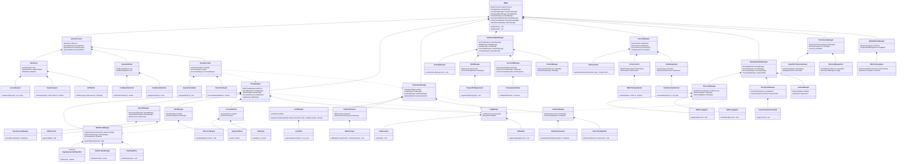

```mermaid
classDiagram
    %% Core DBMS Architecture
    class DBMS {
        -QueryProcessor queryProcessor
        -StorageEngine storageEngine
        -TransactionManager transactionManager
        -DatabaseObjectManager objectManager
        -SecurityManager securityManager
        -BackupDurabilityManager backupManager
        -PerformanceManager performanceManager
        -AdminMonitorManager adminManager
        +startSystem() void
        +stopSystem() void
    }

    %% -----------------------------------------
    %% Query Processor Subsystem
    %% -----------------------------------------
    class QueryProcessor {
        -SQLParser sqlParser
        -QueryOptimizer queryOptimizer
        -QueryExecution queryExecution
        -QueryValidation queryValidation
    }
    class SQLParser {
        -LexicalAnalyzer lexer
        -SyntaxAnalyzer syntaxAnalyzer
        -ASTBuilder astBuilder
    }
    class LexicalAnalyzer {
        +tokenize(String sql) List_Token
    }
    class SyntaxAnalyzer {
        +checkSyntax(List_Token tokens) boolean
    }
    class ASTBuilder {
        +buildTree(List_Token tokens) ASTNode
    }
    class QueryOptimizer {
        -CostBasedOptimizer cbo
        -RuleBasedOptimizer rbo
    }
    class CostBasedOptimizer {
        +estimateCost(Plan p) double
    }
    class RuleBasedOptimizer {
        +applyRules(Plan p) Plan
    }
    class QueryExecution {
        -OperatorScheduler scheduler
        -ExecutionEngine engine
        -ResourceManager resourceManager
    }
    class OperatorScheduler {
        +schedule(Plan p) void
    }
    class ExecutionEngine {
        +executeNode(OpNode n) Result
    }

    QueryProcessor *-- SQLParser
    QueryProcessor *-- QueryOptimizer
    QueryProcessor *-- QueryExecution
    SQLParser *-- LexicalAnalyzer
    SQLParser *-- SyntaxAnalyzer
    SQLParser *-- ASTBuilder
    QueryOptimizer *-- CostBasedOptimizer
    QueryOptimizer *-- RuleBasedOptimizer
    QueryExecution *-- OperatorScheduler
    QueryExecution *-- ExecutionEngine

    %% -----------------------------------------
    %% Storage Engine Subsystem
    %% -----------------------------------------
    class StorageEngine {
        -BufferPoolManager bufferPool
        -RecordManager recordManager
        -IndexManager indexManager
        -AccessMethods accessMethods
        -LogManager logManager
    }
    class BufferPoolManager {
        -PageReplacementAlgorithm replacementAlgo
        -BufferFrameManager frameManager
        -DirtyPageWriter dirtyWriter
        +fetchPage(PageID pid) Page
    }
    class PageReplacementAlgorithm {
        <<interface>>
        +findVictim() PageID
    }
    class BufferFrameManager {
        +allocateFrame() Frame
    }
    class DirtyPageWriter {
        +flushDirtyPages() void
    }
    class RecordManager {
        -RecordLayoutManager layoutManager
        -TupleHeaderManager headerManager
        -RIDGenerator ridGenerator
    }
    class RecordLayoutManager {
        +formatRecord(Tuple t) ByteArray
    }
    class RIDGenerator {
        +generateRID() RID
    }
    class IndexManager {
        -IndexMetadata metadata
        -BTreeCoreEngine bTreeEngine
    }
    class BTreeCoreEngine {
        +insertNode(Key k, RID r) void
    }
    class AccessMethods {
        -SequentialScan seqScan
        -IndexScan idxScan
    }
    class SequentialScan {
        +scan() Iterator
    }
    class IndexScan {
        +scan(Key k) Iterator
    }
    class LogManager {
        -LSNGenerator lsnGenerator
        -WALBuffer walBuffer
    }
    class LSNGenerator {
        +nextLSN() LSN
    }
    class WALBuffer {
        +appendLog(LogRecord l) void
    }

    StorageEngine *-- BufferPoolManager
    StorageEngine *-- RecordManager
    StorageEngine *-- IndexManager
    StorageEngine *-- AccessMethods
    StorageEngine *-- LogManager
    BufferPoolManager *-- PageReplacementAlgorithm
    BufferPoolManager *-- BufferFrameManager
    BufferPoolManager *-- DirtyPageWriter
    RecordManager *-- RecordLayoutManager
    RecordManager *-- RIDGenerator
    IndexManager *-- BTreeCoreEngine
    AccessMethods *-- SequentialScan
    AccessMethods *-- IndexScan
    LogManager *-- LSNGenerator
    LogManager *-- WALBuffer

    %% -----------------------------------------
    %% Transaction Subsystem
    %% -----------------------------------------
    class TransactionManager {
        -TransactionTable txnTable
        -LockManager lockManager
        -IsolationManager isolationManager
        -DeadlockDetector deadlockDetector
    }
    class LockManager {
        -LockTable lockTable
        +acquireLock(TransactionID txnId, ResourceID resId, LockMode mode) boolean
    }
    class LockTable {
        +getLocks(ResourceID r) List_Lock
    }
    class DeadlockDetector {
        -WaitForGraph waitGraph
        -VictimSelectionStrategy victimStrategy
    }
    class WaitForGraph {
        +addEdge(TransactionID t1, TransactionID t2) void
    }
    class IsolationManager {
        -ReadViewGenerator snapshotGen
        -VersionChainBuilder mvccBuilder
    }
    class ReadViewGenerator {
        +createSnapshot(TransactionID t) Snapshot
    }
    class VersionChainBuilder {
        +linkVersion(Record r1, Record r2) void
    }

    TransactionManager *-- LockManager
    TransactionManager *-- DeadlockDetector
    TransactionManager *-- IsolationManager
    LockManager *-- LockTable
    DeadlockDetector *-- WaitForGraph
    IsolationManager *-- ReadViewGenerator
    IsolationManager *-- VersionChainBuilder

    %% -----------------------------------------
    %% Database Object Management
    %% -----------------------------------------
    class DatabaseObjectManager {
        -SchemaManager schemaManager
        -TableManager tableManager
        -ViewManager viewManager
        -ConstraintManager constraintManager
        -ColumnManager columnManager
    }
    class SchemaManager {
        +createSchema(String name) void
    }
    class TableManager {
        -TableCreator tableCreator
        -PhysicalFileRegistration fileRegistry
    }
    class PhysicalFileRegistration {
        +registerFile(String path) void
    }
    class ConstraintManager {
        -PrimaryKeyValidator pkValidator
        -UniqueConstraintManager ukManager
        -CheckConstraintEvaluator checkEvaluator
    }
    class PrimaryKeyValidator {
        +validatePK(Record r) boolean
    }
    class ColumnManager {
        -ColumnDefinitionManager colDefMgr
        -DefaultValueManager defValMgr
    }

    DatabaseObjectManager *-- SchemaManager
    DatabaseObjectManager *-- TableManager
    DatabaseObjectManager *-- ConstraintManager
    DatabaseObjectManager *-- ColumnManager
    ConstraintManager *-- PrimaryKeyValidator
    TableManager *-- PhysicalFileRegistration
    
    %% -----------------------------------------
    %% Backup & Durability
    %% -----------------------------------------
    class BackupDurabilityManager {
        -BackupManager backupManager
        -RestoreManager restoreManager
        -RecoveryManager recoveryManager
        -CheckpointManager checkpointMgr
    }
    class RecoveryManager {
        -CrashRecoveryManager crashRecovery
        -REDOLogApplier redoApplier
        -UNDOLogApplier undoApplier
    }
    class REDOLogApplier {
        +apply(LogRecord l) void
    }
    class UNDOLogApplier {
        +rollback(LogRecord l) void
    }
    class CheckpointManager {
        -CheckpointerDaemon checkpointer
        -FuzzyCheckpointController fuzzyController
    }
    class FuzzyCheckpointController {
        +triggerFuzzy() void
    }
    class RestoreManager {
        -RestoreValidator validator
        -FileRestorer fileRestorer
    }
    BackupDurabilityManager *-- RecoveryManager
    BackupDurabilityManager *-- CheckpointManager
    BackupDurabilityManager *-- RestoreManager
    RecoveryManager *-- REDOLogApplier
    RecoveryManager *-- UNDOLogApplier
    CheckpointManager *-- FuzzyCheckpointController

    %% -----------------------------------------
    %% Security & Access Control
    %% -----------------------------------------
    class SecurityManager {
        -Authentication authModule
        -Authorization authzModule
        -AccessControl accessControl
        -UserManagement userMgmt
    }
    class Authentication {
        +authenticateUser(Credentials creds) SessionToken
    }
    class AccessControl {
        -RBACPolicyEvaluator rbacEvaluator
        -DACEvaluator dacEvaluator
    }
    class RBACPolicyEvaluator {
        +evaluate(Role r, Action a) boolean
    }
    class UserManagement {
        -UserCatalog userCatalog
        -RoleHierarchyResolver roleResolver
    }
    class RoleHierarchyResolver {
        +resolveRoles(User u) List_Role
    }
    SecurityManager *-- Authentication
    SecurityManager *-- AccessControl
    SecurityManager *-- UserManagement
    AccessControl *-- RBACPolicyEvaluator
    UserManagement *-- RoleHierarchyResolver

    %% -----------------------------------------
    %% Performance and Admin Subsystems
    %% -----------------------------------------
    class PerformanceManager {
        -QueryPerformanceAnalyzer perfAnalyzer
        -MemoryManagement memMgmt
        -Caching cacheMgmt
    }
    class QueryPerformanceAnalyzer {
        -IndexUsageAdvisor indexAdvisor
        -SlowQueryProfiler slowProfiler
    }
    class MemoryManagement {
        -SharedMemoryAllocator sharedAlloc
        -MemoryPoolManager poolMgr
    }
    class AdminMonitorManager {
        -MonitoringLogging monitoring
        -ConfigurationManagement configMgmt
    }
    class MonitoringLogging {
        -PerformanceMetricsCollector metricsCollector
        -SystemErrorLogWriter errorWriter
    }
    
    PerformanceManager *-- QueryPerformanceAnalyzer
    PerformanceManager *-- MemoryManagement
    AdminMonitorManager *-- MonitoringLogging

    %% Cross-Subsystem Dependencies
    DBMS *-- QueryProcessor
    DBMS *-- StorageEngine
    DBMS *-- TransactionManager
    DBMS *-- DatabaseObjectManager
    DBMS *-- SecurityManager
    DBMS *-- BackupDurabilityManager
    DBMS *-- PerformanceManager
    DBMS *-- AdminMonitorManager
    
    QueryExecution ..> StorageEngine
    QueryExecution ..> TransactionManager
    StorageEngine ..> LogManager
    RecoveryManager ..> LogManager
    AccessMethods ..> BufferPoolManager
    TransactionManager ..> LogManager
```
