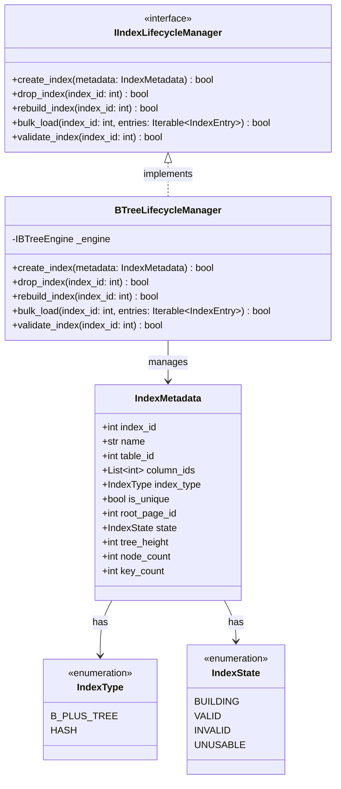

# Index Management Subsystem - Lifecycle Management

This component is responsible for initializing new indexes, deleting indexes, rebuilding them when massive data changes occur (Rebuild), and validating the structural integrity of the B+ Tree (Validate).

---

## 1. Sub-Class Diagram



---

## 2. Python Skeleton Specification

```python
from abc import ABC, abstractmethod
from enum import Enum, auto
from typing import List, Iterable

class IndexType(Enum):
    B_PLUS_TREE = auto()
    HASH = auto()

class IndexState(Enum):
    BUILDING = auto()
    VALID = auto()
    INVALID = auto()
    UNUSABLE = auto()

class IndexMetadata:
    def __init__(self, index_id: int, name: str, table_id: int, column_ids: List[int], index_type: IndexType):
        self.index_id: int = index_id
        self.name: str = name
        self.table_id: int = table_id
        self.column_ids: List[int] = column_ids
        self.index_type: IndexType = index_type
        self.is_unique: bool = False
        self.root_page_id: int = -1
        self.state: IndexState = IndexState.BUILDING
        self.tree_height: int = 0
        self.node_count: int = 0
        self.key_count: int = 0

class IIndexLifecycleManager(ABC):
    @abstractmethod
    def create_index(self, metadata: IndexMetadata) -> bool:
        """Initialize a new index structure in the system."""
        pass

    @abstractmethod
    def drop_index(self, index_id: int) -> bool:
        """Delete the index and free the page resources."""
        pass

    @abstractmethod
    def rebuild_index(self, index_id: int) -> bool:
        """Rebuild the index from the base data table."""
        pass

    @abstractmethod
    def bulk_load(self, index_id: int, entries: Iterable['IndexEntry']) -> bool:
        """Build the index from bottom-up with a large dataset."""
        pass

    @abstractmethod
    def validate_index(self, index_id: int) -> bool:
        """Cross-check the structural integrity of the index tree."""
        pass

class BTreeLifecycleManager(IIndexLifecycleManager):
    def __init__(self, engine: 'IBTreeEngine'):
        self._engine = engine

    def create_index(self, metadata: IndexMetadata) -> bool:
        pass

    def drop_index(self, index_id: int) -> bool:
        pass

    def rebuild_index(self, index_id: int) -> bool:
        pass

    def bulk_load(self, index_id: int, entries: Iterable['IndexEntry']) -> bool:
        pass

    def validate_index(self, index_id: int) -> bool:
        pass
```
