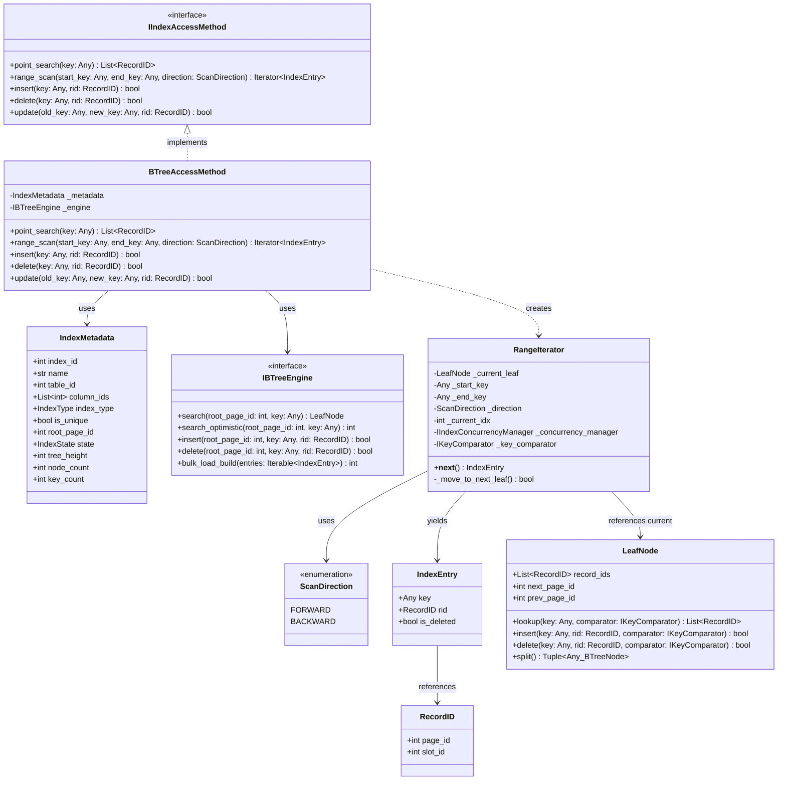

# Index Management Subsystem - Access Methods

This component provides the main API interface for the end-user or Query Optimizer to interact with the index, performing operations: Point Search, Range Scan, Insert, Delete, and Update.

---

## 1. Sub-Class Diagram



---

## 2. Python Skeleton Specification

```python
from abc import ABC, abstractmethod
from enum import Enum, auto
from typing import Any, List, Iterator

class ScanDirection(Enum):
    FORWARD = auto()
    BACKWARD = auto()

class RecordID:
    def __init__(self, page_id: int, slot_id: int):
        self.page_id: int = page_id
        self.slot_id: int = slot_id

class IndexEntry:
    def __init__(self, key: Any, rid: RecordID, is_deleted: bool = False):
        self.key: Any = key
        self.rid: RecordID = rid
        self.is_deleted: bool = is_deleted

class IIndexAccessMethod(ABC):
    @abstractmethod
    def point_search(self, key: Any) -> List[RecordID]:
        """Search for a specific key, return the corresponding list of RecordIDs."""
        pass

    @abstractmethod
    def range_scan(self, start_key: Any, end_key: Any, direction: ScanDirection) -> Iterator[IndexEntry]:
        """Return an Iterator to scan through a range of data keys."""
        pass

    @abstractmethod
    def insert(self, key: Any, rid: RecordID) -> bool:
        """Insert a new index record (key -> RecordID)."""
        pass

    @abstractmethod
    def delete(self, key: Any, rid: RecordID) -> bool:
        """Delete an index record."""
        pass

    @abstractmethod
    def update(self, old_key: Any, new_key: Any, rid: RecordID) -> bool:
        """Update an index record (delete old_key, insert new_key)."""
        pass

class BTreeAccessMethod(IIndexAccessMethod):
    def __init__(self, metadata: 'IndexMetadata', engine: 'IBTreeEngine'):
        self._metadata = metadata
        self._engine = engine

    def point_search(self, key: Any) -> List[RecordID]:
        pass

    def range_scan(self, start_key: Any, end_key: Any, direction: ScanDirection) -> Iterator[IndexEntry]:
        pass

    def insert(self, key: Any, rid: RecordID) -> bool:
        pass

    def delete(self, key: Any, rid: RecordID) -> bool:
        pass

    def update(self, old_key: Any, new_key: Any, rid: RecordID) -> bool:
        pass

class RangeIterator(Iterator[IndexEntry]):
    def __init__(self, 
                 starting_leaf: 'LeafNode', 
                 start_key: Any, 
                 end_key: Any, 
                 direction: ScanDirection,
                 concurrency_manager: 'IIndexConcurrencyManager',
                 key_comparator: 'IKeyComparator'):
        self._current_leaf = starting_leaf
        self._start_key = start_key
        self._end_key = end_key
        self._direction = direction
        self._concurrency_manager = concurrency_manager
        self._key_comparator = key_comparator
        self._current_idx = 0

    def __next__(self) -> IndexEntry:
        pass

    def _move_to_next_leaf(self) -> bool:
        pass
```
