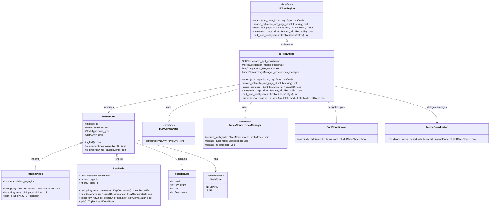

# Index Management Subsystem - Core B+ Tree Engine

This component represents the core of the B+ Tree algorithm, responsible for tree traversal, page allocation, node splitting upon overflow, and merging/borrowing keys from siblings upon underflow.

---

## 1. Sub-Class Diagram



---

## 2. Python Skeleton Specification

```python
from abc import ABC, abstractmethod
from enum import Enum, auto
from typing import Any, List, Tuple, Iterable

class NodeType(Enum):
    INTERNAL = auto()
    LEAF = auto()

class NodeHeader:
    def __init__(self, level: int = 0, key_count: int = 0, lsn: int = 0, free_space: int = 4096):
        self.level: int = level
        self.key_count: int = key_count
        self.lsn: int = lsn
        self.free_space: int = free_space

class BTreeNode:
    def __init__(self, page_id: int, node_type: NodeType, header: NodeHeader):
        self.page_id: int = page_id
        self.header: NodeHeader = header
        self.node_type: NodeType = node_type
        self.keys: List[Any] = []

    def is_leaf(self) -> bool:
        return self.node_type == NodeType.LEAF

    def is_overflow(self, max_capacity: int) -> bool:
        return len(self.keys) > max_capacity

    def is_underflow(self, min_capacity: int) -> bool:
        return len(self.keys) < min_capacity

class InternalNode(BTreeNode):
    def __init__(self, page_id: int, header: NodeHeader):
        super().__init__(page_id, NodeType.INTERNAL, header)
        self.children_page_ids: List[int] = []

    def lookup(self, key: Any, comparator: 'IKeyComparator') -> int:
        pass

    def insert(self, key: Any, child_page_id: int) -> None:
        pass

    def split(self) -> Tuple[Any, BTreeNode]:
        pass

class LeafNode(BTreeNode):
    def __init__(self, page_id: int, header: NodeHeader, next_page_id: int = -1, prev_page_id: int = -1):
        super().__init__(page_id, NodeType.LEAF, header)
        self.record_ids: List['RecordID'] = []
        self.next_page_id: int = next_page_id
        self.prev_page_id: int = prev_page_id

    def lookup(self, key: Any, comparator: 'IKeyComparator') -> List['RecordID']:
        pass

    def insert(self, key: Any, rid: 'RecordID', comparator: 'IKeyComparator') -> bool:
        pass

    def delete(self, key: Any, rid: 'RecordID', comparator: 'IKeyComparator') -> bool:
        pass

    def split(self) -> Tuple[Any, BTreeNode]:
        pass

class IBTreeEngine(ABC):
    @abstractmethod
    def search(self, root_page_id: int, key: Any) -> LeafNode: pass

    @abstractmethod
    def search_optimistic(self, root_page_id: int, key: Any) -> int: pass

    @abstractmethod
    def insert(self, root_page_id: int, key: Any, rid: 'RecordID') -> bool: pass

    @abstractmethod
    def delete(self, root_page_id: int, key: Any, rid: 'RecordID') -> bool: pass

    @abstractmethod
    def bulk_load_build(self, entries: Iterable['IndexEntry']) -> int: pass

class BTreeEngine(IBTreeEngine):
    def __init__(self, 
                 split_coordinator: 'SplitCoordinator', 
                 merge_coordinator: 'MergeCoordinator',
                 key_comparator: 'IKeyComparator',
                 concurrency_manager: 'IIndexConcurrencyManager'):
        self._split_coordinator = split_coordinator
        self._merge_coordinator = merge_coordinator
        self._key_comparator = key_comparator
        self._concurrency_manager = concurrency_manager

    def search(self, root_page_id: int, key: Any) -> LeafNode: pass
    def search_optimistic(self, root_page_id: int, key: Any) -> int: pass
    def insert(self, root_page_id: int, key: Any, rid: 'RecordID') -> bool: pass
    def delete(self, root_page_id: int, key: Any, rid: 'RecordID') -> bool: pass
    def bulk_load_build(self, entries: Iterable['IndexEntry']) -> int: pass
    def _traverse(self, root_page_id: int, key: Any, latch_mode: 'LatchMode') -> BTreeNode: pass

class SplitCoordinator:
    def coordinate_split(self, parent: InternalNode, child: BTreeNode) -> bool:
        pass

class MergeCoordinator:
    def coordinate_merge_or_redistribute(self, parent: InternalNode, child: BTreeNode) -> bool:
        pass
```
