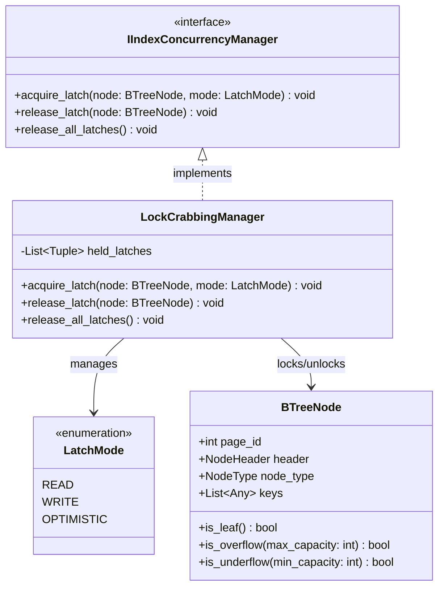

# Index Management Subsystem - Concurrency Control

This component ensures the structural consistency of the index tree when multiple threads are reading and writing simultaneously (Multi-threading). It implements the Latch Crabbing protocol and supports the Optimistic Read strategy.

---

## 1. Sub-Class Diagram



---

## 2. Python Skeleton Specification

```python
from abc import ABC, abstractmethod
from enum import Enum, auto
from typing import List, Tuple

class LatchMode(Enum):
    READ = auto()
    WRITE = auto()
    OPTIMISTIC = auto()

class IIndexConcurrencyManager(ABC):
    @abstractmethod
    def acquire_latch(self, node: 'BTreeNode', mode: LatchMode) -> None:
        """Request to hold an exclusive read/write latch on the corresponding index page."""
        pass

    @abstractmethod
    def release_latch(self, node: 'BTreeNode') -> None:
        """Release a held latch on a specific index page."""
        pass

    @abstractmethod
    def release_all_latches(self) -> None:
        """Release all acquired latches (called after finishing a transaction/operation)."""
        pass

class LockCrabbingManager(IIndexConcurrencyManager):
    def __init__(self):
        # Store a list of held latches: List[Tuple[Node, Mode]]
        self.held_latches: List[Tuple['BTreeNode', LatchMode]] = []

    def acquire_latch(self, node: 'BTreeNode', mode: LatchMode) -> None:
        pass

    def release_latch(self, node: 'BTreeNode') -> None:
        pass

    def release_all_latches(self) -> None:
        pass
```
