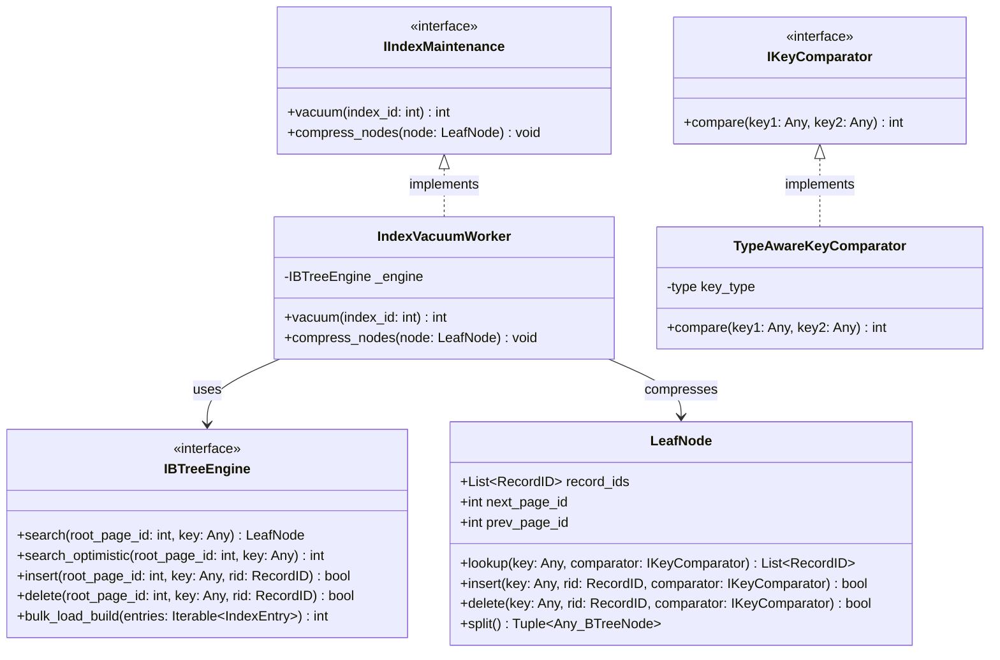

# Index Management Subsystem - Maintenance & Garbage Collection

This component performs periodic or background space reclamation. The Vacuum worker is responsible for physically reclaiming memory slots of logically deleted entries (Tombstone) and compressing prefix keys (Prefix Compression) on B+ Tree leaf nodes. The Key Comparator class is used to define how to compare different data types of keys.

---

## 1. Sub-Class Diagram



---

## 2. Python Skeleton Specification

```python
from abc import ABC, abstractmethod
from typing import Any

class IIndexMaintenance(ABC):
    @abstractmethod
    def vacuum(self, index_id: int) -> int:
        """Traverse through leaf nodes, physically reclaiming records marked as logically deleted (Tombstone)."""
        pass

    @abstractmethod
    def compress_nodes(self, node: 'LeafNode') -> None:
        """Perform Prefix Compression to optimize the storage capacity of leaf nodes."""
        pass

class IndexVacuumWorker(IIndexMaintenance):
    def __init__(self, engine: 'IBTreeEngine'):
        self._engine = engine

    def vacuum(self, index_id: int) -> int:
        pass

    def compress_nodes(self, node: 'LeafNode') -> None:
        pass

class IKeyComparator(ABC):
    @abstractmethod
    def compare(self, key1: Any, key2: Any) -> int:
        """Compare two keys. Return <0 if key1 < key2, =0 if key1 == key2, >0 if key1 > key2."""
        pass

class TypeAwareKeyComparator(IKeyComparator):
    def __init__(self, key_type: type):
        self.key_type = key_type

    def compare(self, key1: Any, key2: Any) -> int:
        # Dynamic comparison based on input data type (int, str, float...)
        if key1 < key2:
            return -1
        elif key1 > key2:
            return 1
        return 0
```
