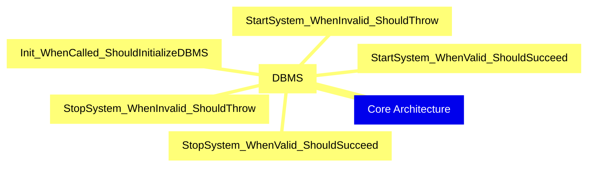
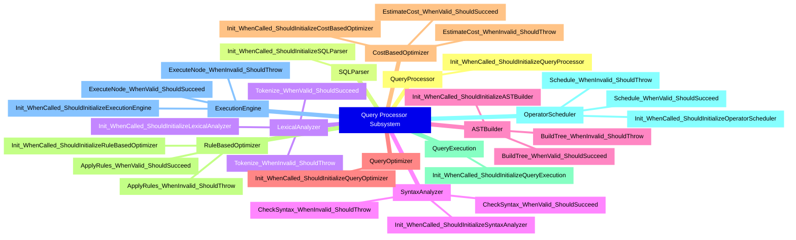
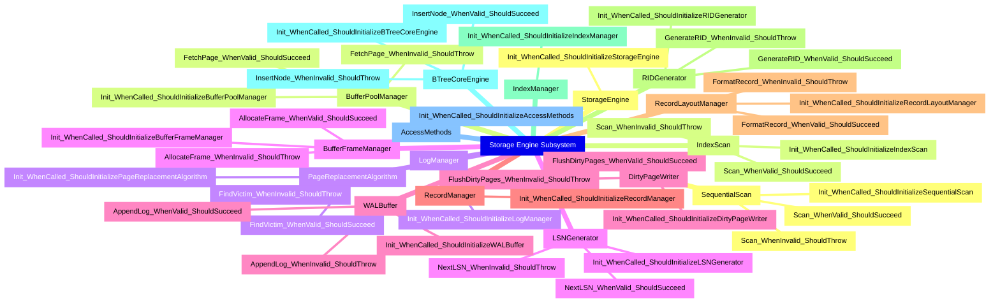
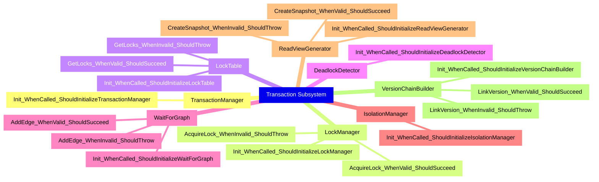
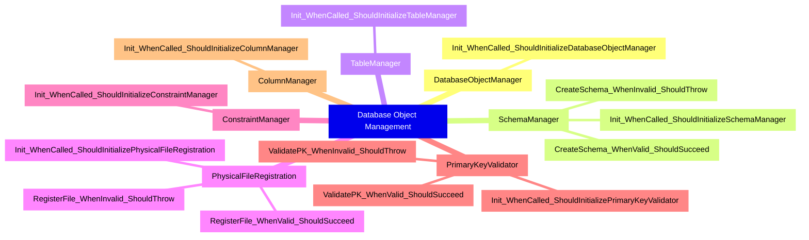
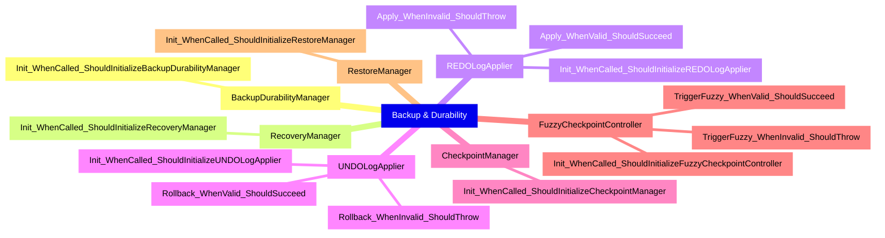
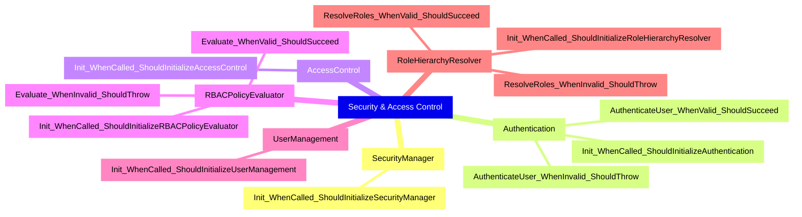
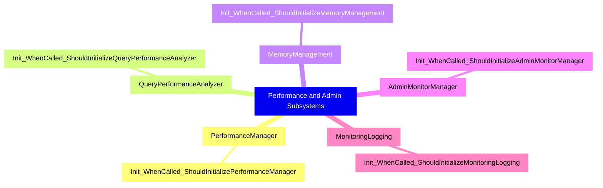

# 🧪 Unit Tests Architecture

## 1. Core Architecture Unit Tests

## 2. Query Processor Subsystem Unit Tests

## 3. Storage Engine Subsystem Unit Tests

## 4. Transaction Subsystem Unit Tests

## 5. Database Object Management Unit Tests

## 6. Backup & Durability Unit Tests

## 7. Security & Access Control Unit Tests

## 8. Performance and Admin Subsystems Unit Tests

