# Giải thích chi tiết 3 Design Pattern trong Hệ quản trị Cơ sở dữ liệu (DBMS)

Tài liệu này giải thích chuyên sâu về 3 mẫu thiết kế (Design Pattern) quan trọng nhất được áp dụng trong kiến trúc của hệ thống DBMS. Mỗi pattern sẽ được phân tích rõ ràng từ vấn đề gặp phải, cách giải quyết, cho đến lý do vì sao nó lại là sự lựa chọn tối ưu nhất.

---

## 1. Mẫu thiết kế Composite (Composite Pattern)
**Áp dụng cho:** Quản lý cấu trúc đối tượng dữ liệu (Database Objects)

### Vấn đề gặp phải
Trong một hệ quản trị CSDL, dữ liệu có tính phân cấp lồng nhau rất sâu: Một `Database` chứa nhiều `Schema`, một `Schema` lại chứa nhiều `Table` và `View`, trong mỗi `Table` lại chứa các `Column` (Cột) và `Constraint` (Ràng buộc). 
Nếu chúng ta lưu trữ và quản lý chúng bằng các danh sách rời rạc (ví dụ: DB giữ một mảng Schema, Schema giữ một mảng Table, Table giữ mảng Column), thì mỗi khi hệ thống cần quét toàn bộ cấu trúc (ví dụ: Tính tổng dung lượng ổ cứng, hoặc xuất file DDL), lập trình viên sẽ phải viết hàng loạt vòng lặp `for` lồng nhau. Code sẽ tràn ngập các câu lệnh kiểm tra kiểu dữ liệu (`if object là Table thì...`, `else if object là Column thì...`), vô cùng cồng kềnh và khó bảo trì.

### Giải pháp của Composite Pattern
Mẫu thiết kế Composite giải quyết triệt để vấn đề này bằng cách gom tất cả các thành phần lại chung dưới một giao diện (Interface) đồng nhất, ví dụ đặt tên là `MetadataNode`.
- Các thành phần không có con (như Cột, Ràng buộc) và các thành phần chứa con (Database, Schema, Bảng) đều phải triển khai chung giao diện này.
- Khi người dùng muốn lấy dữ liệu, họ chỉ cần gọi hàm `get_metadata()` ở cấp độ cao nhất là `Database`.
- Hệ thống sẽ tự động gọi "đệ quy" lệnh đó chui xuống `Schema`, rồi tự động lan truyền xuống `Table`, và cuối cùng đến `Column` để thu thập thông tin. 

### Lý do lựa chọn (Vì sao lại đúng đắn?)
- **Tính đồng nhất tuyệt đối:** DBMS không cần phân biệt đâu là Cột (bé nhất) và đâu là Database (lớn nhất) khi thao tác. Tất cả đều là `MetadataNode`.
- **Dễ dàng mở rộng:** Tuân thủ nguyên lý Đóng/Mở (Open/Closed Principle). Sau này, nếu DBMS cần hỗ trợ thêm khái niệm `Trigger` hay `Index`, lập trình viên chỉ cần tạo class mới kế thừa giao diện chung mà không phải sửa đổi hay phá vỡ bất kỳ vòng lặp cốt lõi nào của hệ thống.

### Giải thích Sơ đồ Class và Sequence (Composite Pattern)

#### Class Diagram
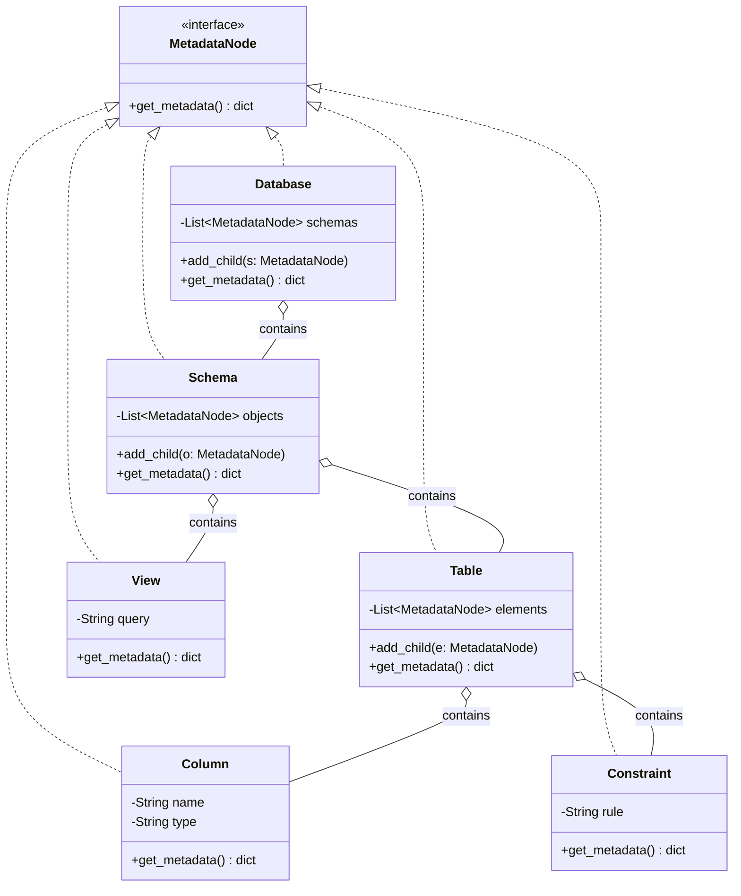
```mermaid
classDiagram
    class MetadataNode {
        <<interface>>
        +get_metadata() dict
    }
    
    class Database {
        -List~MetadataNode~ schemas
        +add_child(s: MetadataNode)
        +get_metadata() dict
    }
    
    class Schema {
        -List~MetadataNode~ objects
        +add_child(o: MetadataNode)
        +get_metadata() dict
    }
    
    class Table {
        -List~MetadataNode~ elements
        +add_child(e: MetadataNode)
        +get_metadata() dict
    }
    
    class View {
        -String query
        +get_metadata() dict
    }
    
    class Column {
        -String name
        -String type
        +get_metadata() dict
    }
    
    class Constraint {
        -String rule
        +get_metadata() dict
    }

    MetadataNode <|.. Database
    MetadataNode <|.. Schema
    MetadataNode <|.. Table
    MetadataNode <|.. View
    MetadataNode <|.. Column
    MetadataNode <|.. Constraint
    
    Database o-- Schema : contains
    Schema o-- Table : contains
    Schema o-- View : contains
    Table o-- Column : contains
    Table o-- Constraint : contains
```
**Giải thích Chi tiết (Phân tích Logic, Quan hệ, và Method):**
- **Method (Phương thức cốt lõi):** Giao diện chung `MetadataNode` định nghĩa một method duy nhất là `get_metadata()`. Bất kỳ đối tượng nào tham gia vào cấu trúc này cũng bắt buộc phải implement hàm này. Các nhánh (Branch như Database, Schema) sẽ có thêm hàm `add_child()` để nhét các phần tử con vào danh sách quản lý.
- **Quan hệ (Relationships):**
  - **Realization (Kế thừa Interface - Mũi tên đứt nét):** Tất cả từ `Database` khổng lồ đến `Column` bé nhỏ đều thực thi chung giao diện `MetadataNode`. Điều này giúp client (bên gọi) đối xử với mọi cấp độ hoàn toàn công bằng (Uniformity).
  - **Aggregation (Quan hệ Tập hợp - Hình thoi rỗng):** Một `Table` có thể chứa nhiều `Column` và `Constraint`. Đây là biểu hiện của nhánh (Branch) giữ con trỏ trỏ tới các nút con (Leaves).
- **Logic hoạt động & Điểm mạnh (Pros):** Khi cần tính toán hoặc xuất dữ liệu, hàm `get_metadata()` ở lớp nhánh sẽ thực hiện vòng lặp duyệt qua toàn bộ `children`, và đệ quy gọi `get_metadata()` của từng đứa con. Hệ thống tự động lan truyền lệnh từ đỉnh tháp xuống tận đáy tháp mà không cần bất kỳ câu lệnh `if (type == Table)` nào.

#### Sequence Diagram
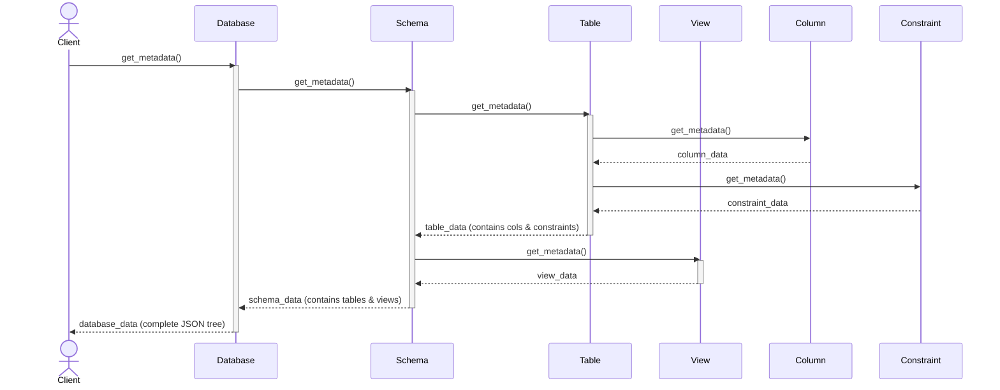
```mermaid
sequenceDiagram
    actor Client
    participant DB as Database
    participant Sch as Schema
    participant Tbl as Table
    participant Vw as View
    participant Col as Column
    participant Cst as Constraint

    Client->>DB: get_metadata()
    activate DB
    
    DB->>Sch: get_metadata()
    activate Sch
    
    %% Processing Table branch
    Sch->>Tbl: get_metadata()
    activate Tbl
    Tbl->>Col: get_metadata()
    Col-->>Tbl: column_data
    Tbl->>Cst: get_metadata()
    Cst-->>Tbl: constraint_data
    Tbl-->>Sch: table_data (contains cols & constraints)
    deactivate Tbl
    
    %% Processing View branch
    Sch->>Vw: get_metadata()
    activate Vw
    Vw-->>Sch: view_data
    deactivate Vw
    
    Sch-->>DB: schema_data (contains tables & views)
    deactivate Sch
    
    DB-->>Client: database_data (complete JSON tree)
    deactivate DB
```
**Giải thích Chi tiết Sơ đồ Động:**
Sơ đồ Sequence mô phỏng hiệu ứng domino của đệ quy:
1. Client kích hoạt phương thức tại root (`Database`).
2. Tín hiệu tự động được đẩy xuống `Schema`.
3. `Schema` gửi yêu cầu thu thập dữ liệu song song cho 2 nhánh con của nó là `Table` và `View`.
4. Bản thân `Table` lại tiếp tục truy vấn xuống các `Column` và `Constraint` trực thuộc.
5. Cuối cùng, dữ liệu từ các lá (như `column_data`, `constraint_data`) cuộn ngược trở lên, gộp thành một khối JSON hoàn chỉnh và trả về cho Client. Rất gọn gàng và tự động!

---

## 2. Mẫu thiết kế Template Method (Template Method Pattern)
**Áp dụng cho:** Cơ chế kiểm tra ràng buộc dữ liệu (Constraint Validation)

### Vấn đề gặp phải
Cơ sở dữ liệu có rất nhiều loại ràng buộc để bảo vệ tính toàn vẹn của data như: `NOT NULL`, `CHECK`, `UNIQUE` (Duy nhất), hay `PRIMARY KEY`. 
Mặc dù logic cốt lõi của chúng khác nhau (VD: Unique phải chọc xuống ổ cứng tìm Index, trong khi Not Null chỉ cần kiểm tra ngay trên RAM), nhưng **quy trình vòng đời** để kiểm tra lỗi lại hoàn toàn giống nhau:
1. **Tiền xử lý:** Bỏ qua không kiểm tra nếu giá trị truyền vào là `Null` (ngoại trừ ràng buộc Not Null).
2. **Kiểm tra logic lõi:** Xem dữ liệu có hợp lệ hay không.
3. **Hậu xử lý:** Nếu dữ liệu sai, ném ra lỗi `ConstraintViolationException` chuẩn hóa để hủy bỏ giao dịch (rollback).

Nếu để lập trình viên tự viết từng Constraint độc lập, họ sẽ phải copy-paste bước 1 và bước 3 liên tục. Điều này tạo ra rác code và nguy cơ cực cao: Một người nào đó có thể quên ném lỗi ở bước 3, dẫn đến hệ thống bị lỗi ngầm.

### Giải pháp của Template Method
Pattern này tạo ra một "khung xương" (Skeleton) cố định nằm ở lớp cha (lớp `Constraint`). Lớp cha sẽ định nghĩa sẵn hàm `validate()` chứa đủ 3 bước trên và **khóa chặt** không cho lớp con sửa đổi. Các lớp con (như `CheckConstraint`, `UniqueConstraint`) chỉ được phép điền phần logic riêng của mình vào duy nhất một lỗ hổng do lớp cha khoét sẵn (hàm `check_logic()`).

### Lý do lựa chọn (Vì sao lại đúng đắn?)
- **Nguyên lý Hollywood (Đừng gọi tôi, tôi sẽ gọi bạn):** Lớp cha nắm toàn quyền kiểm soát luồng chạy của hệ thống, nó sẽ chủ động gọi logic của lớp con khi cần thiết. 
- **Đảm bảo tính nhất quán:** Ngăn chặn triệt để rủi ro lỗi lập trình sai quy trình. Dù mai sau có hàng trăm loại Constraint mới được sinh ra, tất cả đều bị ép buộc phải ném lỗi theo đúng chuẩn quy trình mà DBMS đã thiết kế sẵn.
- **Tái sử dụng code tối đa:** Triệt tiêu hoàn toàn việc lặp lại code kiểm tra Null hay code ném Exception.

### Giải thích Sơ đồ Class và Sequence (Template Method)

#### Class Diagram
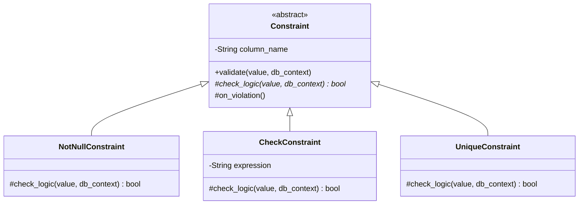
```mermaid
classDiagram
    class Constraint {
        <<abstract>>
        -String column_name
        +validate(value, db_context)
        #check_logic(value, db_context)* bool
        #on_violation()
    }
    
    class NotNullConstraint {
        #check_logic(value, db_context) bool
    }
    
    class CheckConstraint {
        -String expression
        #check_logic(value, db_context) bool
    }
    
    class UniqueConstraint {
        #check_logic(value, db_context) bool
    }

    Constraint <|-- NotNullConstraint
    Constraint <|-- CheckConstraint
    Constraint <|-- UniqueConstraint
```
**Giải thích Chi tiết (Phân tích Logic, Quan hệ, và Method):**
- **Method (Phương thức cốt lõi):**
  - `validate()`: Đây chính là **Template Method**. Nó là một hàm public chứa bộ khung thuật toán cứng (Tiền xử lý -> Logic -> Hậu xử lý). Hàm này không bao giờ được phép ghi đè (override) bởi lớp con.
  - `check_logic()`: Đây là một **Hook Method** (Hàm móc nối) dạng abstract/protected. Nó giống như một lỗ hổng trong bản mẫu, bắt buộc các class con phải "trám" logic kiểm tra cụ thể của chúng vào.
- **Quan hệ (Relationships):**
  - **Inheritance (Kế thừa - Mũi tên liền):** Các lớp con như `CheckConstraint`, `UniqueConstraint` kế thừa lớp trừu tượng `Constraint`.
- **Logic hoạt động & Điểm mạnh (Pros):** Inversion of Control (Đảo ngược điều khiển) - Các class con không có quyền quyết định khi nào nó được chạy. Lớp cha (`Constraint`) mới là kẻ cầm trịch luồng thời gian, nó sẽ tự động gọi hàm `check_logic()` của lớp con ở đúng thời điểm thích hợp nhất trong vòng đời validation. Hàng ngàn loại constraint khác nhau đều sẽ bị ép tuân thủ chung một chuẩn mực ném lỗi.

#### Sequence Diagram
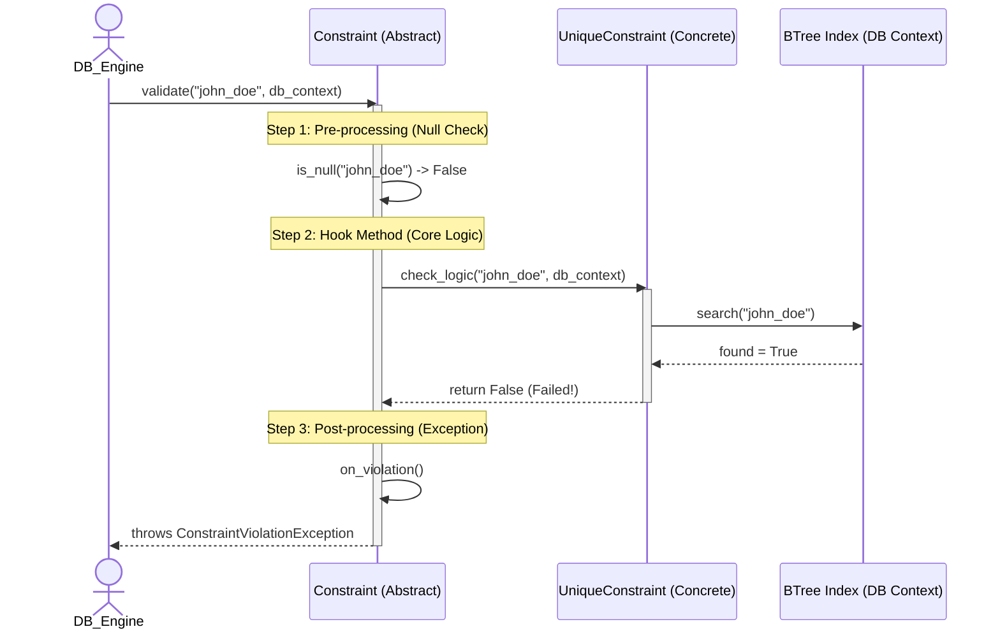
```mermaid
sequenceDiagram
    actor DB_Engine
    participant Base as Constraint (Abstract)
    participant Child as UniqueConstraint (Concrete)
    participant Index as BTree Index (DB Context)

    DB_Engine->>Base: validate("john_doe", db_context)
    activate Base
    
    Note over Base: Step 1: Pre-processing (Null Check)
    Base->>Base: is_null("john_doe") -> False
    
    Note over Base: Step 2: Hook Method (Core Logic)
    Base->>Child: check_logic("john_doe", db_context)
    activate Child
    Child->>Index: search("john_doe")
    Index-->>Child: found = True
    Child-->>Base: return False (Failed!)
    deactivate Child
    
    Note over Base: Step 3: Post-processing (Exception)
    Base->>Base: on_violation()
    Base-->>DB_Engine: throws ConstraintViolationException
    deactivate Base
```
**Giải thích Chi tiết Sơ đồ Động:**
1. Database Engine luôn luôn gọi hàm `validate()` của lớp cha (`Constraint`). Nó hoàn toàn không quan tâm lớp con là ai.
2. Lớp cha tự làm Step 1 (Kiểm tra Null). 
3. Ở Step 2, lớp cha uỷ quyền (delegate) việc kiểm tra nghiệp vụ khó nhằn cho lớp con `UniqueConstraint`. Lớp con lập tức chọc vào BTree Index trên ổ cứng để tìm kiếm.
4. Sau khi lớp con báo cáo kết quả `False` (có nghĩa là "john_doe" đã tồn tại), lớp cha giành lại quyền kiểm soát, tự động chạy Step 3 và ném ra Exception tiêu chuẩn để chặn đứng giao dịch.

---

## 3. Mẫu thiết kế Chuỗi Trách Nhiệm (Chain of Responsibility)
**Áp dụng cho:** Hệ thống kiểm tra phân quyền bảo mật (Privilege Checking)

### Vấn đề gặp phải
Khi một User gõ lệnh truy vấn (Ví dụ: `SELECT * FROM schemaA.tableB`), hệ quản trị CSDL phải kiểm tra bảo mật qua rất nhiều tầng lớp:
1. User có bị cấm truy cập toàn bộ Database không?
2. User có quyền nhìn thấy `schemaA` không?
3. User có quyền `SELECT` trên `tableB` không?
4. User có bị chặn xem một số Cột nhạy cảm không? (Column-level security).

Nếu gom toàn bộ đống luật lệ này vào một file `SecurityManager` khổng lồ chứa hàng tá câu lệnh `if...else` lồng nhau, hệ thống sẽ trở thành một "đống mì spaghetti". Khi cần thêm một lớp bảo mật mới (như chặn IP), bạn sẽ phải phá nát file code cốt lõi để sửa.

### Giải pháp của Chain of Responsibility
Chúng ta tách mỗi tầng kiểm tra bảo mật thành một trạm kiểm soát (Handler) nhỏ, gọn và độc lập. Sau đó, DBMS móc nối các trạm này lại thành một "chuỗi" dây chuyền (Chain):
`Trạm kiểm tra Database` -> `Trạm kiểm tra Schema` -> `Trạm kiểm tra Bảng`.
Khi câu lệnh SQL chạy vào, nó sẽ đi qua từng trạm:
- Nếu trạm nào phát hiện vi phạm, nó lập tức "tuýt còi", ném lỗi Permission Denied và bẻ gãy chuỗi.
- Nếu trạm đó cho qua, nó tự động đẩy câu lệnh sang trạm tiếp theo.

### Lý do lựa chọn (Vì sao lại đúng đắn?)
- **Sự tách bạch hoàn hảo (Decoupling):** Lớp bảo mật cấp Database không cần biết lớp cấp Bảng hoạt động ra sao. Trách nhiệm được chia nhỏ, giúp code cực kỳ dễ đọc và test.
- **Cấu hình động (Dynamic Configuration):** Quản trị viên hệ thống có thể dễ dàng thêm, bớt hoặc đảo lộn thứ tự các lớp bảo mật ngay trong lúc DB đang chạy (Runtime). Ví dụ, bật thêm trạm kiểm tra Cột đối với phiên bản Enterprise mà không cần phải viết lại code lõi. 

### Giải thích Sơ đồ Class và Sequence (Chain of Responsibility)

#### Class Diagram

```mermaid
classDiagram
    class PrivilegeHandler {
        <<abstract>>
        -PrivilegeHandler next_handler
        +set_next(handler: PrivilegeHandler)$ PrivilegeHandler
        +check_access(user, action, target)* bool
        #do_check(user, action, target)* bool
    }
    
    class DatabasePrivilegeHandler {
        #do_check(user, action, target) bool
    }
    
    class SchemaPrivilegeHandler {
        #do_check(user, action, target) bool
    }
    
    class TablePrivilegeHandler {
        #do_check(user, action, target) bool
    }
    
    class ColumnPrivilegeHandler {
        #do_check(user, action, target) bool
    }

    PrivilegeHandler o-- PrivilegeHandler : next_handler
    PrivilegeHandler <|-- DatabasePrivilegeHandler
    PrivilegeHandler <|-- SchemaPrivilegeHandler
    PrivilegeHandler <|-- TablePrivilegeHandler
    PrivilegeHandler <|-- ColumnPrivilegeHandler
```
**Giải thích Chi tiết (Phân tích Logic, Quan hệ, và Method):**
- **Method (Phương thức cốt lõi):**
  - `set_next()`: Hàm dùng để móc trạm hiện tại vào trạm tiếp theo, tạo thành một sợi xích (chain).
  - `check_access()`: Hàm public quản lý việc luân chuyển. Nếu trạm hiện tại check OK, nó sẽ lấy `next_handler` ra và tự động đẩy lệnh `check_access()` về phía trước.
  - `do_check()`: Hàm abstract, nơi chứa nghiệp vụ bảo mật cụ thể của từng trạm (Ví dụ trạm Schema chỉ check quyền của Schema).
- **Quan hệ (Relationships):**
  - **Self-Aggregation (Tự tập hợp - Hình thoi rỗng trỏ lại chính nó):** Lớp `PrivilegeHandler` giữ một biến `next_handler` trỏ tới một object khác mang cùng kiểu `PrivilegeHandler`. Đây chính là cơ chế "mắt xích" kinh điển nối các trạm lại với nhau.
  - **Inheritance:** Tất cả các trạm kiểm duyệt cụ thể (Database, Schema, Table) đều thừa kế từ Handler gốc.
- **Logic hoạt động & Điểm mạnh (Pros):** Khi một request truy cập ập đến, nó sẽ lao vào trạm đầu tiên. Nhờ tính chất mắt xích, request sẽ trôi tuột qua các trạm nếu mọi thứ an toàn, hoặc bị chặn đứng ngay lập tức ở bất kỳ trạm nào báo động đỏ. Ta có thể dễ dàng xáo trộn thứ tự các trạm (hoặc cắm thêm trạm kiểm tra IP) ngay lúc ứng dụng đang chạy cực kỳ mượt mà.

#### Sequence Diagram
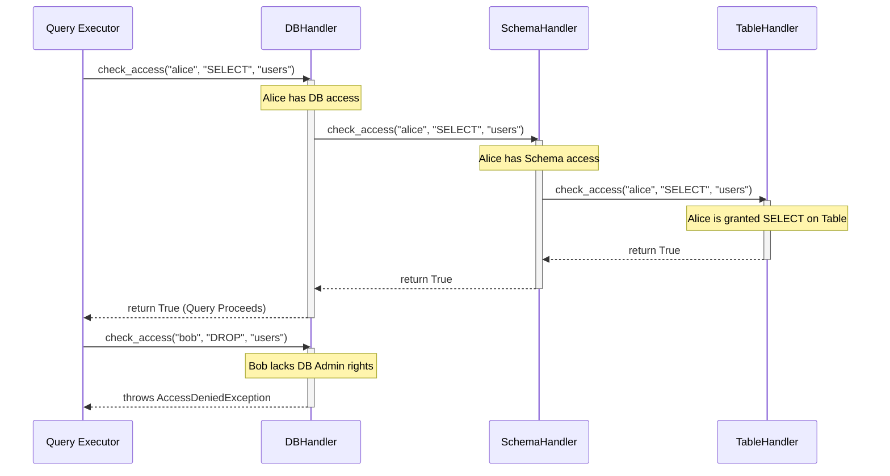
```mermaid
sequenceDiagram
    participant Client as Query Executor
    participant DB as DBHandler
    participant Sch as SchemaHandler
    participant Tbl as TableHandler
    
    Client->>DB: check_access("alice", "SELECT", "users")
    activate DB
    Note over DB: Alice has DB access
    
    DB->>Sch: check_access("alice", "SELECT", "users")
    activate Sch
    Note over Sch: Alice has Schema access
    
    Sch->>Tbl: check_access("alice", "SELECT", "users")
    activate Tbl
    Note over Tbl: Alice is granted SELECT on Table
    Tbl-->>Sch: return True
    deactivate Tbl
    
    Sch-->>DB: return True
    deactivate Sch
    
    DB-->>Client: return True (Query Proceeds)
    deactivate DB
    
    %% Example of Failure
    Client->>DB: check_access("bob", "DROP", "users")
    activate DB
    Note over DB: Bob lacks DB Admin rights
    DB-->>Client: throws AccessDeniedException
    deactivate DB
```
**Giải thích Chi tiết Sơ đồ Động:**
Sơ đồ mô phỏng rõ nét đặc trưng "truyền bóng" của Chain of Responsibility:
1. **Nửa trên (Success Case):** Alice gõ lệnh SELECT. Request chạm vào trạm Database (DBHandler). Pass! Chuyền sang trạm Schema (SchemaHandler). Pass! Cuối cùng chuyền sang trạm Table (TableHandler). Pass! Tín hiệu `True` (Cho phép) dội ngược trở lại cho Client để thực thi Query.
2. **Nửa dưới (Fail Case):** Bob táy máy gõ lệnh DROP. Request vừa đập vào trạm Database (DBHandler) thì bị trạm này bắt thóp ngay (vì thiếu quyền Admin). Chuỗi lập tức bị đứt gãy, DBHandler ném thẳng `AccessDeniedException` vào mặt Client mà không cần tốn công chạy xuống hỏi các trạm Schema hay Table phía sau. Thao tác chặn diễn ra cực kỳ dứt khoát!

---

## 4. Factory Method Pattern (Tạo Lập Đối Tượng)
**Mục tiêu:** Gom toàn bộ logic khởi tạo phức tạp của các đối tượng (như Index, Trigger) vào một xưởng sản xuất (Factory), giúp `Table` không bị dính chặt vào các class cụ thể.

- **Vấn đề:** Nếu ta cho phép class `Table` tự ý gọi `new BTreeIndex()` hay `new HashIndex()`, code của `Table` sẽ chứa đầy các câu lệnh `if/else` chằng chịt để quyết định xem nên khởi tạo class nào. Điều này vi phạm nguyên tắc Open/Closed vì mỗi khi có thêm một loại Index mới (như `BitmapIndex`), ta lại phải chui vào `Table` sửa code.
- **Giải pháp Factory Method:** Ta tạo ra một `IndexFactory`. `Table` bây giờ chỉ cần gọi `factory.create_index("BTREE")`. Xưởng sản xuất sẽ tự lo liệu việc cấp phát bộ nhớ, ghi log, và trả về một instance Index xịn sò. Quá trình tạo lập bị giấu kín hoàn toàn.
- **Sự tách bạch (Decoupling):** Core code không còn quan tâm đối tượng được tạo ra như thế nào, nó chỉ nhận đối tượng đã thành hình và xài thôi. Rất gọn gàng!

### Giải thích Sơ đồ Class và Sequence (Factory Method)

#### Class Diagram
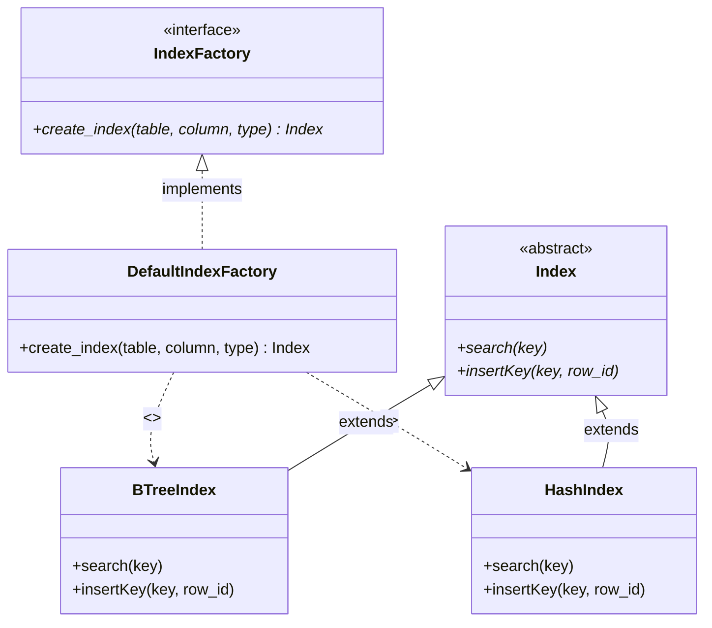
```mermaid
classDiagram
    direction TB

    %% --- Interface Factory ---
    class IndexFactory {
        <<interface>>
        +create_index(table, column, type)* Index
    }

    %% --- Concrete Factory ---
    class DefaultIndexFactory {
        +create_index(table, column, type) Index
    }

    %% --- Abstract Product ---
    class Index {
        <<abstract>>
        +search(key)*
        +insertKey(key, row_id)*
    }

    %% --- Concrete Products ---
    class BTreeIndex {
        +search(key)
        +insertKey(key, row_id)
    }

    class HashIndex {
        +search(key)
        +insertKey(key, row_id)
    }

    %% --- Relationships ---
    %% Realization: DefaultIndexFactory implements IndexFactory
    IndexFactory <|.. DefaultIndexFactory : implements

    %% Dependency: DefaultIndexFactory creates Concrete Products
    DefaultIndexFactory ..> BTreeIndex : <<creates>>
    DefaultIndexFactory ..> HashIndex : <<creates>>

    %% Inheritance: Concrete Products inherit from Index
    Index <|-- BTreeIndex : extends
    Index <|-- HashIndex : extends
```
**Giải thích Chi tiết (Phân tích Logic, Quan hệ, và Method):**
- **Method (Phương thức cốt lõi):**
  - `create_index()`: Hàm duy nhất chịu trách nhiệm sản xuất. Đầu vào là thông tin cơ bản (tên bảng, cột, kiểu), đầu ra luôn là một object tuân theo interface `Index`.
  - Các hàm `search()` và `insertKey()` là đặc trưng của sản phẩm (Index). Factory không quan tâm đến các hàm này, nó chỉ lo đẻ ra đối tượng.
- **Quan hệ (Relationships):**
  - **Realization (Kế thừa Interface):** `DefaultIndexFactory` thực thi `IndexFactory`. `BTreeIndex` và `HashIndex` thực thi `Index`.
  - **Dependency (Phụ thuộc - Mũi tên đứt nét):** Nhà máy (`DefaultIndexFactory`) phụ thuộc trực tiếp vào các class con `BTreeIndex` và `HashIndex` để có thể khởi tạo chúng (`creates`).
- **Logic hoạt động & Điểm mạnh (Pros):** Đẩy toàn bộ sự phức tạp của quá trình khởi tạo (cấp phát, cấu hình ban đầu) ra khỏi class `Table`. Nếu ngày mai ta cần thêm `BitmapIndex`, ta chỉ việc update `DefaultIndexFactory` mà không hề đụng chạm một dòng code nào trong `Table`.

#### Sequence Diagram
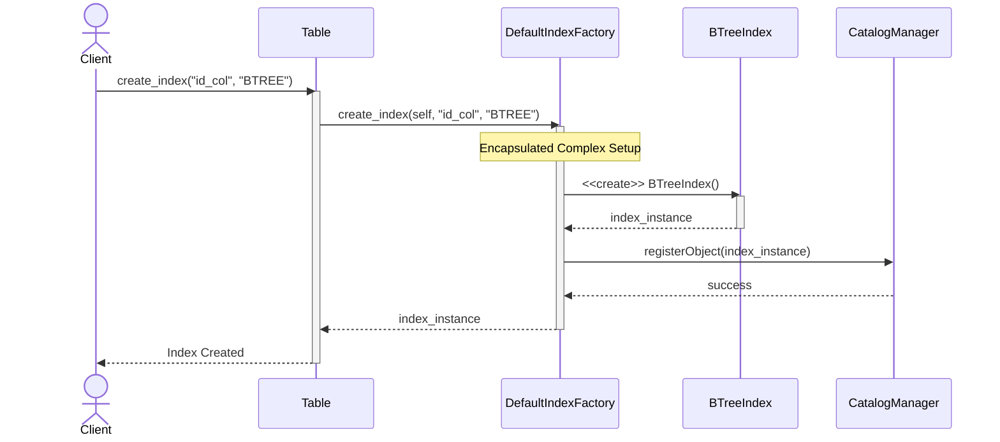
```mermaid
sequenceDiagram
    actor Client
    participant Tbl as Table
    participant Fct as DefaultIndexFactory
    participant Idx as BTreeIndex
    participant Cat as CatalogManager

    Client->>Tbl: create_index("id_col", "BTREE")
    activate Tbl
    
    Tbl->>Fct: create_index(self, "id_col", "BTREE")
    activate Fct
    
    Note over Fct: Encapsulated Complex Setup
    Fct->>Idx: <<create>> BTreeIndex()
    activate Idx
    Idx-->>Fct: index_instance
    deactivate Idx
    
    Fct->>Cat: registerObject(index_instance)
    Cat-->>Fct: success
    
    Fct-->>Tbl: index_instance
    deactivate Fct
    
    Tbl-->>Client: Index Created
    deactivate Tbl
```
**Giải thích Chi tiết Sơ đồ Động:**
Sơ đồ thể hiện luồng uỷ quyền (delegation) hoàn hảo:
1. Client yêu cầu `Table` tạo index BTREE. 
2. Thay vì tự xắn tay áo lên làm, `Table` ném ngay quả bóng trách nhiệm sang cho `DefaultIndexFactory`. 
3. `DefaultIndexFactory` thực hiện chuỗi khởi tạo phức tạp: Vừa gọi `new BTreeIndex()`, vừa âm thầm móc nối với `CatalogManager` để đăng ký siêu dữ liệu vào hệ thống.
4. Trả về thành phẩm đã hoàn thiện cho `Table`. Lúc này `Table` mới thảnh thơi báo cáo hoàn tất về cho Client.

---

## 5. Strategy Pattern (Hành Động Tham Chiếu - Referential Action)
**Mục tiêu:** Cô lập các hành vi phản ứng khi xoá/sửa Khoá Ngoại (Cascade, Restrict, Set Null) thành các thuật toán riêng biệt có thể tráo đổi cho nhau.

- **Vấn đề:** Khi một dòng cha bị xoá, dòng con đang chứa khoá ngoại trỏ tới nó phải làm gì? Tuỳ cấu hình mà ta có thể xoá theo (Cascade), báo lỗi cấm xoá (Restrict), hoặc set bằng Null. Nếu nhét mớ hổ lốn này vào hàm `on_delete()` của class `ForeignKey` bằng `if/elif/else`, hàm này sẽ phình to khủng khiếp.
- **Giải pháp Strategy:** Rút ruột từng hành vi đó ra, đóng gói thành các class riêng biệt (`CascadeAction`, `RestrictAction`, `SetNullAction`). Đứa nào làm việc nấy. Class `ForeignKey` giờ chỉ cần cầm một biến `deleteAction`. Bất cứ khi nào có biến, nó cứ thế mà gõ đầu biến `deleteAction` bảo: "Ê, chạy execute() đi!".
- **Sự linh hoạt:** Ta hoàn toàn có thể đổi chiến thuật từ Restrict sang Cascade ngay trong lúc phần mềm đang chạy bằng cách gắn class Action khác vào. Cực kỳ uyển chuyển.

### Giải thích Sơ đồ Class và Sequence (Strategy)

#### Class Diagram
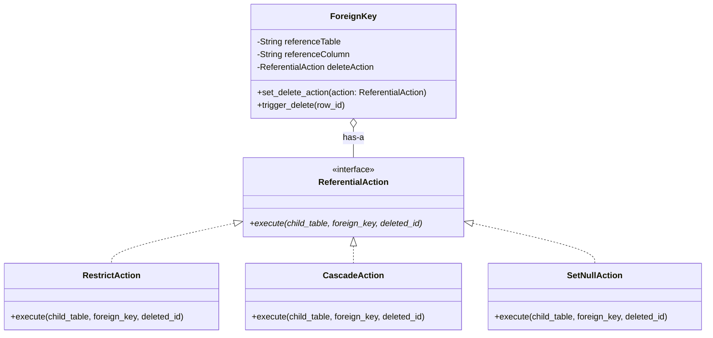
```mermaid
classDiagram
    class ForeignKey {
        -String referenceTable
        -String referenceColumn
        -ReferentialAction deleteAction
        +set_delete_action(action: ReferentialAction)
        +trigger_delete(row_id)
    }
    
    class ReferentialAction {
        <<interface>>
        +execute(child_table, foreign_key, deleted_id)*
    }
    
    class RestrictAction {
        +execute(child_table, foreign_key, deleted_id)
    }
    
    class CascadeAction {
        +execute(child_table, foreign_key, deleted_id)
    }
    
    class SetNullAction {
        +execute(child_table, foreign_key, deleted_id)
    }

    ForeignKey o-- ReferentialAction : has-a
    ReferentialAction <|.. RestrictAction
    ReferentialAction <|.. CascadeAction
    ReferentialAction <|.. SetNullAction
```
**Giải thích Chi tiết (Phân tích Logic, Quan hệ, và Method):**
- **Method (Phương thức cốt lõi):**
  - `execute()`: Lệnh bài thi triển võ công. Mọi class Chiến thuật (Action) đều phải có hàm này để tự định nghĩa cách xử lý riêng khi bị gọi tên.
  - `set_delete_action()`: Nằm trong `ForeignKey`, dùng để nạp đạn (cài đặt/đổi chiến thuật) vào bất cứ lúc nào.
  - `trigger_delete()`: Hàm của `ForeignKey` dùng để bóp cò, bên trong nó sẽ gọi `.execute()` của chiến thuật đang được nạp.
- **Quan hệ (Relationships):**
  - **Realization (Kế thừa Interface):** `RestrictAction`, `CascadeAction`, `SetNullAction` đều thực thi giao diện chung `ReferentialAction`.
  - **Aggregation (Tập hợp - Hình thoi rỗng):** `ForeignKey` (đóng vai trò Context) sở hữu một biến `deleteAction` trỏ tới interface `ReferentialAction`.
- **Logic hoạt động & Điểm mạnh (Pros):** Khi có sự cố xoá dữ liệu, thay vì `ForeignKey` phải chạy một hàm `on_delete()` dài nghìn dòng chứa đầy `switch/case`, nó chỉ cần lôi đúng cái Action hiện tại ra và gõ đầu nó bắt chạy `execute()`. Nhờ thế ta dễ dàng bổ sung `SetDefaultAction` sau này mà không sợ vỡ code cũ.

#### Sequence Diagram
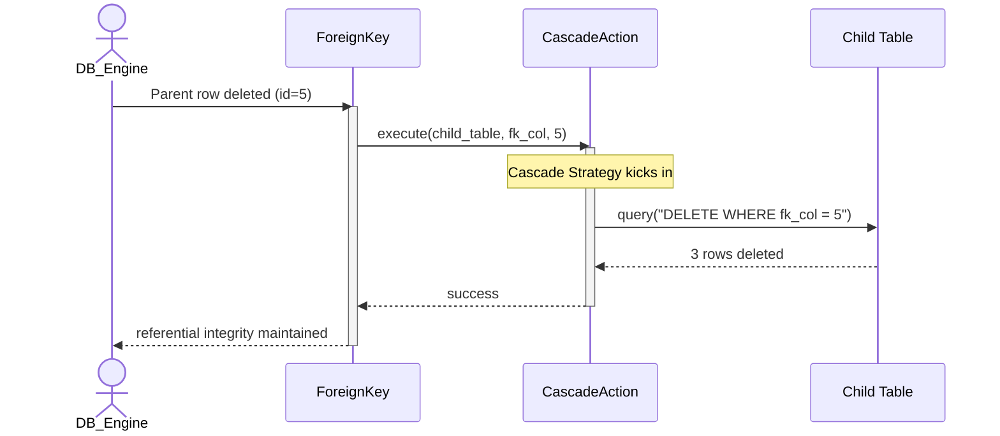
```mermaid
sequenceDiagram
    actor DB_Engine
    participant FK as ForeignKey
    participant Strat as CascadeAction
    participant ChildDB as Child Table

    DB_Engine->>FK: Parent row deleted (id=5)
    activate FK
    
    FK->>Strat: execute(child_table, fk_col, 5)
    activate Strat
    
    Note over Strat: Cascade Strategy kicks in
    Strat->>ChildDB: query("DELETE WHERE fk_col = 5")
    ChildDB-->>Strat: 3 rows deleted
    
    Strat-->>FK: success
    deactivate Strat
    
    FK-->>DB_Engine: referential integrity maintained
    deactivate FK
```
**Giải thích Chi tiết Sơ đồ Động:**
Sơ đồ minh hoạ sự uyển chuyển của Context khi gọi Strategy:
1. DB Engine thông báo dòng cha (id=5) đã bị xoá cho `ForeignKey`.
2. `ForeignKey` không tự xử lý mà gọi ngay `execute()` của chiến thuật đang được cài đặt (hiện tại là `CascadeAction`).
3. `CascadeAction` tự biết thân biết phận, gửi thẳng một câu Query "xoá tận gốc" (DELETE WHERE) xuống cho Bảng Con (Child Table) để dọn dẹp tàn dư.
4. Báo cáo thành công ngược trở lại, giữ vững tính toàn vẹn dữ liệu (Referential Integrity) mà không hề làm nghẽn logic lõi.

---

## 6. Iterator Pattern (Trình Xử Lý Truy Vấn - Volcano Model)
**Mục tiêu:** Xử lý luồng dữ liệu khổng lồ bằng cách kéo (pull) từng dòng một thay vì tải tất cả vào bộ nhớ cùng lúc.

- **Vấn đề:** Khi DBMS thực thi câu truy vấn `SELECT * FROM users JOIN orders`, nó phải xử lý hàng triệu dòng dữ liệu. Nếu toán tử `Join` nạp toàn bộ kết quả vào một mảng khổng lồ trên RAM rồi mới truyền sang toán tử `Filter`, máy chủ chắc chắn sẽ sập vì lỗi Out-Of-Memory (Hết bộ nhớ).
- **Giải pháp Iterator:** Đóng gói mỗi bước thực thi vật lý (`TableScan`, `Filter`, `Join`) thành một toán tử (Operator) hoạt động như một Iterator. Mỗi toán tử đều có hàm `next()`.
- **Sự linh hoạt:** Dữ liệu sẽ chảy qua hệ thống theo từng dòng (hoặc từng lô nhỏ - batch) một cách lười biếng (lazy evaluation). Gốc của cây truy vấn sẽ liên tục gọi `next()`, kéo dữ liệu từ từ từ các lá lên đỉnh. Do đó, dù bảng có 1 tỷ dòng, RAM cũng chỉ chứa vài dòng tại một thời điểm.

### Giải thích Sơ đồ Class và Sequence (Iterator)

#### Class Diagram
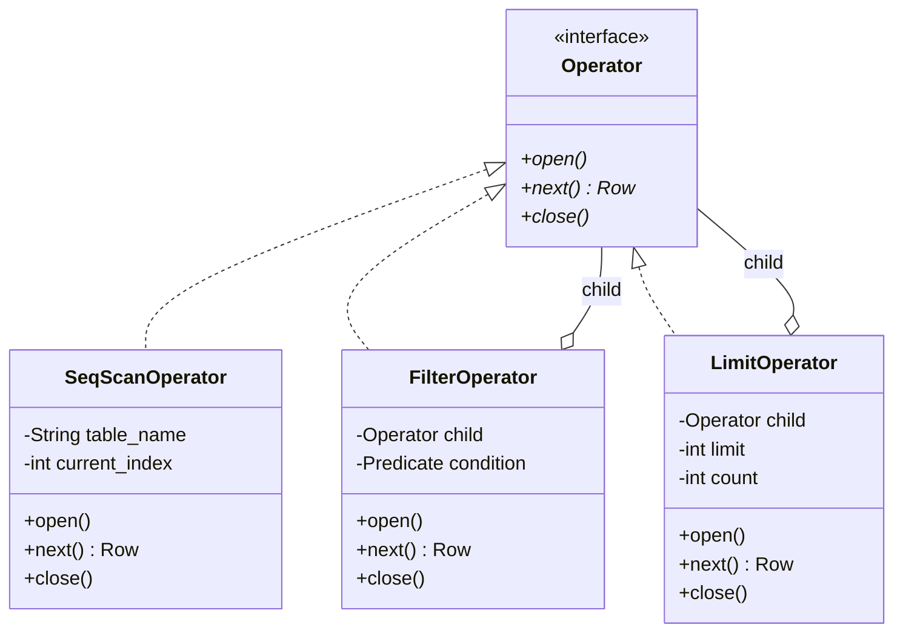
```mermaid
classDiagram
    class Operator {
        <<interface>>
        +open()*
        +next()* Row
        +close()*
    }
    
    class SeqScanOperator {
        -String table_name
        -int current_index
        +open()
        +next() Row
        +close()
    }
    
    class FilterOperator {
        -Operator child
        -Predicate condition
        +open()
        +next() Row
        +close()
    }
    
    class LimitOperator {
        -Operator child
        -int limit
        -int count
        +open()
        +next() Row
        +close()
    }

    Operator <|.. SeqScanOperator
    Operator <|.. FilterOperator
    Operator <|.. LimitOperator
    FilterOperator o-- Operator : child
    LimitOperator o-- Operator : child
```
**Giải thích Chi tiết (Phân tích Logic, Quan hệ, và Method):**
- **Method (Phương thức cốt lõi):** Mọi Operator đều có chung một bộ API gồm 3 hàm cơ bản: `open()` (khởi tạo), `next()` (lấy dòng tiếp theo), `close()` (dọn dẹp).
- **Quan hệ (Relationships):** 
  - **Realization:** `SeqScanOperator`, `FilterOperator`, `LimitOperator` đều implement `Operator`.
  - **Aggregation:** `FilterOperator` và `LimitOperator` tự giữ một biến trỏ tới `Operator` con của nó để có thể gọi `self.child.next()` liên tục.
- **Điểm mạnh (Pros):** Rất dễ để thêm các thuật toán thực thi mới (như `HashJoinOperator`) mà không phá vỡ mô hình Volcano hiện tại, chỉ cần tuân thủ đúng 3 hàm cơ bản là cắm vào đâu cũng chạy được.

#### Sequence Diagram
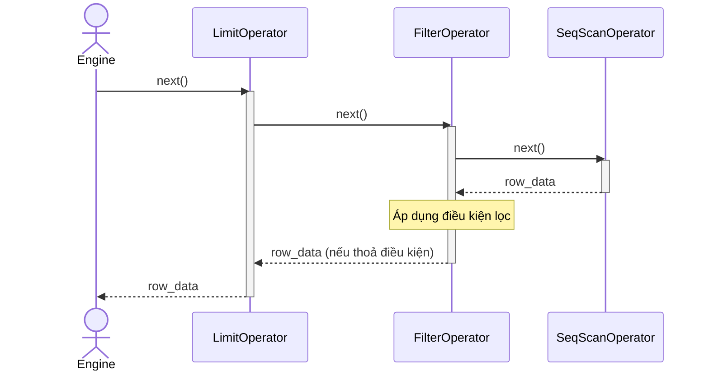
```mermaid
sequenceDiagram
    actor Engine
    participant Lim as LimitOperator
    participant Fil as FilterOperator
    participant Sca as SeqScanOperator
    
    Engine->>Lim: next()
    activate Lim
    
    Lim->>Fil: next()
    activate Fil
    
    Fil->>Sca: next()
    activate Sca
    Sca-->>Fil: row_data
    deactivate Sca
    
    Note over Fil: Áp dụng điều kiện lọc
    Fil-->>Lim: row_data (nếu thoả điều kiện)
    deactivate Fil
    
    Lim-->>Engine: row_data
    deactivate Lim
```
**Giải thích Chi tiết Sơ đồ Động:**
1. Engine ở trên cùng sẽ bắt đầu gọi `next()` vào thằng Toán tử gốc (`LimitOperator`).
2. `LimitOperator` chưa có sẵn data nên nó đẩy lệnh `next()` xuống `FilterOperator`.
3. `FilterOperator` lại đẩy lệnh `next()` xuống tận cùng là `SeqScanOperator` (toán tử quét ổ đĩa).
4. `SeqScanOperator` đọc 1 dòng từ đĩa và ném ngược lên. `FilterOperator` nhận dòng đó, lọc xem có thoả mãn không, nếu có thì ném lên cho `Limit`. `Limit` sẽ đếm số lượng, nếu chưa đủ thì trả lên Engine. Quy trình lặp lại vòng vèo như vậy nhưng hoàn toàn tiết kiệm RAM!

---

## 7. Prototype Pattern (Nhân Bản Lược Đồ)
**Mục tiêu:** Cấp phát các cấu trúc bảng phức tạp nhanh chóng bằng cách nhân bản sâu (deep-clone).

- **Vấn đề:** Khi bạn muốn tạo ra một bảng ảo, bảng tạm từ một bảng có sẵn (VD: `CREATE TABLE temp_users AS SELECT * FROM users` nhưng chỉ lấy schema), hệ thống sẽ phải đọc lại bảng `users` từ System Catalog, chọc vào từng cột, xem kiểu dữ liệu, các ràng buộc... rồi mới gán từng cái một để tạo bảng mới. Việc này rất chậm.
- **Giải pháp Prototype:** Mỗi đối tượng `MetadataNode` (như `Table`, `Column`) tự biết cách tạo ra một bản sao (clone) chính xác y hệt nó thông qua hàm `clone()`. Thay vì lắp ráp từ đầu, ta lấy thẳng cái khuôn cũ mà đúc ra đối tượng mới trong tích tắc.
- **Sự linh hoạt:** Trình khởi tạo không cần biết rõ bên trong `Table` có những cấu trúc `Column` hay `Constraint` rắc rối thế nào, nó chỉ đơn giản gọi `table.clone()` và nhận về một bảng y chang, sẵn sàng để sửa đổi độc lập.

### Giải thích Sơ đồ Class và Sequence (Prototype)

#### Class Diagram
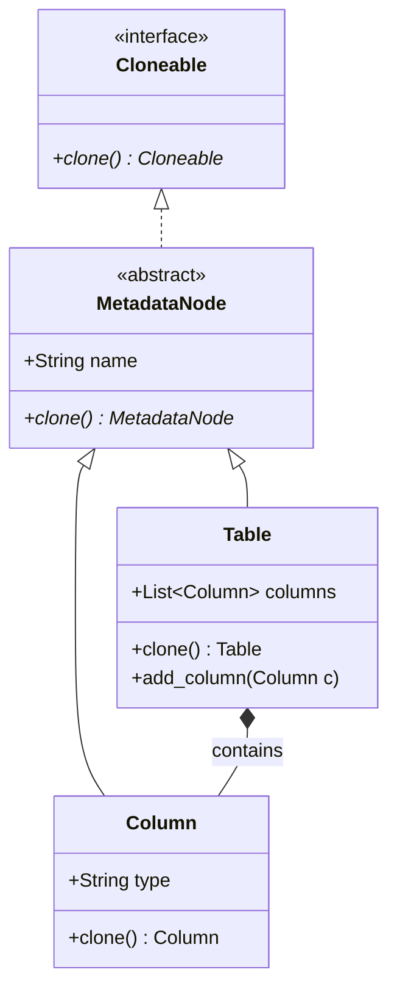
```mermaid
classDiagram
    class Cloneable {
        <<interface>>
        +clone()* Cloneable
    }
    
    class MetadataNode {
        <<abstract>>
        +String name
        +clone()* MetadataNode
    }
    
    class Table {
        +List~Column~ columns
        +clone() Table
        +add_column(Column c)
    }
    
    class Column {
        +String type
        +clone() Column
    }

    Cloneable <|.. MetadataNode
    MetadataNode <|-- Table
    MetadataNode <|-- Column
    Table *-- Column : contains
```
**Giải thích Chi tiết (Phân tích Logic, Quan hệ, và Method):**
- **Method (Phương thức cốt lõi):** Mấu chốt nằm ở hàm `clone()`. Ở `Column`, `clone()` có thể chỉ cần Shallow Copy (vì chỉ lưu String). Nhưng ở `Table`, hàm `clone()` bắt buộc phải thực thi Deep Copy: Tự tạo một `Table` mới, duyệt qua mảng `columns` cũ, gọi `col.clone()` cho từng đứa rồi nhét vào `Table` mới.
- **Quan hệ (Relationships):** `Table` có chứa nhiều `Column`. Khi `Table` được nhân bản, mọi `Column` bên trong nó cũng phải được đệ quy nhân bản theo.
- **Điểm mạnh (Pros):** Giải quyết triệt để bài toán tạo các object có cấu trúc cây (tree structure) phức tạp một cách nhanh nhất.

#### Sequence Diagram
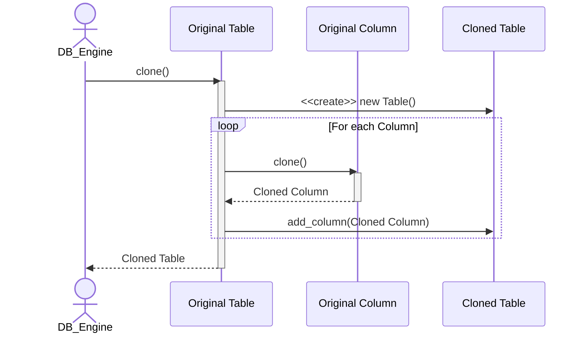
```mermaid
sequenceDiagram
    actor DB_Engine
    participant Tbl as Original Table
    participant Col1 as Original Column
    participant ClonedTbl as Cloned Table
    
    DB_Engine->>Tbl: clone()
    activate Tbl
    
    Tbl->>ClonedTbl: <<create>> new Table()
    
    loop For each Column
        Tbl->>Col1: clone()
        activate Col1
        Col1-->>Tbl: Cloned Column
        deactivate Col1
        Tbl->>ClonedTbl: add_column(Cloned Column)
    end
    
    Tbl-->>DB_Engine: Cloned Table
    deactivate Tbl
```
**Giải thích Chi tiết Sơ đồ Động:**
1. Engine yêu cầu clone một Table có sẵn.
2. Table gốc tự đứng ra lập một bản sao Table trống trơn.
3. Chạy vòng lặp qua từng Column của mình, ép mỗi Column phải tự nhả ra một bản sao.
4. Gắn các Column sao chép đó vào Table mới. Mọi thứ diễn ra ngầm định hoàn toàn bên trong hàm `clone()`, DB_Engine ở bên ngoài không cần động tay.

---

## 8. Proxy Pattern (Cơ Chế Bộ Nhớ Đệm Lười Biếng - Lazy Loading)
**Mục tiêu:** Giảm thiểu nghẽn RAM lúc khởi động bằng cách dùng một lớp vỏ giả mạo (Proxy).

- **Vấn đề:** Khởi động một DBMS doanh nghiệp có hàng vạn bảng, view, thủ tục... Nếu load toàn bộ định dạng và siêu dữ liệu (metadata) của tất cả vào RAM một lúc, server sẽ cực kỳ nặng nề và khởi động chậm chạp.
- **Giải pháp Proxy:** Cung cấp một "chim mồi" (Proxy) thay cho đối tượng Bảng thực sự. Cái Proxy này cực nhẹ, chỉ chứa mỗi cái tên bảng. Khi Query Optimizer ngó tới cái tên bảng đó và đòi lấy danh sách cột `get_columns()`, Proxy sẽ đánh lừa bằng cách âm thầm chặn luồng, xuống ổ đĩa lôi cái `RealTable` lên (Lazy-Load), lưu vào bộ nhớ cache, rồi mới trỏ qua để lấy kết quả. 
- **Sự linh hoạt:** Tiết kiệm tối đa bộ nhớ vì những bảng nào 10 năm không ai sờ tới thì mãi mãi chỉ nằm dưới đĩa cứng, nhưng Client vẫn tưởng là bảng đó đang sẵn sàng trên RAM.

### Giải thích Sơ đồ Class và Sequence (Proxy)

#### Class Diagram
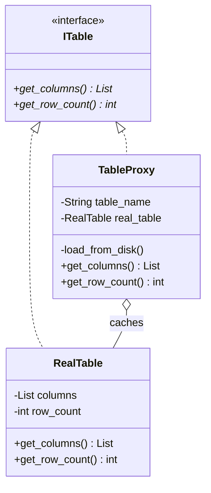
```mermaid
classDiagram
    class ITable {
        <<interface>>
        +get_columns()* List
        +get_row_count()* int
    }
    
    class RealTable {
        -List columns
        -int row_count
        +get_columns() List
        +get_row_count() int
    }
    
    class TableProxy {
        -String table_name
        -RealTable real_table
        -load_from_disk()
        +get_columns() List
        +get_row_count() int
    }

    ITable <|.. RealTable
    ITable <|.. TableProxy
    TableProxy o-- RealTable : caches
```
**Giải thích Chi tiết (Phân tích Logic, Quan hệ, và Method):**
- **Method (Phương thức cốt lõi):** Cả Proxy và RealTable đều tuân theo Interface `ITable` (Có chung hàm `get_columns()`). Trong `TableProxy`, nó có thêm hàm `load_from_disk()` sẽ được kích hoạt bí mật trong lần đầu tiên bị gọi.
- **Quan hệ (Relationships):** `TableProxy` và `RealTable` là anh em cùng chung interface, nhưng Proxy lại giấu một con trỏ trỏ tới `RealTable`. Sự giả mạo này quá hoàn hảo đến mức Optimizer ở ngoài không thể nhận ra nó đang nói chuyện với Bảng Thật hay Vỏ Bọc.
- **Điểm mạnh (Pros):** Proxy trong DBMS là đỉnh cao của Lazy Loading, cứu cánh cho việc ngốn RAM.

#### Sequence Diagram
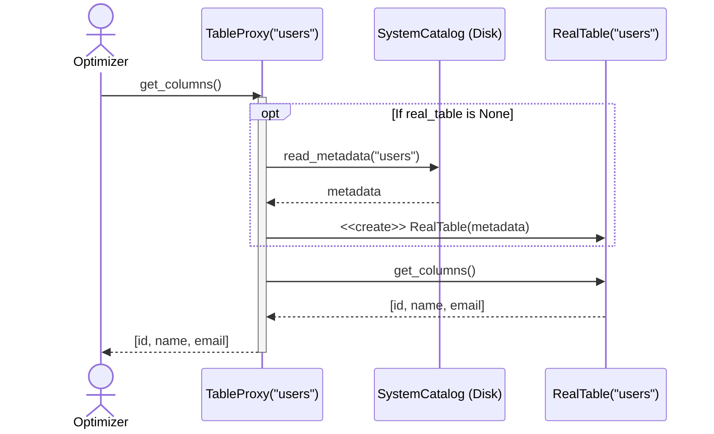
```mermaid
sequenceDiagram
    actor Optimizer
    participant Proxy as TableProxy("users")
    participant Disk as SystemCatalog (Disk)
    participant Real as RealTable("users")

    Optimizer->>Proxy: get_columns()
    activate Proxy
    
    opt If real_table is None
        Proxy->>Disk: read_metadata("users")
        Disk-->>Proxy: metadata
        Proxy->>Real: <<create>> RealTable(metadata)
    end
    
    Proxy->>Real: get_columns()
    Real-->>Proxy: [id, name, email]
    
    Proxy-->>Optimizer: [id, name, email]
    deactivate Proxy
```
**Giải thích Chi tiết Sơ đồ Động:**
1. Optimizer (Trình tối ưu hoá) chỉ gọi vô tư hàm `get_columns()` của đối tượng Proxy.
2. Proxy kiểm tra xem ruột của mình (con trỏ `RealTable`) có rỗng không. Lần đầu chắc chắn rỗng, nó lẳng lặng quét đĩa, khởi tạo đối tượng `RealTable` thật sự.
3. Sau đó, nó mới chuyển lời yêu cầu `get_columns()` sang cho `RealTable`.
4. Mọi lần gọi tiếp theo sẽ bỏ qua bước quét đĩa mà dùng luôn ruột đã nạp, tạo ra một cache vô cùng tiện lợi.

---

## 9. Command Pattern (Thực Thi Lệnh DDL)
**Mục tiêu:** Đóng gói các lệnh biến đổi cấu trúc (CREATE, DROP) thành các đối tượng độc lập.

- **Vấn đề:** Nếu Parser dịch ra lệnh `CREATE TABLE users` và lập tức nhét thẳng vào Engine bằng cách gọi một hàm `Engine.create_table("users")` cực to, hai module này sẽ dính liền với nhau (tightly coupled). Khủng khiếp hơn, nếu giao dịch (Transaction) đang chạy mà bị sập, làm sao ta Undo (rollback) lại bảng vừa mới tạo? 
- **Giải pháp Command:** Biến câu lệnh DDL thành một thực thể (Object) có thể cầm nắm được, ví dụ `CreateTableCommand`. Object này chứa đầy đủ mọi tham số cần thiết để thực thi việc tạo bảng. Đặc biệt, nó được chuẩn hóa để có thêm hàm `undo()` giúp đảo ngược thao tác.
- **Sự linh hoạt:** DBMS có thể xếp hàng (Queue) một loạt các thao tác DDL lại, rồi mới chạy lệnh `execute()` hàng loạt. Nếu thằng nào chạy giữa chừng bị lỗi, DBMS chỉ cần lôi đống Command cũ ra gõ lệnh `undo()` là database quay về trạng thái sạch bóc ban đầu (Transactional DDL).

### Giải thích Sơ đồ Class và Sequence (Command)

#### Class Diagram
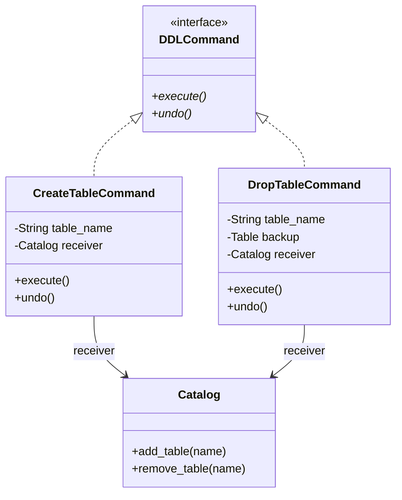
```mermaid
classDiagram
    class DDLCommand {
        <<interface>>
        +execute()*
        +undo()*
    }
    
    class CreateTableCommand {
        -String table_name
        -Catalog receiver
        +execute()
        +undo()
    }
    
    class DropTableCommand {
        -String table_name
        -Table backup
        -Catalog receiver
        +execute()
        +undo()
    }
    
    class Catalog {
        +add_table(name)
        +remove_table(name)
    }

    DDLCommand <|.. CreateTableCommand
    DDLCommand <|.. DropTableCommand
    CreateTableCommand --> Catalog : receiver
    DropTableCommand --> Catalog : receiver
```
**Giải thích Chi tiết (Phân tích Logic, Quan hệ, và Method):**
- **Method (Phương thức cốt lõi):** Tất cả Command đều tuân thủ `execute()` (Làm) và `undo()` (Hoàn Tác). Trong `CreateTableCommand`, thao tác Làm là Gọi `add_table`, thao tác Hoàn Tác là Gọi `remove_table`.
- **Quan hệ (Relationships):** Các Command phải giữ con trỏ trỏ tới kẻ thực sự hành động - Receiver (ở đây là `Catalog` của hệ thống). Nhờ có con trỏ receiver, Command biết phải sai khiến ai làm việc.
- **Điểm mạnh (Pros):** Tách rời kẻ ra lệnh (Parser) với kẻ thực thi (Catalog), tạo tiền đề cho hệ thống Recovery và Rollback (Redo/Undo Log) đỉnh cao trong DBMS.

#### Sequence Diagram
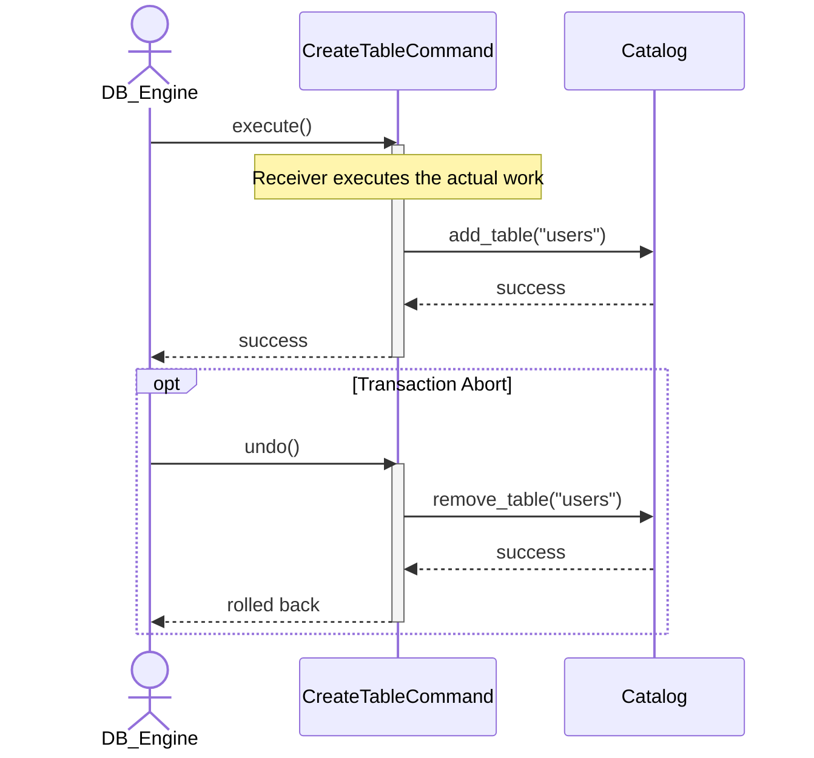
```mermaid
sequenceDiagram
    actor DB_Engine
    participant Cmd as CreateTableCommand
    participant Cat as Catalog

    DB_Engine->>Cmd: execute()
    activate Cmd
    
    Note over Cmd: Receiver executes the actual work
    Cmd->>Cat: add_table("users")
    Cat-->>Cmd: success
    
    Cmd-->>DB_Engine: success
    deactivate Cmd
    
    opt Transaction Abort
        DB_Engine->>Cmd: undo()
        activate Cmd
        Cmd->>Cat: remove_table("users")
        Cat-->>Cmd: success
        Cmd-->>DB_Engine: rolled back
        deactivate Cmd
    end
```
**Giải thích Chi tiết Sơ đồ Động:**
1. Engine ra lệnh `execute()` cho Command.
2. Command tự động gọi xuống hàm thao tác của Catalog để thêm bảng.
3. Nếu vì một lý do nào đó giao dịch thất bại, Engine sẽ lấy ngay chính Command đó ra gọi `undo()`. Command sẽ tự biết cách dọn dẹp bãi chiến trường (gọi ngược lệnh xoá bảng). Tính năng Rollback của DB chính là hoạt động theo kiểu này!

---

## 10. Observer Pattern (Thông Báo Triggers)
**Mục tiêu:** Cho phép nhiều lớp xử lý tự động lắng nghe và phản ứng khi Bảng (Table) bị thay đổi.

- **Vấn đề:** Khi một bảng `users` được insert một dòng mới, nó có thể cần phải kích hoạt hàng loạt tác vụ phụ: Gọi `AuditLog` để lưu log, gọi `NotificationService` để bắn mail, hoặc gọi Trigger để kiểm tra logic nội bộ. Nếu ta Code tất cả các hàm gọi này vào cuối hàm `Table.insert()`, Bảng sẽ phình to và biến thành một nồi lẩu thập cẩm các thứ linh tinh.
- **Giải pháp Observer:** Class `Table` giờ sẽ là một Kẻ Phát Sóng (Subject), nó giữ một mảng `Triggers` (Người Lắng Nghe - Observer). Khi có đứa insert dữ liệu thành công, Bảng chả cần biết ai đang quan tâm, nó chỉ việc hét lên `notify("INSERT", data)`. Những ai đã đăng ký `attach()` trước đó sẽ tự động nhận được thông báo qua hàm `update()` để tự lo phần việc của mình.
- **Sự linh hoạt:** Trigger, Log, Notification có thể tự do cắm vào hoặc rút ra khỏi một Bảng (Plugin) lúc Database đang vận hành mà không cần đụng chạm gì đến lớp lõi `Table`.

### Giải thích Sơ đồ Class và Sequence (Observer)

#### Class Diagram
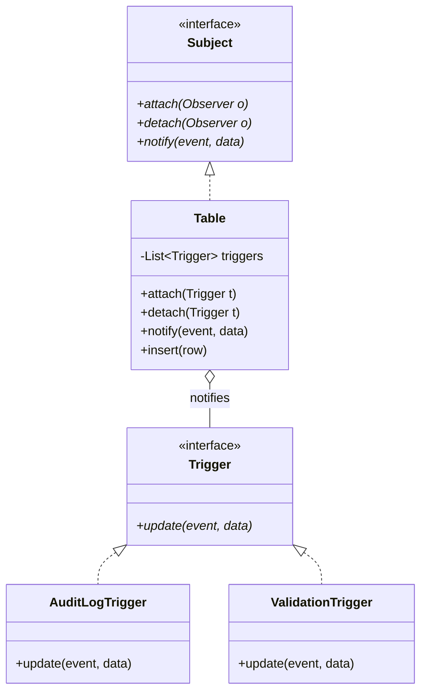
```mermaid
classDiagram
    class Subject {
        <<interface>>
        +attach(Observer o)*
        +detach(Observer o)*
        +notify(event, data)*
    }
    
    class Table {
        -List~Trigger~ triggers
        +attach(Trigger t)
        +detach(Trigger t)
        +notify(event, data)
        +insert(row)
    }
    
    class Trigger {
        <<interface>>
        +update(event, data)*
    }
    
    class AuditLogTrigger {
        +update(event, data)
    }
    
    class ValidationTrigger {
        +update(event, data)
    }

    Subject <|.. Table
    Trigger <|.. AuditLogTrigger
    Trigger <|.. ValidationTrigger
    Table o-- Trigger : notifies
```
**Giải thích Chi tiết (Phân tích Logic, Quan hệ, và Method):**
- **Method (Phương thức cốt lõi):** `Table` có `attach()`, `detach()` để quản lý đăng ký, và `notify()` để duyệt mảng gọi thông báo. Tất cả `Trigger` phải có hàm callback `update()`.
- **Quan hệ (Relationships):** Bảng có quan hệ Tụ tập (Aggregation) 1-Nhiều với Trigger. Sự phụ thuộc cực kỳ lỏng lẻo, Bảng chỉ gọi `Trigger.update()`, ngoài ra không cần biết bên trong cái Trigger nó làm khỉ gì.
- **Điểm mạnh (Pros):** Hệ thống Event-Driven hoàn hảo, là nền tảng cốt lõi của tính năng Database Triggers trong thực tế.

#### Sequence Diagram
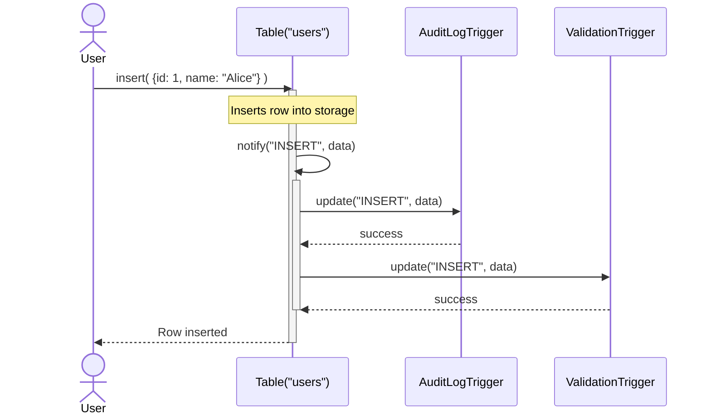
```mermaid
sequenceDiagram
    actor User
    participant Tbl as Table("users")
    participant Aud as AuditLogTrigger
    participant Val as ValidationTrigger

    User->>Tbl: insert( {id: 1, name: "Alice"} )
    activate Tbl
    
    Note over Tbl: Inserts row into storage
    
    Tbl->>Tbl: notify("INSERT", data)
    activate Tbl
    
    Tbl->>Aud: update("INSERT", data)
    Aud-->>Tbl: success
    
    Tbl->>Val: update("INSERT", data)
    Val-->>Tbl: success
    
    deactivate Tbl
    
    Tbl-->>User: Row inserted
    deactivate Tbl
```
**Giải thích Chi tiết Sơ đồ Động:**
1. User gọi `insert()` một hàng vào bảng. Bảng thực hiện lưu xuống đĩa.
2. Lưu xong, bảng lập tức kích hoạt chuông báo cháy `notify()`.
3. Chuông này sẽ kêu gọi từng Observer (`AuditLogTrigger`, `ValidationTrigger`) gọi hàm `update()` để thi hành các logic phụ (ghi log, hoặc cấm cản). Mọi thứ kết thúc êm đẹp và cực kỳ tách bạch!

---

## 11. Builder Pattern (Xây Dựng Cấu Trúc Bảng)
**Mục tiêu:** Xây dựng một đối tượng Bảng phức tạp từng bước một thay vì nhét tất cả vào một hàm khởi tạo (Constructor) khổng lồ.

- **Vấn đề:** Để tạo một đối tượng `Table` trong CSDL, bạn cần rất nhiều thứ: Tên bảng, danh sách Cột, Khoá chính, Khoá ngoại, Index. Nếu dùng hàm khởi tạo thông thường, bạn sẽ phải gọi một hàm vô cùng rắc rối: `new Table("users", [col1, col2], "id", [fk1], [idx1])`. Càng về sau, hàm này càng dài và cực kỳ dễ truyền nhầm tham số (Anti-pattern Telescoping Constructor).
- **Giải pháp Builder:** Tách rời quá trình xây dựng bảng ra khỏi lớp `Table`. Ta tạo ra một lớp `TableBuilder`. Lớp này cung cấp các hàm nối tiếp nhau (fluent interface) để lắp ráp bảng từ từ: `builder.add_column("id").add_primary_key("id").build()`.
- **Sự linh hoạt:** Code cực kỳ dễ đọc. Bạn có thể xây dựng các bảng khác nhau mà không sợ thiếu sót dữ liệu. Nếu hệ thống báo thiếu Khoá chính, trình Builder có thể bắt lỗi ngay tại hàm `build()` trước khi bảng được tạo ra.

### Giải thích Sơ đồ Class và Sequence (Builder)

#### Class Diagram
```mermaid
classDiagram
    class Table {
        +String name
        +List columns
        +String primary_key
        +add_column(c)
        +set_primary_key(k)
    }
    
    class TableBuilder {
        -Table table
        +TableBuilder(name)
        +add_column(name, type) TableBuilder
        +add_primary_key(col_name) TableBuilder
        +build() Table
    }

    TableBuilder --> Table : builds
```
**Giải thích Chi tiết (Phân tích Logic, Quan hệ, và Method):**
- **Method (Phương thức cốt lõi):** Mấu chốt của Builder là mọi hàm cấu hình như `add_column()` đều kết thúc bằng lệnh `return self`. Nhờ đó ta có thể gọi chuỗi liên tục (Method Chaining). Hàm `build()` cuối cùng sẽ nhả ra thành phẩm là đối tượng `Table`.
- **Quan hệ (Relationships):** `TableBuilder` giữ nhiệm vụ "build" (tạo lập) đối tượng `Table`. Nó cô lập toàn bộ sự phức tạp ra khỏi client.

#### Sequence Diagram
```mermaid
sequenceDiagram
    actor DB_Engine
    participant Builder as TableBuilder
    participant Tbl as Table
    
    DB_Engine->>Builder: <<create>> TableBuilder("users")
    activate Builder
    Builder->>Tbl: <<create>> Table("users")
    
    DB_Engine->>Builder: add_column("id", "INT")
    Builder->>Tbl: add_column(Column("id", "INT"))
    Builder-->>DB_Engine: returns self
    
    DB_Engine->>Builder: add_primary_key("id")
    Builder->>Tbl: set_primary_key("id")
    Builder-->>DB_Engine: returns self
    
    DB_Engine->>Builder: build()
    Builder-->>DB_Engine: returns Table
    deactivate Builder
```
**Giải thích Chi tiết Sơ đồ Động:**
1. Engine triệu hồi Builder thay vì triệu hồi thẳng Table.
2. Engine liên tiếp nhét nguyên liệu vào (cột, khoá chính). Builder đứng giữa nhận lệnh và sắp xếp vào bảng.
3. Khi Engine gọi `build()`, Builder giao ra chiếc Bảng hoàn chỉnh.

---

## 12. Flyweight Pattern (Dùng Chung Siêu Dữ Liệu)
**Mục tiêu:** Tiết kiệm tối đa bộ nhớ RAM bằng cách chia sẻ các đối tượng có thuộc tính giống hệt nhau.

- **Vấn đề:** Một CSDL có 10.000 bảng, mỗi bảng 20 cột => Tổng cộng 200.000 đối tượng `Column`. Mỗi cột lại cần một đối tượng `DataType` để quy định nó là INT hay VARCHAR. Việc tạo ra 200.000 đối tượng `DataType` trong RAM để lưu trữ những chữ "INT", "VARCHAR" giống hệt nhau là một sự lãng phí khủng khiếp.
- **Giải pháp Flyweight:** Tạo một nhà máy `DataTypeFactory` có chứa bộ nhớ đệm (Cache). Lần đầu tiên hệ thống cần kiểu `INT`, nhà máy khởi tạo object `IntegerType` và lưu vào cache. Các cột sau này nếu cần kiểu `INT`, nhà máy chỉ việc móc cái object cũ ra cho xài chung.
- **Sự linh hoạt:** Hàng triệu cột trên toàn bộ hệ thống CSDL sẽ chỉ trỏ về đúng **1** đối tượng `IntegerType` duy nhất trên RAM. Tiết kiệm hàng trăm Megabyte bộ nhớ dễ như trở bàn tay.

### Giải thích Sơ đồ Class và Sequence (Flyweight)

#### Class Diagram
```mermaid
classDiagram
    class DataType {
        <<interface>>
        +get_name()* String
        +get_size()* int
    }
    
    class IntegerType {
        +get_name() String
        +get_size() int
    }
    
    class DataTypeFactory {
        -Map~String, DataType~ cache
        +get_type(name) DataType
    }
    
    class Column {
        -String name
        -DataType type
    }

    DataType <|.. IntegerType
    DataTypeFactory *-- DataType : caches
    Column o-- DataType : uses (shared)
```
**Giải thích Chi tiết (Phân tích Logic, Quan hệ, và Method):**
- **Method (Phương thức cốt lõi):** Hàm `get_type(name)` của Factory đóng vai trò người gác cổng. Nó quét Hash Map, có thì trả về, không có thì tạo mới.
- **Quan hệ (Relationships):** Nút thắt quan trọng nhất là `Column` chỉ giữ quan hệ Aggregation (sử dụng chung) đối với `DataType`. Nó không tự tạo (không dùng Composition) mà phụ thuộc vào đồ xài chung của Factory.

#### Sequence Diagram
```mermaid
sequenceDiagram
    actor Engine
    participant Factory as DataTypeFactory
    participant Cache as HashMap
    participant IntType as IntegerType
    
    Engine->>Factory: get_type("INT")
    activate Factory
    Factory->>Cache: check "INT"
    Cache-->>Factory: not found
    
    Factory->>IntType: <<create>> IntegerType()
    Factory->>Cache: store("INT", instance)
    
    Factory-->>Engine: IntType instance
    deactivate Factory
    
    Engine->>Factory: get_type("INT")
    activate Factory
    Factory->>Cache: check "INT"
    Cache-->>Factory: returns existing instance
    Factory-->>Engine: IntType instance (shared)
    deactivate Factory
```
**Giải thích Chi tiết Sơ đồ Động:**
1. Lần gọi thứ 1: Factory không thấy `INT` trong kho. Nó cắn răng khởi tạo tốn tài nguyên, cất vào kho rồi trả về.
2. Lần gọi thứ 2 (và n lần sau): Factory moi ngay hàng có sẵn trong kho ra trả về. Cực kỳ tốc độ và zero tốn kém RAM.

---

## 13. Visitor Pattern (Duyệt Cấu Trúc Đa Hình)
**Mục tiêu:** Bổ sung chức năng mới cho một cấu trúc cây phức tạp (như Database -> Schema -> Table) mà không cần chui vào sửa code của các đối tượng trong cây.

- **Vấn đề:** Chúng ta đã dùng Composite Pattern để nối Bảng với Cột thành một cây. Giờ nếu muốn viết chức năng "Xuất toàn bộ cấu trúc CSDL thành câu lệnh SQL (DDL)", ta phải nhét hàm `generate_ddl()` vào trong lớp `Database`, lớp `Table`, lớp `Column`. Điều này làm code rác rưởi, vi phạm Single Responsibility Principle (Vì các lớp này vốn chỉ dùng để chứa cấu trúc dữ liệu, không phải để sinh mã).
- **Giải pháp Visitor:** Tạo ra một chuyên gia (Visitor) tên là `DDLGeneratorVisitor`. Gã chuyên gia này ôm toàn bộ logic sinh mã SQL. Cây cấu trúc lúc này chỉ cần có duy nhất một hàm `accept(Visitor)`. Nó nói rằng: *"Mời chuyên gia vào thăm. Chuyên gia muốn làm gì nhà tôi thì làm"*.
- **Sự linh hoạt:** Ngày mai sếp yêu cầu chức năng "Tính tổng dung lượng đĩa của toàn CSDL". Ta chỉ việc viết thêm class `SizeCalculatorVisitor` và thả vào cho nó đi dạo trong cây cấu trúc. Các lớp Bảng, Cột đứng im không cần phải sửa đổi bất kỳ dòng code nào!

### Giải thích Sơ đồ Class và Sequence (Visitor)

#### Class Diagram
```mermaid
classDiagram
    class DatabaseNode {
        <<interface>>
        +accept(Visitor v)*
    }
    
    class Table {
        +accept(Visitor v)
    }
    
    class Column {
        +accept(Visitor v)
    }
    
    class Visitor {
        <<interface>>
        +visit_table(Table t)*
        +visit_column(Column c)*
    }
    
    class DDLGeneratorVisitor {
        -String script
        +visit_table(Table t)
        +visit_column(Column c)
        +get_script() String
    }

    DatabaseNode <|.. Table
    DatabaseNode <|.. Column
    Visitor <|.. DDLGeneratorVisitor
    DatabaseNode --> Visitor : accepts
```
**Giải thích Chi tiết (Phân tích Logic, Quan hệ, và Method):**
- **Method (Phương thức cốt lõi):** Kỹ thuật *Double Dispatch*. `Table` có hàm `accept(visitor)`, bên trong nó lập tức gọi ngược lại `visitor.visit_table(self)`. Nó tự khai báo danh tính của mình cho Visitor.
- **Quan hệ (Relationships):** Các Node hoàn toàn không dính chặt vào `DDLGeneratorVisitor`, chúng chỉ nhận giao diện trừu tượng `Visitor`.

#### Sequence Diagram
```mermaid
sequenceDiagram
    actor Engine
    participant Vis as DDLGeneratorVisitor
    participant Tbl as Table
    participant Col as Column
    
    Engine->>Tbl: accept(Vis)
    activate Tbl
    Tbl->>Vis: visit_table(self)
    activate Vis
    Note over Vis: Appends "CREATE TABLE..."
    
    loop For each column
        Tbl->>Col: accept(Vis)
        activate Col
        Col->>Vis: visit_column(self)
        Vis-->>Col: returns
        deactivate Col
    end
    
    Vis-->>Tbl: returns
    deactivate Vis
    Tbl-->>Engine: returns
    deactivate Tbl
```
**Giải thích Chi tiết Sơ đồ Động:**
1. Engine thả ông Visitor vào bảng.
2. Bảng nhiệt tình gọi: `"Mời ông vào thăm bảng của tôi" (visit_table)`. Ông Visitor lập tức lấy bút ra viết `CREATE TABLE...`
3. Bảng gọi tiếp đàn con của mình (các Cột), bảo chúng đưa tay ra đón khách.
4. Lần lượt các Cột gọi: `"Mời ông vào thăm cột của cháu" (visit_column)`. Ông Visitor lại lia lịa viết tên cột vào script.
5. Duyệt xong, toàn bộ câu lệnh SQL hoàn chỉnh đã nằm gọn trong tay ông Visitor. Bảng và Cột đứng vỗ tay mà không phải suy nghĩ gì thêm.

---

## TỔNG HỢP: Danh sách Thuộc tính và Phương thức cần thêm vào Code/Test

Dưới đây là bảng liệt kê chi tiết những **Thuộc tính (Properties)** và **Phương thức (Methods)** mới phát sinh từ 3 Design Pattern trên. Bạn hãy sử dụng danh sách này làm "Checklist" để implement vào Source Code, Class và viết Unit Test cho chính xác nhé.

### 1. Thuộc cho Composite Pattern (Quản lý Cấu trúc)
**Mục tiêu:** Áp dụng đệ quy để gom nhóm Database, Schema, Table, View, Column, Constraint.

*   **Interface `MetadataNode` (Bắt buộc cho mọi class kiến trúc):**
    *   `+ get_metadata() -> dict`: Hàm trả về từ điển JSON chứa thông tin cấu trúc.
*   **Các class Nhánh (Branch: `Database`, `Schema`, `Table`):**
    *   **Thuộc tính:**
        *   `- children: List[MetadataNode]`: Danh sách chứa các phần tử con bên trong nó (Nên xài tên chung là `children` để chuẩn hóa, thay vì `tables`, `columns`).
    *   **Phương thức:**
        *   `+ add_child(node: MetadataNode)`: Hàm để nhét một phần tử con (như thêm Schema vào DB, thêm Table vào Schema, thêm Column vào Table).
        *   `+ get_metadata() -> dict`: Code thực thi vòng lặp qua mảng `children` và gọi đệ quy hàm `get_metadata()` của từng đứa con.
*   **Các class Lá (Leaf: `View`, `Column`, `Constraint`):**
    *   **Thuộc tính đặc trưng:**
        *   `- name: String` (Tên Cột/View)
        *   `- type: String` (Kiểu dữ liệu của Cột như INT, VARCHAR)
        *   `- query: String` (Câu SQL tạo View)
        *   `- rule: String` (Luật của Constraint, VD: `PRIMARY KEY`)
    *   **Phương thức:**
        *   `+ get_metadata() -> dict`: Trả về dict chứa chính thuộc tính của nó (Không có vòng lặp vì không có con).

### 2. Thuộc cho Template Method Pattern (Xử lý Ràng buộc)
**Mục tiêu:** Tạo bộ khung Validation cứng nhắc không thể bị phá vỡ.

*   **Class trừu tượng `Constraint` (Lớp Cha):**
    *   **Thuộc tính:**
        *   `- column_name: String`: Tên cột đang bị áp dụng ràng buộc.
    *   **Phương thức:**
        *   `+ validate(value, db_context) -> None`: **(Template Method)** - Hàm public thực hiện 3 bước: Kiểm tra Null -> Gọi `check_logic()` -> Gọi `on_violation()`. Không được ghi đè.
        *   `# check_logic(value, db_context) -> bool`: **(Hook Method)** - Hàm trừu tượng (Abstract), bắt buộc con phải tự định nghĩa logic.
        *   `# on_violation(value) -> None`: Hàm nội bộ để ném Exception nếu fail.
*   **Các class Cụ thể (`NotNullConstraint`, `CheckConstraint`, `UniqueConstraint`):**
    *   **Thuộc tính:**
        *   `- expression: String`: Thuộc tính riêng của `CheckConstraint` (VD: `> 0`).
    *   **Phương thức:**
        *   `# check_logic(value, db_context) -> bool`: Triển khai logic lõi. Ví dụ `UniqueConstraint` thì chọc vào `db_context` để lấy mảng index và kiểm tra xem giá trị đã tồn tại chưa.
*   **Class Lỗi (Exception):**
    *   `ConstraintViolationException`: Kế thừa từ `Exception` gốc của ngôn ngữ, chuyên dùng ném lỗi khi Validation thất bại.

### 3. Thuộc cho Chain of Responsibility Pattern (Kiểm tra Phân quyền)
**Mục tiêu:** Nối các trạm kiểm tra quyền lại thành 1 chuỗi dài, đứt trạm nào báo lỗi trạm đó.

*   **Class trừu tượng `PrivilegeHandler` (Lớp Cha):**
    *   **Thuộc tính:**
        *   `- next_handler: PrivilegeHandler`: Biến lưu trữ con trỏ trỏ tới Trạm kiểm tra tiếp theo.
    *   **Phương thức:**
        *   `+ set_next(handler: PrivilegeHandler) -> PrivilegeHandler`: Hàm truyền vào Trạm tiếp theo. Cần return lại chính cái handler truyền vào để có thể chain code kiểu `A.set_next(B).set_next(C)`.
        *   `+ check_access(user, action, target) -> bool`: Hàm public chạy quy trình. Gọi `do_check()` trước, nếu True thì tự lấy `next_handler` gọi tiếp `check_access()`.
        *   `# do_check(user, action, target) -> bool`: Hàm abstract nơi viết logic kiểm duyệt của trạm đó.
*   **Các Trạm Cụ thể (`DatabasePrivilegeHandler`, `SchemaPrivilegeHandler`, `TablePrivilegeHandler`, `ColumnPrivilegeHandler`):**
    *   **Phương thức:**
        *   `# do_check(user, action, target) -> bool`: Override lại hàm của cha. Mỗi trạm tự viết logic kiểm tra quyền của cấp bậc mình (Cấp DB thì check quyền DB Admin, cấp Table thì check quyền SELECT/UPDATE/DROP...).
*   **Class Lỗi (Exception):**
    *   `AccessDeniedException`: Lỗi chuyên biệt bị ném ra ngay lập tức khi một trạm báo False (Cấm truy cập).

### 4. Thuộc cho Factory Method Pattern (Khởi tạo Đối tượng)
**Mục tiêu:** Tách rời logic cấp phát bộ nhớ và đăng ký hệ thống ra khỏi đối tượng gốc.

*   **Interface `IndexFactory` (Xưởng Sản Xuất):**
    *   **Phương thức:**
        *   `+ create_index(table, column, type) -> Index`: Hàm abstract, nhận vào tên bảng, tên cột và kiểu index (BTREE, HASH) để nhào nặn ra một Index thực thể.
*   **Class Cụ thể `DefaultIndexFactory`:**
    *   **Phương thức:**
        *   `+ create_index(...) -> Index`: Implement logic thật. Nó có trách nhiệm khởi tạo `BTreeIndex` hoặc `HashIndex`, sau đó đăng ký chúng vào Hệ thống (CatalogManager) rồi mới return về.
*   **Class Đích `Index` (Sản phẩm):**
    *   **Thuộc tính:**
        *   `- type: String`: Lưu kiểu Index (Ví dụ: "BTREE").
    *   **Phương thức:**
        *   `+ search(key)`: Abstract method bắt con cái phải tự viết thuật toán dò tìm.

### 5. Thuộc cho Strategy Pattern (Chiến thuật Xoá Khoá Ngoại)
**Mục tiêu:** Linh hoạt hoán đổi thuật toán xử lý dữ liệu dính líu đến Khoá Ngoại bị xoá.

*   **Interface `ReferentialAction` (Bản Hợp Đồng Chiến Thuật):**
    *   **Phương thức:**
        *   `+ execute(child_table, foreign_key, deleted_id)`: Hàm abstract để các chiến thuật thi triển võ công của mình.
*   **Các Chiến Thuật Cụ thể (`RestrictAction`, `CascadeAction`, `SetNullAction`):**
    *   **Phương thức:**
        *   `+ execute(...)`: Override lại. `RestrictAction` thì đếm xem con có tồn tại không rồi ném Exception cấm xoá. `CascadeAction` thì gọi hàm xoá thẳng tay. `SetNullAction` thì chèn chữ NULL vào.
*   **Class `ForeignKey` (Kẻ Điều Binh - Context):**
    *   **Thuộc tính:**
        *   `- delete_action: ReferentialAction`: Chứa chiến thuật đang được áp dụng hiện tại.
    *   **Phương thức:**
        *   `+ set_delete_action(action: ReferentialAction)`: Hàm nạp chiến thuật mới lúc Runtime.
        *   `+ trigger_delete(child_table, deleted_id)`: Hàm được DB gọi. Bên trong hàm này, nó móc `delete_action` ra và uỷ quyền cho nó (gọi `.execute()`).

### 6. Thuộc cho Iterator Pattern (Trình Xử Lý Truy Vấn - Volcano Model)
**Mục tiêu:** Xử lý luồng dữ liệu khổng lồ bằng cách kéo (pull) từng dòng một thay vì tải tất cả vào bộ nhớ cùng lúc.

*   **Interface `Operator` (Lớp Cha):**
    *   **Phương thức:**
        *   `+ open() -> None`: Khởi tạo trạng thái, reset con trỏ.
        *   `+ next() -> Row`: Kéo dòng tiếp theo. Trả về None nếu hết dữ liệu.
        *   `+ close() -> None`: Đóng tài nguyên và dọn dẹp.
*   **Các Toán tử Cụ thể (`SeqScanOperator`, `FilterOperator`, `LimitOperator`):**
    *   **Thuộc tính:**
        *   `- child: Operator`: Biến lưu trữ toán tử con (đối với Filter/Limit) để gọi chuỗi.
        *   `- predicate: callable`: Điều kiện lọc (cho Filter).
        *   `- limit: int`: Số dòng giới hạn (cho Limit).
    *   **Phương thức:**
        *   `+ next() -> Row`: Override. Tự gọi `self.child.next()` liên tục để lấy dòng dữ liệu, kiểm tra logic riêng của mình, sau đó trả về cho thằng gọi phía trên.

### 7. Thuộc cho Prototype Pattern (Nhân Bản Lược Đồ)
**Mục tiêu:** Cấp phát các cấu trúc bảng phức tạp nhanh chóng bằng cách nhân bản sâu (deep-clone) thay vì phải dùng Factory/Builder đọc lại từ ổ đĩa.

*   **Interface `Cloneable` (Bản Hợp Đồng Nhân Bản):**
    *   **Phương thức:**
        *   `+ clone() -> Cloneable`: Hàm bắt buộc mọi đối tượng muốn nhân bản phải có.
*   **Class `MetadataNode`, `Table`, `Column`:**
    *   **Phương thức:**
        *   `+ clone() -> Table/Column`: Triển khai logic sao chép. `Column` có thể xài Shallow Copy (vì chỉ chứa String đơn giản). `Table` bắt buộc phải xài Deep Copy vì nó phải duyệt qua danh sách `self.columns`, gọi `col.clone()` cho từng cột rồi nhét vào bảng sao chép mới.

### 8. Thuộc cho Proxy Pattern (Cơ Chế Bộ Nhớ Đệm Lười Biếng - Lazy Loading)
**Mục tiêu:** Giảm thiểu nghẽn RAM lúc khởi động bằng cách dùng một lớp vỏ giả mạo (Proxy), chỉ thực sự tải dữ liệu nặng từ ổ cứng khi có lệnh truy vấn.

*   **Interface `ITable` (Giao Diện Bảng Chân Chính):**
    *   **Phương thức:**
        *   `+ get_columns() -> List`: Lấy danh sách cột của bảng.
*   **Class `RealTable` (Bảng Thật - Chứa Dữ Liệu Nặng):**
    *   **Thuộc tính:**
        *   `- columns: List`: Chứa hàng tá siêu dữ liệu nặng nề.
*   **Class `TableProxy` (Vỏ Bọc):**
    *   **Thuộc tính:**
        *   `- real_table: RealTable`: Con trỏ tới bảng thật (Khởi tạo bằng None).
        *   `- table_name: String`: Nhớ tên bảng để sau này còn biết đường mà load từ đĩa.
    *   **Phương thức:**
        *   `# _load() -> None`: Hàm nội bộ. Kiểm tra nếu `real_table` là None thì mới gọi `RealTable(name)` để load từ đĩa lên.
        *   `+ get_columns() -> List`: Gọi `self._load()` trước, đảm bảo dữ liệu có sẵn rồi mới uỷ quyền cho `self.real_table.get_columns()`.

### 9. Thuộc cho Command Pattern (Thực Thi Lệnh DDL)
**Mục tiêu:** Đóng gói các lệnh biến đổi cấu trúc (CREATE, DROP) thành các đối tượng có thể xếp hàng, hoàn tác (Undo) và theo dõi log.

*   **Interface `DDLCommand`:**
    *   **Phương thức:**
        *   `+ execute() -> None`: Thực thi lệnh.
        *   `+ undo() -> None`: Đảo ngược lệnh (rollback).
*   **Các Lệnh Cụ Thể (`CreateTableCommand`, `DropTableCommand`):**
    *   **Thuộc tính:**
        *   `- receiver: Catalog`: Hệ thống chịu trách nhiệm thao tác thật.
        *   `- table_name: String`: Tên bảng cần thao tác.
    *   **Phương thức:**
        *   `+ execute() -> None`: Gọi `receiver.add_table(table_name)`.
        *   `+ undo() -> None`: Gọi ngược lại `receiver.remove_table(table_name)`.
*   **Class Quản Lý (Invoker - Tuỳ chọn):**
    *   **Thuộc tính:**
        *   `- history: List[DDLCommand]`: Danh sách các lệnh đã được gọi (để dùng khi cần Undo).

### 10. Thuộc cho Observer Pattern (Thông Báo Triggers)
**Mục tiêu:** Cho phép nhiều Triggers độc lập có thể lắng nghe và phản ứng khi Bảng (Table) bị thay đổi mà không làm thay đổi lõi Bảng.

*   **Interface `Subject` (Chủ Thể):**
    *   **Phương thức:**
        *   `+ attach(observer: Trigger) -> None`: Đăng ký theo dõi.
        *   `+ detach(observer: Trigger) -> None`: Huỷ theo dõi.
        *   `+ notify(event, data) -> None`: Thông báo tới toàn bộ danh sách.
*   **Class `Table` (Đóng vai trò Subject):**
    *   **Thuộc tính:**
        *   `- triggers: List[Trigger]`: Danh sách các Trigger đang đính kèm vào bảng.
    *   **Phương thức:**
        *   `+ insert(row)`: Hàm nghiệp vụ chính. Cuối hàm sẽ gọi `self.notify("INSERT", row)`.
*   **Interface `Trigger` (Kẻ Lắng Nghe - Observer):**
    *   **Phương thức:**
        *   `+ update(event_type, row_data) -> None`: Hàm callback được tự động gọi khi Subject có biến.
*   **Các Triggers Cụ Thể (`AuditLogTrigger`, `ValidationTrigger`):**
    *   **Phương thức:**
        *   `+ update(...) -> None`: Tự định nghĩa logic của riêng nó. (VD: Audit thì in log, Validation thì check lỗi thiếu dữ liệu).

### 11. Thuộc cho Builder Pattern (Xây Dựng Cấu Trúc Bảng)
**Mục tiêu:** Tránh nhồi nhét thuộc tính vào Constructor, cho phép lắp ráp bảng một cách mềm dẻo.

*   **Class `TableBuilder` (Kẻ Xây Dựng):**
    *   **Thuộc tính:**
        *   `- table: Table`: Con trỏ chứa đối tượng Bảng đang được xây dựng dang dở.
    *   **Phương thức (Lưu ý: Mọi hàm đều phải return self):**
        *   `+ add_column(name, data_type) -> TableBuilder`: Nhét cột vào bảng, trả về chính nó để nối chuỗi (Method chaining).
        *   `+ add_primary_key(col_name) -> TableBuilder`: Đặt khoá chính cho bảng.
        *   `+ build() -> Table`: Khóa sổ, trả về đối tượng `Table` hoàn chỉnh để DBMS sử dụng.

### 12. Thuộc cho Flyweight Pattern (Dùng Chung Siêu Dữ Liệu)
**Mục tiêu:** Chia sẻ thuộc tính dùng chung trên toàn hệ thống để cứu rỗi bộ nhớ RAM.

*   **Interface `DataType` (Kiểu Dữ Liệu):**
    *   **Phương thức:**
        *   `+ get_name() -> String`: Lấy tên (Ví dụ: "INT").
        *   `+ get_size() -> int`: Lấy số byte chiếm dụng (Ví dụ: 4 bytes).
*   **Class `DataTypeFactory` (Nhà Máy Cấp Phát):**
    *   **Thuộc tính:**
        *   `- cache: Map<String, DataType>`: Kho lưu trữ tĩnh (Static/Class-level variable) chứa các đối tượng đã được sinh ra.
    *   **Phương thức:**
        *   `+ get_type(name) -> DataType`: Quét cache. Có thì móc ra, chưa có thì gọi `new IntegerType()` rồi nhét vào cache trước khi trả về.
*   **Class `Column` (Kẻ Ăn Bám):**
    *   **Thuộc tính:**
        *   `- type: DataType`: Con trỏ chỉ lưu địa chỉ tham chiếu đến đối tượng nằm trong kho của Factory, không tự khởi tạo mới.

### 13. Thuộc cho Visitor Pattern (Duyệt Cấu Trúc Đa Hình)
**Mục tiêu:** Thêm thuật toán mới (như sinh mã DDL) vào cây cấu trúc CSDL mà không làm rác code của các bảng/cột.

*   **Interface `Visitor` (Chuyên Gia Thăm Viếng):**
    *   **Phương thức:**
        *   `+ visit_table(Table t) -> None`: Nơi chứa logic muốn áp dụng lên Bảng.
        *   `+ visit_column(Column c) -> None`: Nơi chứa logic muốn áp dụng lên Cột.
*   **Class `DDLGeneratorVisitor` (Chuyên Gia Sinh Mã):**
    *   **Thuộc tính:**
        *   `- script: List[String]`: Mảng lưu trữ câu lệnh SQL dần dần được hình thành.
    *   **Phương thức:**
        *   `+ visit_table(Table t)`: Ghi chuỗi `"CREATE TABLE..."`. Duyệt qua các cột con bắt chúng nó `accept(self)`.
        *   `+ get_script() -> String`: Hàm gọi cuối cùng để lấy thành quả chuỗi SQL.
*   **Interface `DatabaseNode` (Giao Diện Chờ Viếng Thăm):**
    *   **Phương thức:**
        *   `+ accept(Visitor v) -> None`: Mọi thành phần (Table, Column) phải có hàm này.
*   **Class `Table`, `Column`:**
    *   **Phương thức:**
        *   `+ accept(Visitor v)`: Viết đúng 1 dòng logic chuẩn mực: `v.visit_table(self)` (với Table) hoặc `v.visit_column(self)` (với Column). Đẩy trách nhiệm xử lý sang cho ông Visitor.
