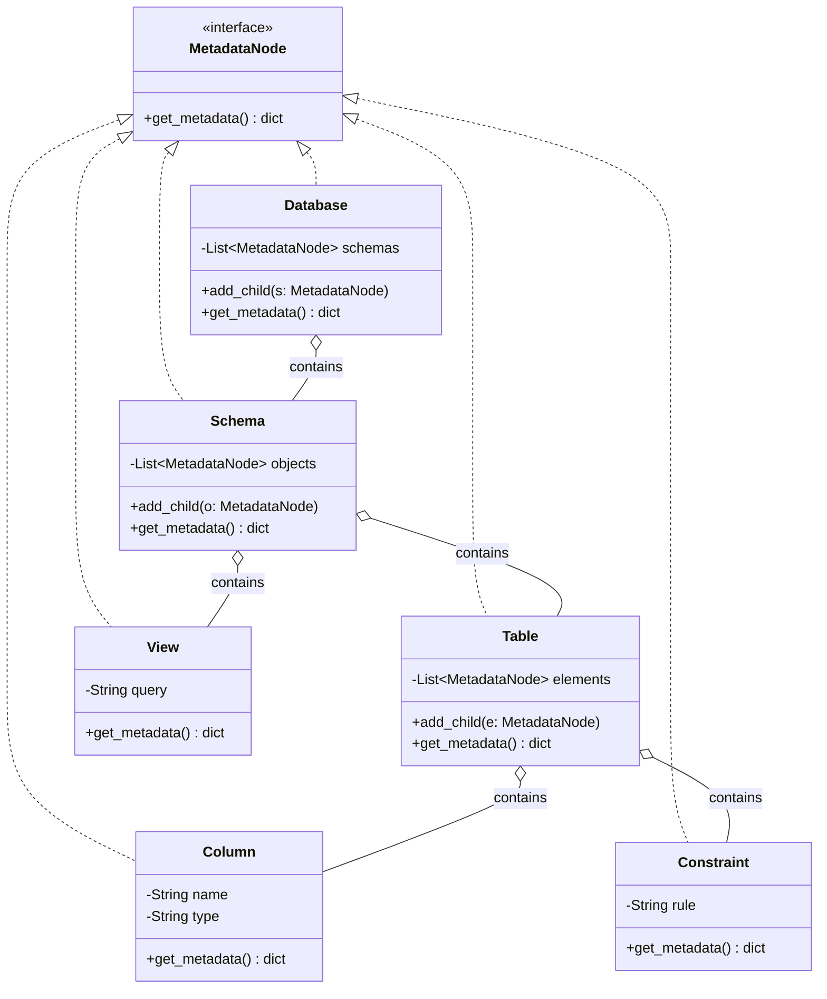
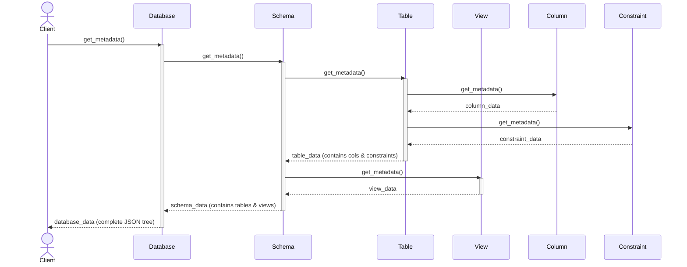
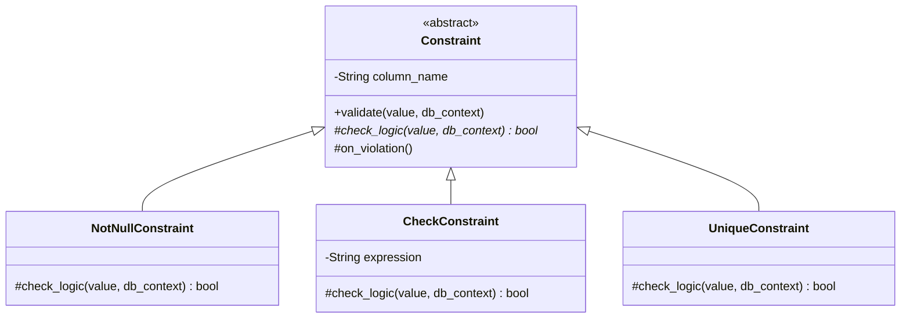
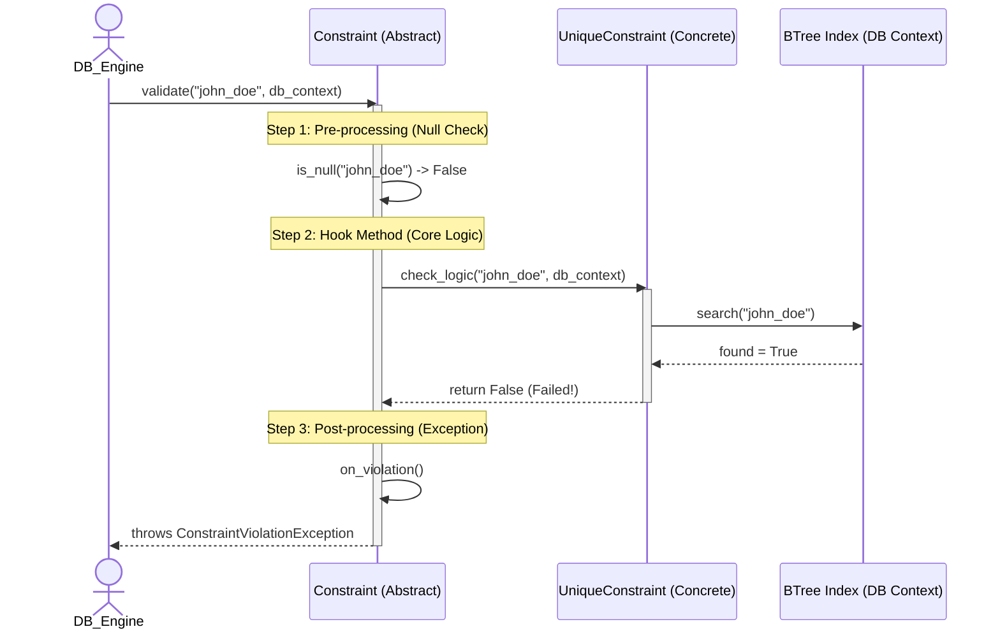
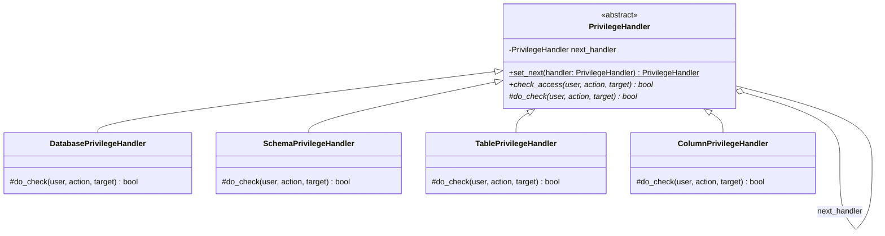
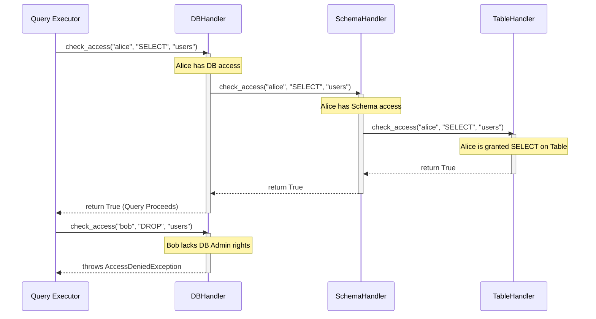
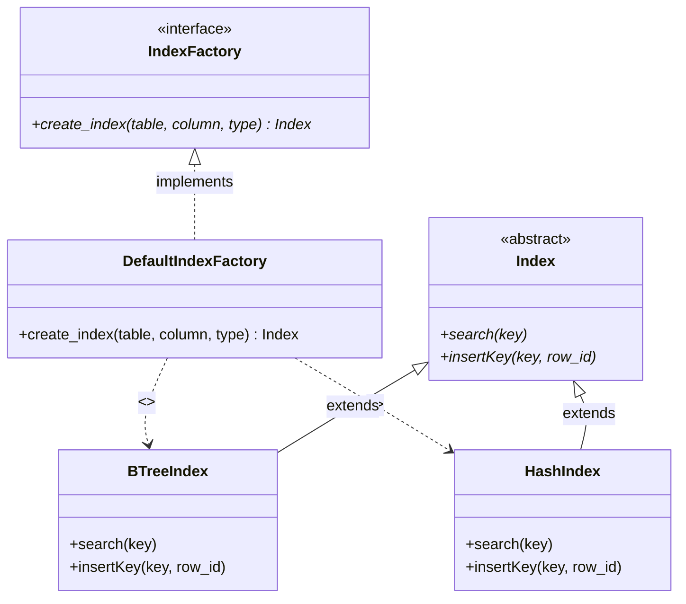
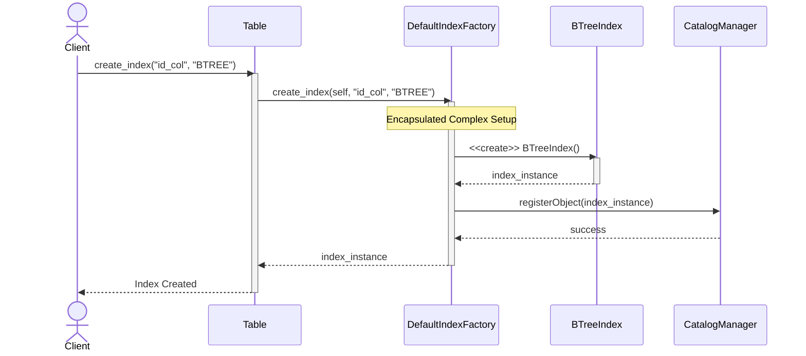
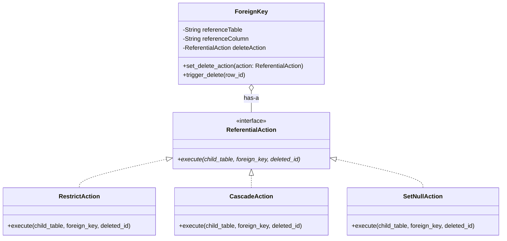
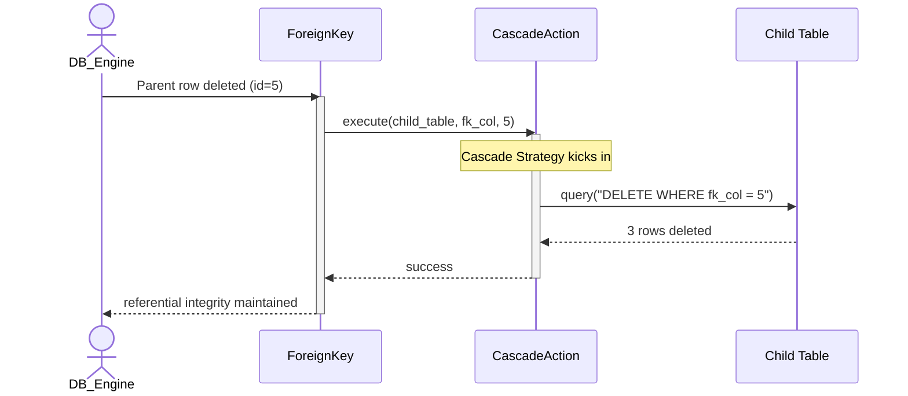

# Giải thích chi tiết 3 Design Pattern trong Hệ quản trị Cơ sở dữ liệu (DBMS)

Tài liệu này giải thích chuyên sâu về 3 mẫu thiết kế (Design Pattern) quan trọng nhất được áp dụng trong kiến trúc của hệ thống DBMS. Mỗi pattern sẽ được phân tích rõ ràng từ vấn đề gặp phải, cách giải quyết, cho đến lý do vì sao nó lại là sự lựa chọn tối ưu nhất.

---

## 1. Mẫu thiết kế Composite (Composite Pattern)
**Áp dụng cho:** Quản lý cấu trúc đối tượng dữ liệu (Database Objects)

### Vấn đề gặp phải
Trong một hệ quản trị CSDL, dữ liệu có tính phân cấp lồng nhau rất sâu: Một `Database` chứa nhiều `Schema`, một `Schema` lại chứa nhiều `Table` và `View`, trong mỗi `Table` lại chứa các `Column` (Cột) và `Constraint` (Ràng buộc). 
Nếu chúng ta lưu trữ và quản lý chúng bằng các danh sách rời rạc (ví dụ: DB giữ một mảng Schema, Schema giữ một mảng Table, Table giữ mảng Column), thì mỗi khi hệ thống cần quét toàn bộ cấu trúc (ví dụ: Tính tổng dung lượng ổ cứng, hoặc xuất file DDL), lập trình viên sẽ phải viết hàng loạt vòng lặp `for` lồng nhau. Code sẽ tràn ngập các câu lệnh kiểm tra kiểu dữ liệu (`if object là Table thì...`, `else if object là Column thì...`), vô cùng cồng kềnh và khó bảo trì.

### Giải pháp của Composite Pattern
Mẫu thiết kế Composite giải quyết triệt để vấn đề này bằng cách gom tất cả các thành phần lại chung dưới một giao diện (Interface) đồng nhất, ví dụ đặt tên là `MetadataNode`.
- Các thành phần không có con (như Cột, Ràng buộc) và các thành phần chứa con (Database, Schema, Bảng) đều phải triển khai chung giao diện này.
- Khi người dùng muốn lấy dữ liệu, họ chỉ cần gọi hàm `get_metadata()` ở cấp độ cao nhất là `Database`.
- Hệ thống sẽ tự động gọi "đệ quy" lệnh đó chui xuống `Schema`, rồi tự động lan truyền xuống `Table`, và cuối cùng đến `Column` để thu thập thông tin. 

### Lý do lựa chọn (Vì sao lại đúng đắn?)
- **Tính đồng nhất tuyệt đối:** DBMS không cần phân biệt đâu là Cột (bé nhất) và đâu là Database (lớn nhất) khi thao tác. Tất cả đều là `MetadataNode`.
- **Dễ dàng mở rộng:** Tuân thủ nguyên lý Đóng/Mở (Open/Closed Principle). Sau này, nếu DBMS cần hỗ trợ thêm khái niệm `Trigger` hay `Index`, lập trình viên chỉ cần tạo class mới kế thừa giao diện chung mà không phải sửa đổi hay phá vỡ bất kỳ vòng lặp cốt lõi nào của hệ thống.

### Giải thích Sơ đồ Class và Sequence (Composite Pattern)

#### Class Diagram

**Giải thích Chi tiết (Phân tích Logic, Quan hệ, và Method):**
- **Method (Phương thức cốt lõi):** Giao diện chung `MetadataNode` định nghĩa một method duy nhất là `get_metadata()`. Bất kỳ đối tượng nào tham gia vào cấu trúc này cũng bắt buộc phải implement hàm này. Các nhánh (Branch như Database, Schema) sẽ có thêm hàm `add_child()` để nhét các phần tử con vào danh sách quản lý.
- **Quan hệ (Relationships):**
  - **Realization (Kế thừa Interface - Mũi tên đứt nét):** Tất cả từ `Database` khổng lồ đến `Column` bé nhỏ đều thực thi chung giao diện `MetadataNode`. Điều này giúp client (bên gọi) đối xử với mọi cấp độ hoàn toàn công bằng (Uniformity).
  - **Aggregation (Quan hệ Tập hợp - Hình thoi rỗng):** Một `Table` có thể chứa nhiều `Column` và `Constraint`. Đây là biểu hiện của nhánh (Branch) giữ con trỏ trỏ tới các nút con (Leaves).
- **Logic hoạt động & Điểm mạnh (Pros):** Khi cần tính toán hoặc xuất dữ liệu, hàm `get_metadata()` ở lớp nhánh sẽ thực hiện vòng lặp duyệt qua toàn bộ `children`, và đệ quy gọi `get_metadata()` của từng đứa con. Hệ thống tự động lan truyền lệnh từ đỉnh tháp xuống tận đáy tháp mà không cần bất kỳ câu lệnh `if (type == Table)` nào.

#### Sequence Diagram

**Giải thích Chi tiết Sơ đồ Động:**
Sơ đồ Sequence mô phỏng hiệu ứng domino của đệ quy:
1. Client kích hoạt phương thức tại root (`Database`).
2. Tín hiệu tự động được đẩy xuống `Schema`.
3. `Schema` gửi yêu cầu thu thập dữ liệu song song cho 2 nhánh con của nó là `Table` và `View`.
4. Bản thân `Table` lại tiếp tục truy vấn xuống các `Column` và `Constraint` trực thuộc.
5. Cuối cùng, dữ liệu từ các lá (như `column_data`, `constraint_data`) cuộn ngược trở lên, gộp thành một khối JSON hoàn chỉnh và trả về cho Client. Rất gọn gàng và tự động!

---

## 2. Mẫu thiết kế Template Method (Template Method Pattern)
**Áp dụng cho:** Cơ chế kiểm tra ràng buộc dữ liệu (Constraint Validation)

### Vấn đề gặp phải
Cơ sở dữ liệu có rất nhiều loại ràng buộc để bảo vệ tính toàn vẹn của data như: `NOT NULL`, `CHECK`, `UNIQUE` (Duy nhất), hay `PRIMARY KEY`. 
Mặc dù logic cốt lõi của chúng khác nhau (VD: Unique phải chọc xuống ổ cứng tìm Index, trong khi Not Null chỉ cần kiểm tra ngay trên RAM), nhưng **quy trình vòng đời** để kiểm tra lỗi lại hoàn toàn giống nhau:
1. **Tiền xử lý:** Bỏ qua không kiểm tra nếu giá trị truyền vào là `Null` (ngoại trừ ràng buộc Not Null).
2. **Kiểm tra logic lõi:** Xem dữ liệu có hợp lệ hay không.
3. **Hậu xử lý:** Nếu dữ liệu sai, ném ra lỗi `ConstraintViolationException` chuẩn hóa để hủy bỏ giao dịch (rollback).

Nếu để lập trình viên tự viết từng Constraint độc lập, họ sẽ phải copy-paste bước 1 và bước 3 liên tục. Điều này tạo ra rác code và nguy cơ cực cao: Một người nào đó có thể quên ném lỗi ở bước 3, dẫn đến hệ thống bị lỗi ngầm.

### Giải pháp của Template Method
Pattern này tạo ra một "khung xương" (Skeleton) cố định nằm ở lớp cha (lớp `Constraint`). Lớp cha sẽ định nghĩa sẵn hàm `validate()` chứa đủ 3 bước trên và **khóa chặt** không cho lớp con sửa đổi. Các lớp con (như `CheckConstraint`, `UniqueConstraint`) chỉ được phép điền phần logic riêng của mình vào duy nhất một lỗ hổng do lớp cha khoét sẵn (hàm `check_logic()`).

### Lý do lựa chọn (Vì sao lại đúng đắn?)
- **Nguyên lý Hollywood (Đừng gọi tôi, tôi sẽ gọi bạn):** Lớp cha nắm toàn quyền kiểm soát luồng chạy của hệ thống, nó sẽ chủ động gọi logic của lớp con khi cần thiết. 
- **Đảm bảo tính nhất quán:** Ngăn chặn triệt để rủi ro lỗi lập trình sai quy trình. Dù mai sau có hàng trăm loại Constraint mới được sinh ra, tất cả đều bị ép buộc phải ném lỗi theo đúng chuẩn quy trình mà DBMS đã thiết kế sẵn.
- **Tái sử dụng code tối đa:** Triệt tiêu hoàn toàn việc lặp lại code kiểm tra Null hay code ném Exception.

### Giải thích Sơ đồ Class và Sequence (Template Method)

#### Class Diagram

**Giải thích Chi tiết (Phân tích Logic, Quan hệ, và Method):**
- **Method (Phương thức cốt lõi):**
  - `validate()`: Đây chính là **Template Method**. Nó là một hàm public chứa bộ khung thuật toán cứng (Tiền xử lý -> Logic -> Hậu xử lý). Hàm này không bao giờ được phép ghi đè (override) bởi lớp con.
  - `check_logic()`: Đây là một **Hook Method** (Hàm móc nối) dạng abstract/protected. Nó giống như một lỗ hổng trong bản mẫu, bắt buộc các class con phải "trám" logic kiểm tra cụ thể của chúng vào.
- **Quan hệ (Relationships):**
  - **Inheritance (Kế thừa - Mũi tên liền):** Các lớp con như `CheckConstraint`, `UniqueConstraint` kế thừa lớp trừu tượng `Constraint`.
- **Logic hoạt động & Điểm mạnh (Pros):** Inversion of Control (Đảo ngược điều khiển) - Các class con không có quyền quyết định khi nào nó được chạy. Lớp cha (`Constraint`) mới là kẻ cầm trịch luồng thời gian, nó sẽ tự động gọi hàm `check_logic()` của lớp con ở đúng thời điểm thích hợp nhất trong vòng đời validation. Hàng ngàn loại constraint khác nhau đều sẽ bị ép tuân thủ chung một chuẩn mực ném lỗi.

#### Sequence Diagram

**Giải thích Chi tiết Sơ đồ Động:**
1. Database Engine luôn luôn gọi hàm `validate()` của lớp cha (`Constraint`). Nó hoàn toàn không quan tâm lớp con là ai.
2. Lớp cha tự làm Step 1 (Kiểm tra Null). 
3. Ở Step 2, lớp cha uỷ quyền (delegate) việc kiểm tra nghiệp vụ khó nhằn cho lớp con `UniqueConstraint`. Lớp con lập tức chọc vào BTree Index trên ổ cứng để tìm kiếm.
4. Sau khi lớp con báo cáo kết quả `False` (có nghĩa là "john_doe" đã tồn tại), lớp cha giành lại quyền kiểm soát, tự động chạy Step 3 và ném ra Exception tiêu chuẩn để chặn đứng giao dịch.

---

## 3. Mẫu thiết kế Chuỗi Trách Nhiệm (Chain of Responsibility)
**Áp dụng cho:** Hệ thống kiểm tra phân quyền bảo mật (Privilege Checking)

### Vấn đề gặp phải
Khi một User gõ lệnh truy vấn (Ví dụ: `SELECT * FROM schemaA.tableB`), hệ quản trị CSDL phải kiểm tra bảo mật qua rất nhiều tầng lớp:
1. User có bị cấm truy cập toàn bộ Database không?
2. User có quyền nhìn thấy `schemaA` không?
3. User có quyền `SELECT` trên `tableB` không?
4. User có bị chặn xem một số Cột nhạy cảm không? (Column-level security).

Nếu gom toàn bộ đống luật lệ này vào một file `SecurityManager` khổng lồ chứa hàng tá câu lệnh `if...else` lồng nhau, hệ thống sẽ trở thành một "đống mì spaghetti". Khi cần thêm một lớp bảo mật mới (như chặn IP), bạn sẽ phải phá nát file code cốt lõi để sửa.

### Giải pháp của Chain of Responsibility
Chúng ta tách mỗi tầng kiểm tra bảo mật thành một trạm kiểm soát (Handler) nhỏ, gọn và độc lập. Sau đó, DBMS móc nối các trạm này lại thành một "chuỗi" dây chuyền (Chain):
`Trạm kiểm tra Database` -> `Trạm kiểm tra Schema` -> `Trạm kiểm tra Bảng`.
Khi câu lệnh SQL chạy vào, nó sẽ đi qua từng trạm:
- Nếu trạm nào phát hiện vi phạm, nó lập tức "tuýt còi", ném lỗi Permission Denied và bẻ gãy chuỗi.
- Nếu trạm đó cho qua, nó tự động đẩy câu lệnh sang trạm tiếp theo.

### Lý do lựa chọn (Vì sao lại đúng đắn?)
- **Sự tách bạch hoàn hảo (Decoupling):** Lớp bảo mật cấp Database không cần biết lớp cấp Bảng hoạt động ra sao. Trách nhiệm được chia nhỏ, giúp code cực kỳ dễ đọc và test.
- **Cấu hình động (Dynamic Configuration):** Quản trị viên hệ thống có thể dễ dàng thêm, bớt hoặc đảo lộn thứ tự các lớp bảo mật ngay trong lúc DB đang chạy (Runtime). Ví dụ, bật thêm trạm kiểm tra Cột đối với phiên bản Enterprise mà không cần phải viết lại code lõi. 

### Giải thích Sơ đồ Class và Sequence (Chain of Responsibility)

#### Class Diagram

**Giải thích Chi tiết (Phân tích Logic, Quan hệ, và Method):**
- **Method (Phương thức cốt lõi):**
  - `set_next()`: Hàm dùng để móc trạm hiện tại vào trạm tiếp theo, tạo thành một sợi xích (chain).
  - `check_access()`: Hàm public quản lý việc luân chuyển. Nếu trạm hiện tại check OK, nó sẽ lấy `next_handler` ra và tự động đẩy lệnh `check_access()` về phía trước.
  - `do_check()`: Hàm abstract, nơi chứa nghiệp vụ bảo mật cụ thể của từng trạm (Ví dụ trạm Schema chỉ check quyền của Schema).
- **Quan hệ (Relationships):**
  - **Self-Aggregation (Tự tập hợp - Hình thoi rỗng trỏ lại chính nó):** Lớp `PrivilegeHandler` giữ một biến `next_handler` trỏ tới một object khác mang cùng kiểu `PrivilegeHandler`. Đây chính là cơ chế "mắt xích" kinh điển nối các trạm lại với nhau.
  - **Inheritance:** Tất cả các trạm kiểm duyệt cụ thể (Database, Schema, Table) đều thừa kế từ Handler gốc.
- **Logic hoạt động & Điểm mạnh (Pros):** Khi một request truy cập ập đến, nó sẽ lao vào trạm đầu tiên. Nhờ tính chất mắt xích, request sẽ trôi tuột qua các trạm nếu mọi thứ an toàn, hoặc bị chặn đứng ngay lập tức ở bất kỳ trạm nào báo động đỏ. Ta có thể dễ dàng xáo trộn thứ tự các trạm (hoặc cắm thêm trạm kiểm tra IP) ngay lúc ứng dụng đang chạy cực kỳ mượt mà.

#### Sequence Diagram

**Giải thích Chi tiết Sơ đồ Động:**
Sơ đồ mô phỏng rõ nét đặc trưng "truyền bóng" của Chain of Responsibility:
1. **Nửa trên (Success Case):** Alice gõ lệnh SELECT. Request chạm vào trạm Database (DBHandler). Pass! Chuyền sang trạm Schema (SchemaHandler). Pass! Cuối cùng chuyền sang trạm Table (TableHandler). Pass! Tín hiệu `True` (Cho phép) dội ngược trở lại cho Client để thực thi Query.
2. **Nửa dưới (Fail Case):** Bob táy máy gõ lệnh DROP. Request vừa đập vào trạm Database (DBHandler) thì bị trạm này bắt thóp ngay (vì thiếu quyền Admin). Chuỗi lập tức bị đứt gãy, DBHandler ném thẳng `AccessDeniedException` vào mặt Client mà không cần tốn công chạy xuống hỏi các trạm Schema hay Table phía sau. Thao tác chặn diễn ra cực kỳ dứt khoát!

---

## 4. Factory Method Pattern (Tạo Lập Đối Tượng)
**Mục tiêu:** Gom toàn bộ logic khởi tạo phức tạp của các đối tượng (như Index, Trigger) vào một xưởng sản xuất (Factory), giúp `Table` không bị dính chặt vào các class cụ thể.

- **Vấn đề:** Nếu ta cho phép class `Table` tự ý gọi `new BTreeIndex()` hay `new HashIndex()`, code của `Table` sẽ chứa đầy các câu lệnh `if/else` chằng chịt để quyết định xem nên khởi tạo class nào. Điều này vi phạm nguyên tắc Open/Closed vì mỗi khi có thêm một loại Index mới (như `BitmapIndex`), ta lại phải chui vào `Table` sửa code.
- **Giải pháp Factory Method:** Ta tạo ra một `IndexFactory`. `Table` bây giờ chỉ cần gọi `factory.create_index("BTREE")`. Xưởng sản xuất sẽ tự lo liệu việc cấp phát bộ nhớ, ghi log, và trả về một instance Index xịn sò. Quá trình tạo lập bị giấu kín hoàn toàn.
- **Sự tách bạch (Decoupling):** Core code không còn quan tâm đối tượng được tạo ra như thế nào, nó chỉ nhận đối tượng đã thành hình và xài thôi. Rất gọn gàng!

### Giải thích Sơ đồ Class và Sequence (Factory Method)

#### Class Diagram

**Giải thích Chi tiết (Phân tích Logic, Quan hệ, và Method):**
- **Method (Phương thức cốt lõi):**
  - `create_index()`: Hàm duy nhất chịu trách nhiệm sản xuất. Đầu vào là thông tin cơ bản (tên bảng, cột, kiểu), đầu ra luôn là một object tuân theo interface `Index`.
  - Các hàm `search()` và `insertKey()` là đặc trưng của sản phẩm (Index). Factory không quan tâm đến các hàm này, nó chỉ lo đẻ ra đối tượng.
- **Quan hệ (Relationships):**
  - **Realization (Kế thừa Interface):** `DefaultIndexFactory` thực thi `IndexFactory`. `BTreeIndex` và `HashIndex` thực thi `Index`.
  - **Dependency (Phụ thuộc - Mũi tên đứt nét):** Nhà máy (`DefaultIndexFactory`) phụ thuộc trực tiếp vào các class con `BTreeIndex` và `HashIndex` để có thể khởi tạo chúng (`creates`).
- **Logic hoạt động & Điểm mạnh (Pros):** Đẩy toàn bộ sự phức tạp của quá trình khởi tạo (cấp phát, cấu hình ban đầu) ra khỏi class `Table`. Nếu ngày mai ta cần thêm `BitmapIndex`, ta chỉ việc update `DefaultIndexFactory` mà không hề đụng chạm một dòng code nào trong `Table`.

#### Sequence Diagram

**Giải thích Chi tiết Sơ đồ Động:**
Sơ đồ thể hiện luồng uỷ quyền (delegation) hoàn hảo:
1. Client yêu cầu `Table` tạo index BTREE. 
2. Thay vì tự xắn tay áo lên làm, `Table` ném ngay quả bóng trách nhiệm sang cho `DefaultIndexFactory`. 
3. `DefaultIndexFactory` thực hiện chuỗi khởi tạo phức tạp: Vừa gọi `new BTreeIndex()`, vừa âm thầm móc nối với `CatalogManager` để đăng ký siêu dữ liệu vào hệ thống.
4. Trả về thành phẩm đã hoàn thiện cho `Table`. Lúc này `Table` mới thảnh thơi báo cáo hoàn tất về cho Client.

---

## 5. Strategy Pattern (Hành Động Tham Chiếu - Referential Action)
**Mục tiêu:** Cô lập các hành vi phản ứng khi xoá/sửa Khoá Ngoại (Cascade, Restrict, Set Null) thành các thuật toán riêng biệt có thể tráo đổi cho nhau.

- **Vấn đề:** Khi một dòng cha bị xoá, dòng con đang chứa khoá ngoại trỏ tới nó phải làm gì? Tuỳ cấu hình mà ta có thể xoá theo (Cascade), báo lỗi cấm xoá (Restrict), hoặc set bằng Null. Nếu nhét mớ hổ lốn này vào hàm `on_delete()` của class `ForeignKey` bằng `if/elif/else`, hàm này sẽ phình to khủng khiếp.
- **Giải pháp Strategy:** Rút ruột từng hành vi đó ra, đóng gói thành các class riêng biệt (`CascadeAction`, `RestrictAction`, `SetNullAction`). Đứa nào làm việc nấy. Class `ForeignKey` giờ chỉ cần cầm một biến `deleteAction`. Bất cứ khi nào có biến, nó cứ thế mà gõ đầu biến `deleteAction` bảo: "Ê, chạy execute() đi!".
- **Sự linh hoạt:** Ta hoàn toàn có thể đổi chiến thuật từ Restrict sang Cascade ngay trong lúc phần mềm đang chạy bằng cách gắn class Action khác vào. Cực kỳ uyển chuyển.

### Giải thích Sơ đồ Class và Sequence (Strategy)

#### Class Diagram

**Giải thích Chi tiết (Phân tích Logic, Quan hệ, và Method):**
- **Method (Phương thức cốt lõi):**
  - `execute()`: Lệnh bài thi triển võ công. Mọi class Chiến thuật (Action) đều phải có hàm này để tự định nghĩa cách xử lý riêng khi bị gọi tên.
  - `set_delete_action()`: Nằm trong `ForeignKey`, dùng để nạp đạn (cài đặt/đổi chiến thuật) vào bất cứ lúc nào.
  - `trigger_delete()`: Hàm của `ForeignKey` dùng để bóp cò, bên trong nó sẽ gọi `.execute()` của chiến thuật đang được nạp.
- **Quan hệ (Relationships):**
  - **Realization (Kế thừa Interface):** `RestrictAction`, `CascadeAction`, `SetNullAction` đều thực thi giao diện chung `ReferentialAction`.
  - **Aggregation (Tập hợp - Hình thoi rỗng):** `ForeignKey` (đóng vai trò Context) sở hữu một biến `deleteAction` trỏ tới interface `ReferentialAction`.
- **Logic hoạt động & Điểm mạnh (Pros):** Khi có sự cố xoá dữ liệu, thay vì `ForeignKey` phải chạy một hàm `on_delete()` dài nghìn dòng chứa đầy `switch/case`, nó chỉ cần lôi đúng cái Action hiện tại ra và gõ đầu nó bắt chạy `execute()`. Nhờ thế ta dễ dàng bổ sung `SetDefaultAction` sau này mà không sợ vỡ code cũ.

#### Sequence Diagram

**Giải thích Chi tiết Sơ đồ Động:**
Sơ đồ minh hoạ sự uyển chuyển của Context khi gọi Strategy:
1. DB Engine thông báo dòng cha (id=5) đã bị xoá cho `ForeignKey`.
2. `ForeignKey` không tự xử lý mà gọi ngay `execute()` của chiến thuật đang được cài đặt (hiện tại là `CascadeAction`).
3. `CascadeAction` tự biết thân biết phận, gửi thẳng một câu Query "xoá tận gốc" (DELETE WHERE) xuống cho Bảng Con (Child Table) để dọn dẹp tàn dư.
4. Báo cáo thành công ngược trở lại, giữ vững tính toàn vẹn dữ liệu (Referential Integrity) mà không hề làm nghẽn logic lõi.

---

## TỔNG HỢP: Danh sách Thuộc tính và Phương thức cần thêm vào Code/Test

Dưới đây là bảng liệt kê chi tiết những **Thuộc tính (Properties)** và **Phương thức (Methods)** mới phát sinh từ 3 Design Pattern trên. Bạn hãy sử dụng danh sách này làm "Checklist" để implement vào Source Code, Class và viết Unit Test cho chính xác nhé.

### 1. Thuộc cho Composite Pattern (Quản lý Cấu trúc)
**Mục tiêu:** Áp dụng đệ quy để gom nhóm Database, Schema, Table, View, Column, Constraint.

*   **Interface `MetadataNode` (Bắt buộc cho mọi class kiến trúc):**
    *   `+ get_metadata() -> dict`: Hàm trả về từ điển JSON chứa thông tin cấu trúc.
*   **Các class Nhánh (Branch: `Database`, `Schema`, `Table`):**
    *   **Thuộc tính:**
        *   `- children: List[MetadataNode]`: Danh sách chứa các phần tử con bên trong nó (Nên xài tên chung là `children` để chuẩn hóa, thay vì `tables`, `columns`).
    *   **Phương thức:**
        *   `+ add_child(node: MetadataNode)`: Hàm để nhét một phần tử con (như thêm Schema vào DB, thêm Table vào Schema, thêm Column vào Table).
        *   `+ get_metadata() -> dict`: Code thực thi vòng lặp qua mảng `children` và gọi đệ quy hàm `get_metadata()` của từng đứa con.
*   **Các class Lá (Leaf: `View`, `Column`, `Constraint`):**
    *   **Thuộc tính đặc trưng:**
        *   `- name: String` (Tên Cột/View)
        *   `- type: String` (Kiểu dữ liệu của Cột như INT, VARCHAR)
        *   `- query: String` (Câu SQL tạo View)
        *   `- rule: String` (Luật của Constraint, VD: `PRIMARY KEY`)
    *   **Phương thức:**
        *   `+ get_metadata() -> dict`: Trả về dict chứa chính thuộc tính của nó (Không có vòng lặp vì không có con).

### 2. Thuộc cho Template Method Pattern (Xử lý Ràng buộc)
**Mục tiêu:** Tạo bộ khung Validation cứng nhắc không thể bị phá vỡ.

*   **Class trừu tượng `Constraint` (Lớp Cha):**
    *   **Thuộc tính:**
        *   `- column_name: String`: Tên cột đang bị áp dụng ràng buộc.
    *   **Phương thức:**
        *   `+ validate(value, db_context) -> None`: **(Template Method)** - Hàm public thực hiện 3 bước: Kiểm tra Null -> Gọi `check_logic()` -> Gọi `on_violation()`. Không được ghi đè.
        *   `# check_logic(value, db_context) -> bool`: **(Hook Method)** - Hàm trừu tượng (Abstract), bắt buộc con phải tự định nghĩa logic.
        *   `# on_violation(value) -> None`: Hàm nội bộ để ném Exception nếu fail.
*   **Các class Cụ thể (`NotNullConstraint`, `CheckConstraint`, `UniqueConstraint`):**
    *   **Thuộc tính:**
        *   `- expression: String`: Thuộc tính riêng của `CheckConstraint` (VD: `> 0`).
    *   **Phương thức:**
        *   `# check_logic(value, db_context) -> bool`: Triển khai logic lõi. Ví dụ `UniqueConstraint` thì chọc vào `db_context` để lấy mảng index và kiểm tra xem giá trị đã tồn tại chưa.
*   **Class Lỗi (Exception):**
    *   `ConstraintViolationException`: Kế thừa từ `Exception` gốc của ngôn ngữ, chuyên dùng ném lỗi khi Validation thất bại.

### 3. Thuộc cho Chain of Responsibility Pattern (Kiểm tra Phân quyền)
**Mục tiêu:** Nối các trạm kiểm tra quyền lại thành 1 chuỗi dài, đứt trạm nào báo lỗi trạm đó.

*   **Class trừu tượng `PrivilegeHandler` (Lớp Cha):**
    *   **Thuộc tính:**
        *   `- next_handler: PrivilegeHandler`: Biến lưu trữ con trỏ trỏ tới Trạm kiểm tra tiếp theo.
    *   **Phương thức:**
        *   `+ set_next(handler: PrivilegeHandler) -> PrivilegeHandler`: Hàm truyền vào Trạm tiếp theo. Cần return lại chính cái handler truyền vào để có thể chain code kiểu `A.set_next(B).set_next(C)`.
        *   `+ check_access(user, action, target) -> bool`: Hàm public chạy quy trình. Gọi `do_check()` trước, nếu True thì tự lấy `next_handler` gọi tiếp `check_access()`.
        *   `# do_check(user, action, target) -> bool`: Hàm abstract nơi viết logic kiểm duyệt của trạm đó.
*   **Các Trạm Cụ thể (`DatabasePrivilegeHandler`, `SchemaPrivilegeHandler`, `TablePrivilegeHandler`, `ColumnPrivilegeHandler`):**
    *   **Phương thức:**
        *   `# do_check(user, action, target) -> bool`: Override lại hàm của cha. Mỗi trạm tự viết logic kiểm tra quyền của cấp bậc mình (Cấp DB thì check quyền DB Admin, cấp Table thì check quyền SELECT/UPDATE/DROP...).
*   **Class Lỗi (Exception):**
    *   `AccessDeniedException`: Lỗi chuyên biệt bị ném ra ngay lập tức khi một trạm báo False (Cấm truy cập).

### 4. Thuộc cho Factory Method Pattern (Khởi tạo Đối tượng)
**Mục tiêu:** Tách rời logic cấp phát bộ nhớ và đăng ký hệ thống ra khỏi đối tượng gốc.

*   **Interface `IndexFactory` (Xưởng Sản Xuất):**
    *   **Phương thức:**
        *   `+ create_index(table, column, type) -> Index`: Hàm abstract, nhận vào tên bảng, tên cột và kiểu index (BTREE, HASH) để nhào nặn ra một Index thực thể.
*   **Class Cụ thể `DefaultIndexFactory`:**
    *   **Phương thức:**
        *   `+ create_index(...) -> Index`: Implement logic thật. Nó có trách nhiệm khởi tạo `BTreeIndex` hoặc `HashIndex`, sau đó đăng ký chúng vào Hệ thống (CatalogManager) rồi mới return về.
*   **Class Đích `Index` (Sản phẩm):**
    *   **Thuộc tính:**
        *   `- type: String`: Lưu kiểu Index (Ví dụ: "BTREE").
    *   **Phương thức:**
        *   `+ search(key)`: Abstract method bắt con cái phải tự viết thuật toán dò tìm.

### 5. Thuộc cho Strategy Pattern (Chiến thuật Xoá Khoá Ngoại)
**Mục tiêu:** Linh hoạt hoán đổi thuật toán xử lý dữ liệu dính líu đến Khoá Ngoại bị xoá.

*   **Interface `ReferentialAction` (Bản Hợp Đồng Chiến Thuật):**
    *   **Phương thức:**
        *   `+ execute(child_table, foreign_key, deleted_id)`: Hàm abstract để các chiến thuật thi triển võ công của mình.
*   **Các Chiến Thuật Cụ thể (`RestrictAction`, `CascadeAction`, `SetNullAction`):**
    *   **Phương thức:**
        *   `+ execute(...)`: Override lại. `RestrictAction` thì đếm xem con có tồn tại không rồi ném Exception cấm xoá. `CascadeAction` thì gọi hàm xoá thẳng tay. `SetNullAction` thì chèn chữ NULL vào.
*   **Class `ForeignKey` (Kẻ Điều Binh - Context):**
    *   **Thuộc tính:**
        *   `- delete_action: ReferentialAction`: Chứa chiến thuật đang được áp dụng hiện tại.
    *   **Phương thức:**
        *   `+ set_delete_action(action: ReferentialAction)`: Hàm nạp chiến thuật mới lúc Runtime.
        *   `+ trigger_delete(child_table, deleted_id)`: Hàm được DB gọi. Bên trong hàm này, nó móc `delete_action` ra và uỷ quyền cho nó (gọi `.execute()`).
