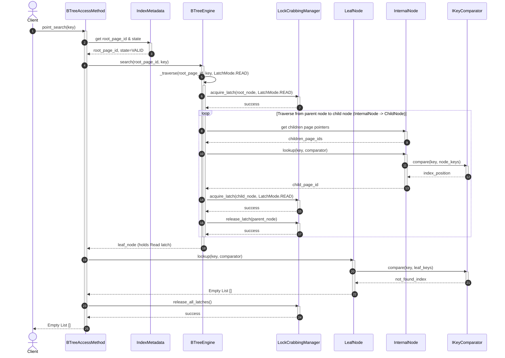
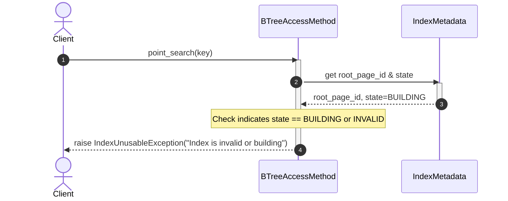

# Index Management Subsystem - Point Search Flow

The Point Search flow performs a search for a specific key in the B+ Tree index to return the corresponding list of `RecordID`s. Below is a detailed description of the scenarios for this flow.

---

## 1. Scenario A: Key Found - Happy Path

* **Description:** The key exists in the index. The traversal process succeeds from the root node down to the leaf node, applying **Read Lock Crabbing**, finds the key at the leaf page, and returns a valid list of `RecordID`s.

### Sequence Diagram:

---

## 2. Scenario B: Key Not Found

* **Description:** The key does not exist in the index. The tree traversal process proceeds normally down to the leaf node, but when performing the binary search on the leaf node, there is no matching key. The system returns an empty list (`[]`).

### Sequence Diagram:

---

## 3. Scenario C: Invalid Index - Early Failure

* **Description:** The client requests a search on an index that is corrupted or currently being built (`state != VALID`). The system checks the metadata, detects the invalid state, and aborts the process early, throwing an error.

### Sequence Diagram:

