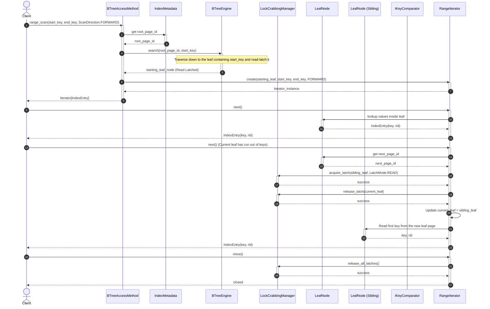
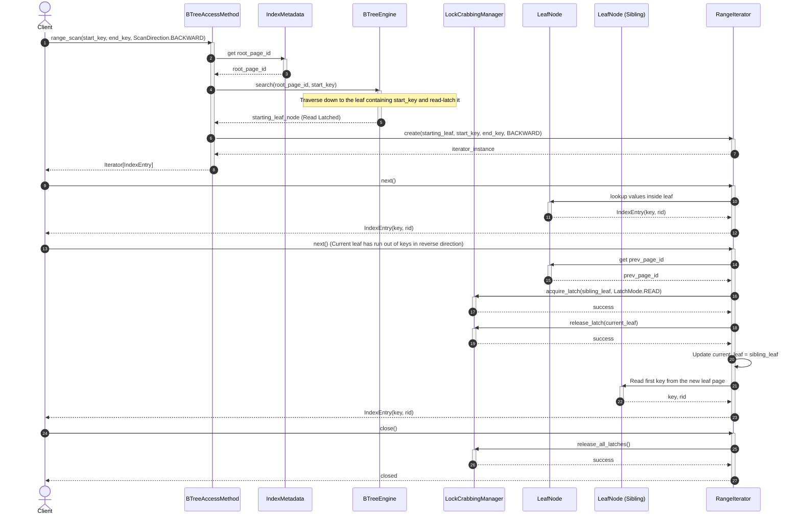
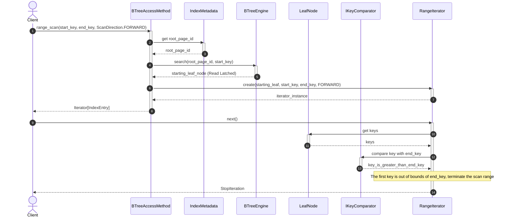

# Index Management Subsystem - Range Scan Flow

The Range Scan flow allows users to scan and retrieve all records falling within a key range `[start_key, end_key]` in either forward or backward direction.

---

## 1. Scenario A: Forward Scan - Multiple Leaves

* **Description:** The scan process moves from `start_key` to `end_key` in the forward direction (`direction = FORWARD`). When finishing scanning the current page, it gets the `next_page_id`, acquires the read latch on the next leaf page first before releasing the read latch on the current leaf page (Lock Crabbing on leaf pages) to prevent losing the link due to another write thread.

### Sequence Diagram:

---

## 2. Scenario B: Backward Scan

* **Description:** The backward scan process goes from `start_key` to `end_key` (`direction = BACKWARD`). It traverses in the reverse direction using the previous page link pointer `prev_page_id`.

### Sequence Diagram:

---

## 3. Scenario C: Empty Range

* **Description:** No key falls within the scan range or the start_key is completely out of bounds of the index tree. The iterator terminates immediately with a `StopIteration` error.

### Sequence Diagram:

