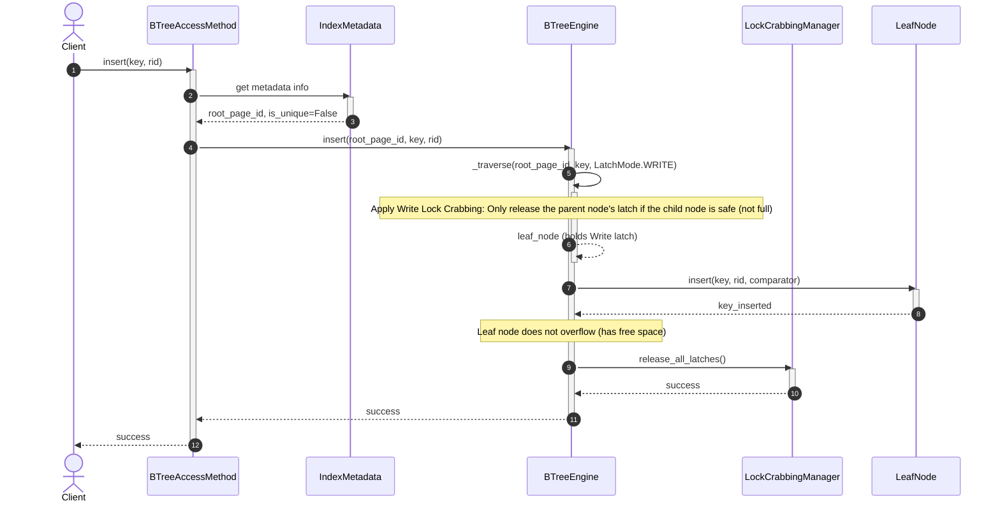
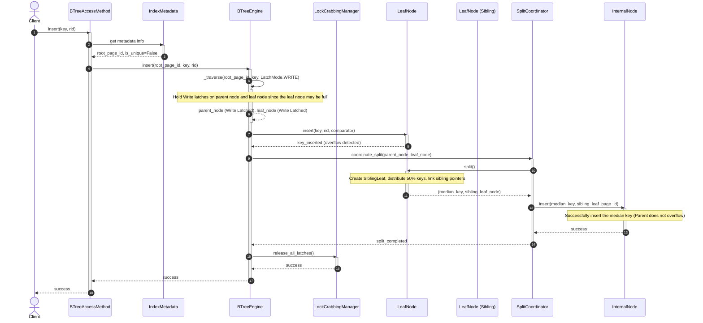
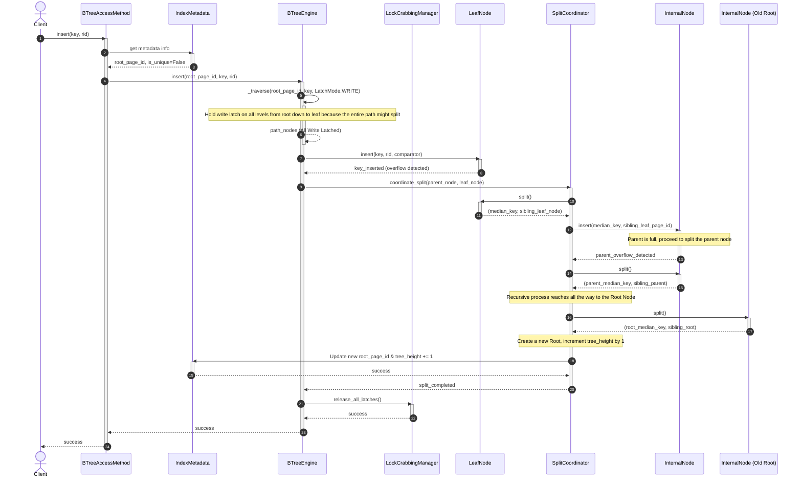
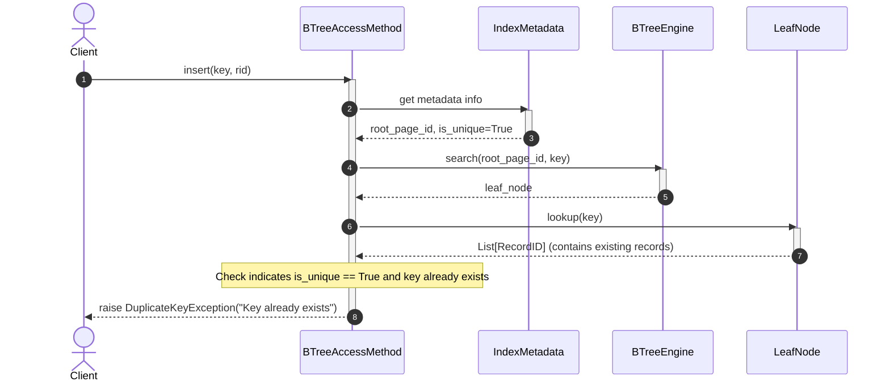

# Index Management Subsystem - Insert Flow (Insert Key & Node Split)

The flow to insert a new key into the B+ Tree requires locating the appropriate leaf page, verifying uniqueness (if it is a unique index), and handling recursive node splitting when the page overflows.

---

## 1. Scenario A: Leaf Node Has Free Space (No Split) - Happy Path

* **Description:** The target leaf node still has enough free space. The new key is inserted directly into the correct sorted position on the leaf page. No tree structure modification is needed.

### Sequence Diagram:

---

## 2. Scenario B: Leaf Node Splits, Parent Safe (Leaf Split, Parent Safe)

* **Description:** The target leaf page is full (`key_count > max_capacity`). The system splits the leaf page into two (creates a new sibling leaf page, moves 50% of the keys to the new node, updates sibling links). The median key (`median_key`) is pushed up and inserted into the parent node (`InternalNode`). The parent node still has free space, so it accepts the new key without needing a further split.

### Sequence Diagram:

---

## 3. Scenario C: Recursive Split to Root

* **Description:** The leaf node becomes full and splits, pushing the median key up to the parent node. The parent node also becomes full and must split and push further up. This process repeats until it reaches the root node. The root node splits, a new root node is created, and the index tree height increases by 1.

### Sequence Diagram:

---

## 4. Scenario D: Duplicate Key on Unique Index

* **Description:** The index is configured as unique (`is_unique = True`). Before insertion, the system performs a search and detects that this key already exists in the index tree. The insertion process stops immediately and throws a duplicate key error.

### Sequence Diagram:

