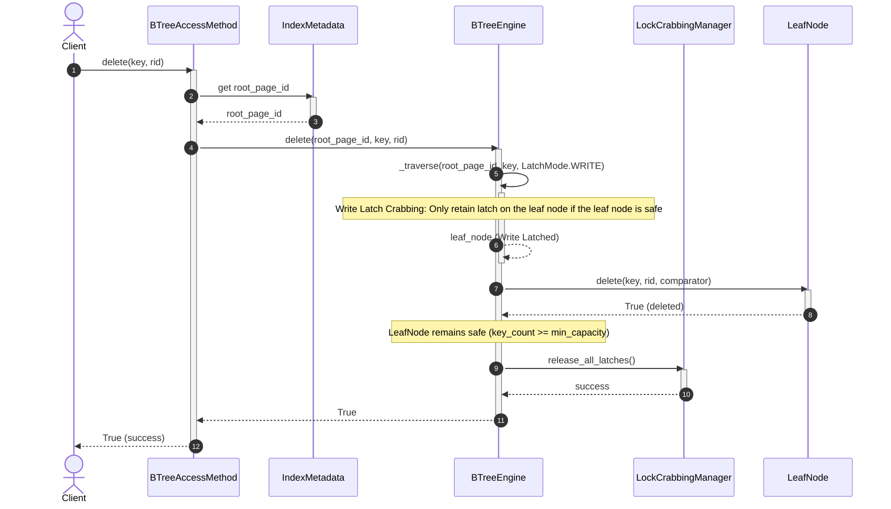
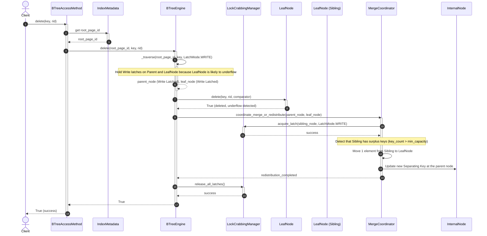
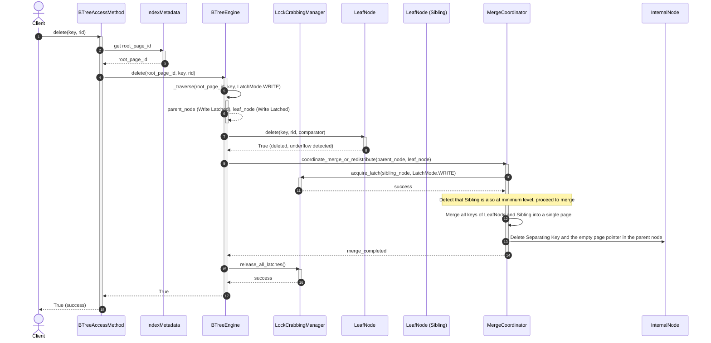
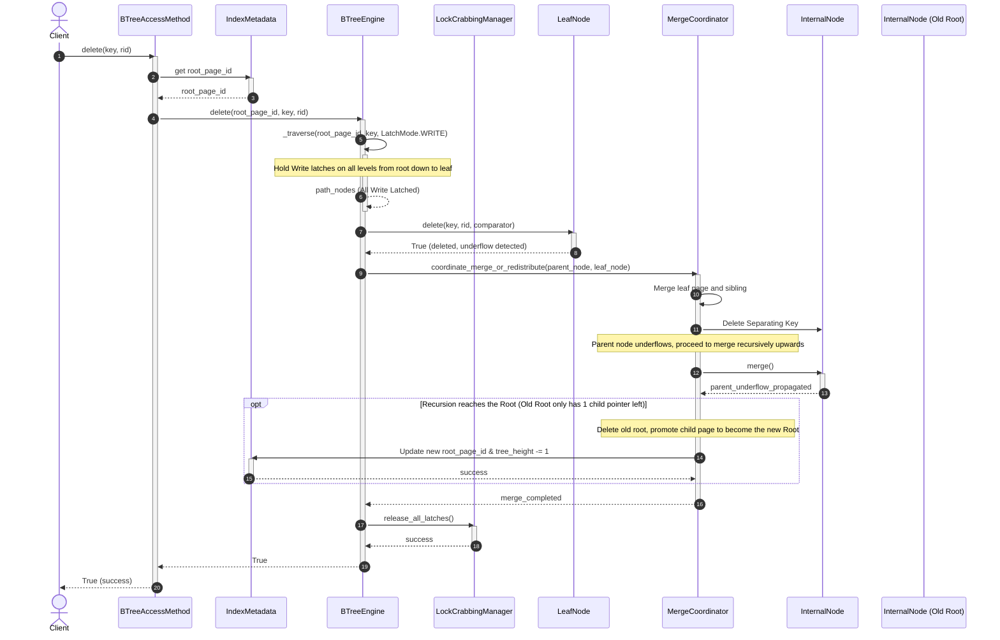
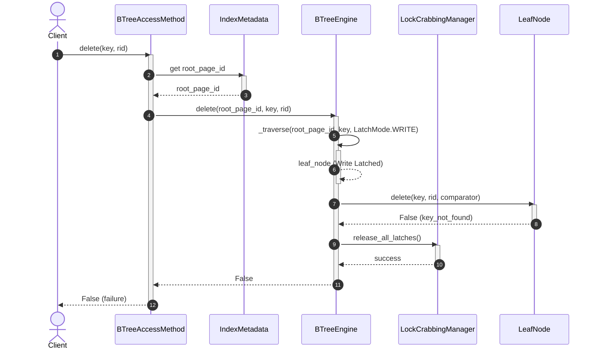

# Index Management Subsystem - Delete Flow (Delete Key & Merge/Redistribute)

The flow to delete a key from the B+ Tree performs locating the leaf page containing the key, removing the key, and coordinating tree restructuring if the leaf page falls into an underflow state.

---

## 1. Scenario A: Leaf Safe After Delete (Leaf Safe) - Happy Path

* **Description:** The key is deleted from the leaf page. The number of remaining keys on the leaf page still satisfies the minimum capacity requirement (`key_count >= min_capacity`). The tree structure is preserved.

### Sequence Diagram:

---

## 2. Scenario B: Key Underflow & Borrowing from Sibling (Redistribution)

* **Description:** After deletion, the leaf page suffers from underflow (`key_count < min_capacity`). The adjacent sibling (sibling page under the same parent) has surplus keys. The system borrows 1 key from the sibling page and moves it to the underflowing leaf page, and simultaneously updates the separating key in the parent node.

### Sequence Diagram:

---

## 3. Scenario C: Key Underflow & Node Merging (Merge)

* **Description:** The leaf page suffers from underflow, but the adjacent sibling page also only has the minimum number of keys (cannot lend). The system performs a merge of all keys from the leaf page and the sibling page into a single page. The separating key in the parent node is deleted.

### Sequence Diagram:

---

## 4. Scenario D: Recursive Merge to Root & Root Delete (Recursive Merge)

* **Description:** After merging the leaf node and deleting the key in the parent node, the parent node also suffers from underflow and must continue merging recursively up to the root. The old root node is left with only 1 child pointer, gets deleted, and promotes its child page to become the new root, decreasing the index tree height by 1.

### Sequence Diagram:

---

## 5. Scenario E: Key to Delete Not Found

* **Description:** The system traverses the tree to the leaf node but detects that the key to be deleted does not exist in the index. The process stops and returns `False`.

### Sequence Diagram:

