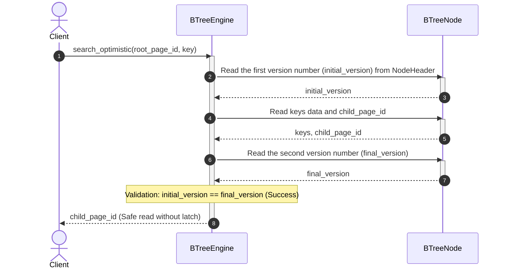
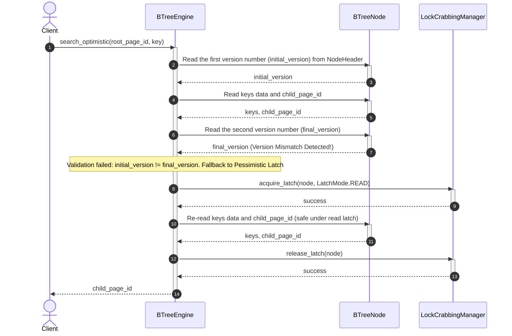

# Index Management Subsystem - Optimistic Read Strategy Flow

The Optimistic Read strategy helps accelerate multi-threaded queries on the index by eliminating the need to continuously acquire Read Latches on the upper nodes of the B+ Tree.

---

## 1. Scenario A: Optimistic Success

* **Description:** A Reader traverses a node without any Writer modifying that node simultaneously. The Reader reads the version number before and after reading the node's data; if they match, the data is considered consistent. No latch needs to be acquired on that node.

### Sequence Diagram:

---

## 2. Scenario B: Optimistic Failure & Fallback to Pessimistic Latch

* **Description:** While the Reader is reading the node's keys, a Writer thread concurrently performs an insert/delete operation on this node and alters the node's version number. Upon the second check, the Reader detects the version mismatch and considers the read data inconsistent. The system will automatically fall back to the standard Read Latch mode on that node to safely re-read the data.

### Sequence Diagram:

