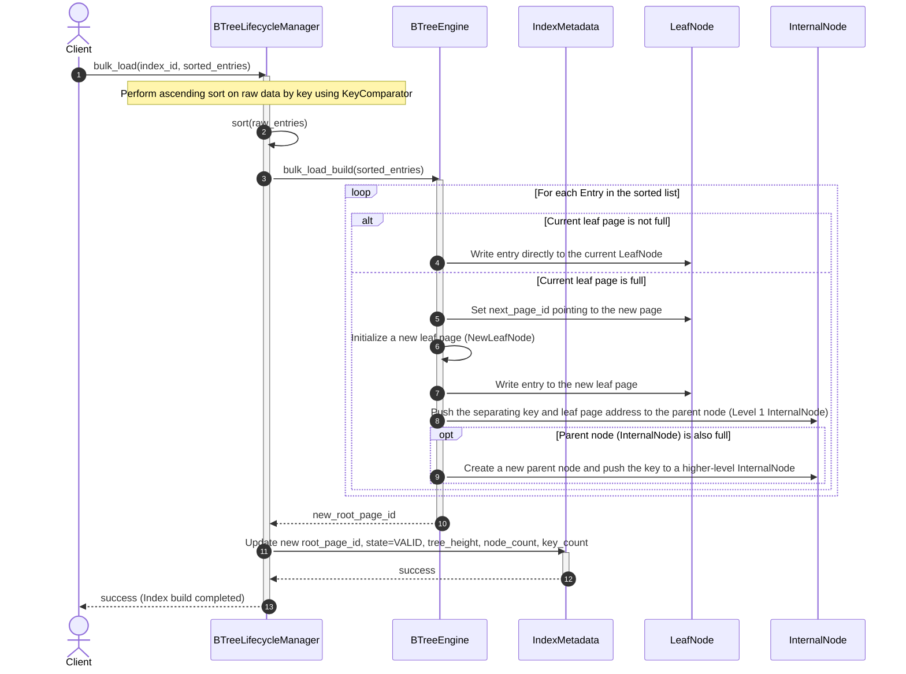
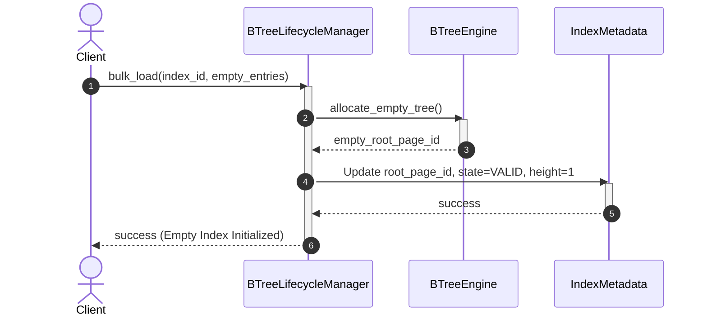

# Index Management Subsystem - Bulk Loading Flow

Bulk Loading is an extremely high-performance optimization method used to build a new B+ Tree index from a large existing dataset using a bottom-up build algorithm.

---

## 1. Scenario A: Bulk Load Success

* **Description:** The input dataset contains multiple valid records. The process first sorts the entire data by key, then sequentially allocates the records into leaf pages from left to right. When a page fills up, the separating key is pushed directly to the immediate parent nodes (InternalNode) without recursively traversing from the root node.

### Sequence Diagram:

---

## 2. Scenario B: Empty Dataset

* **Description:** The input dataset contains no elements. The process creates a standard empty index tree: consisting of only a single empty leaf page acting as the root node. The index state is set to `VALID`.

### Sequence Diagram:

